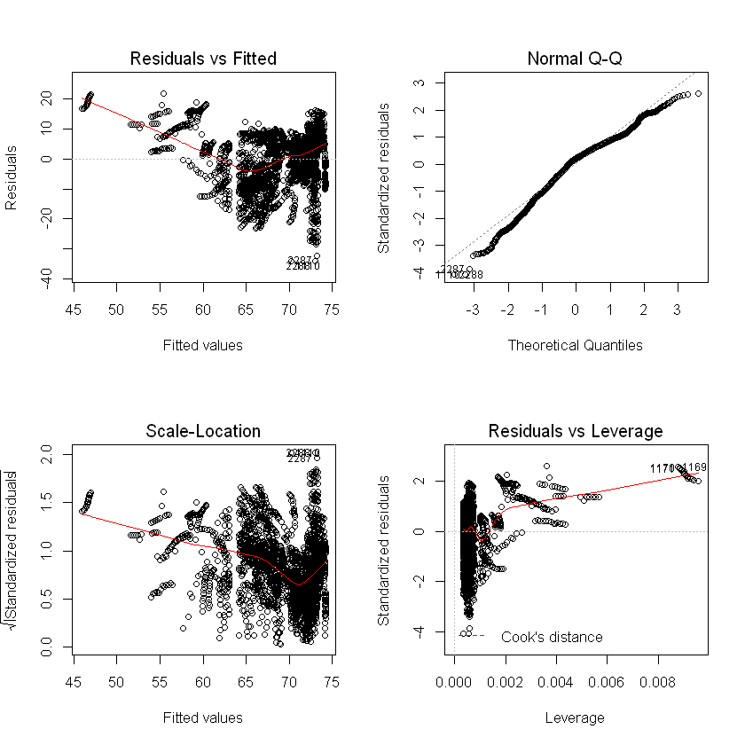
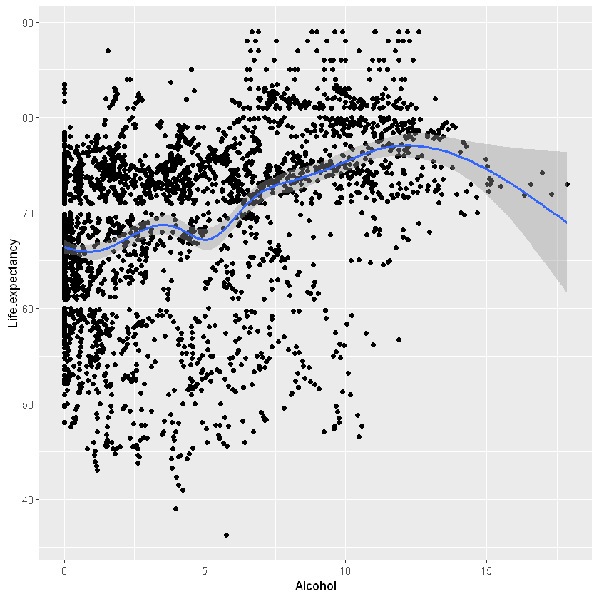

# Project Part 1: Estimating Life Expectancy

### We chose the Life Expectancy dataset to answer the question "what are the factors that affect the life expectancy of a population?"

The data-set related to life expectancy, health factors for 193 countries has been collected from the same WHO data repository website and its corresponding economic data was collected from United Nation website. Among all categories of health-related factors only those critical factors were chosen which are more representative. It has been observed that in the past 15 years , there has been a huge development in health sector resulting in improvement of human mortality rates especially in the developing nations in comparison to the past 30 years. 

We wish to explore the data in order to find which factors affect the life expectancy.

Importing needed libraries


```R
library(ggplot2)
library(MASS)
library(pROC)
library(tidyr)
library(dplyr)
```

    Registered S3 methods overwritten by 'ggplot2':
      method         from 
      [.quosures     rlang
      c.quosures     rlang
      print.quosures rlang
    Type 'citation("pROC")' for a citation.
    
    Attaching package: 'pROC'
    
    The following objects are masked from 'package:stats':
    
        cov, smooth, var
    
    
    Attaching package: 'dplyr'
    
    The following object is masked from 'package:MASS':
    
        select
    
    The following objects are masked from 'package:stats':
    
        filter, lag
    
    The following objects are masked from 'package:base':
    
        intersect, setdiff, setequal, union
    
    

# Data Preprocessing

## Uploading our data


```R
df <- read.csv("life_expectancy_data.csv", header=TRUE)
```

Our data looks like this


```R
df
```


<table>
<thead><tr><th scope=col>Country</th><th scope=col>Year</th><th scope=col>Status</th><th scope=col>Life.expectancy</th><th scope=col>Adult.Mortality</th><th scope=col>infant.deaths</th><th scope=col>Alcohol</th><th scope=col>percentage.expenditure</th><th scope=col>Hepatitis.B</th><th scope=col>Measles</th><th scope=col>...</th><th scope=col>Polio</th><th scope=col>Total.expenditure</th><th scope=col>Diphtheria</th><th scope=col>HIV.AIDS</th><th scope=col>GDP</th><th scope=col>Population</th><th scope=col>thinness..1.19.years</th><th scope=col>thinness.5.9.years</th><th scope=col>Income.composition.of.resources</th><th scope=col>Schooling</th></tr></thead>
<tbody>
	<tr><td>Afghanistan</td><td>2015       </td><td>Developing </td><td>65.0       </td><td>263        </td><td>62         </td><td>0.01       </td><td> 71.279624 </td><td>65         </td><td>1154       </td><td>...        </td><td> 6         </td><td>8.16       </td><td>65         </td><td>0.1        </td><td> 584.25921 </td><td>33736494   </td><td>17.2       </td><td>17.3       </td><td>0.479      </td><td>10.1       </td></tr>
	<tr><td>Afghanistan</td><td>2014       </td><td>Developing </td><td>59.9       </td><td>271        </td><td>64         </td><td>0.01       </td><td> 73.523582 </td><td>62         </td><td> 492       </td><td>...        </td><td>58         </td><td>8.18       </td><td>62         </td><td>0.1        </td><td> 612.69651 </td><td>  327582   </td><td>17.5       </td><td>17.5       </td><td>0.476      </td><td>10.0       </td></tr>
	<tr><td>Afghanistan</td><td>2013       </td><td>Developing </td><td>59.9       </td><td>268        </td><td>66         </td><td>0.01       </td><td> 73.219243 </td><td>64         </td><td> 430       </td><td>...        </td><td>62         </td><td>8.13       </td><td>64         </td><td>0.1        </td><td> 631.74498 </td><td>31731688   </td><td>17.7       </td><td>17.7       </td><td>0.470      </td><td> 9.9       </td></tr>
	<tr><td>Afghanistan</td><td>2012       </td><td>Developing </td><td>59.5       </td><td>272        </td><td>69         </td><td>0.01       </td><td> 78.184215 </td><td>67         </td><td>2787       </td><td>...        </td><td>67         </td><td>8.52       </td><td>67         </td><td>0.1        </td><td> 669.95900 </td><td> 3696958   </td><td>17.9       </td><td>18.0       </td><td>0.463      </td><td> 9.8       </td></tr>
	<tr><td>Afghanistan</td><td>2011       </td><td>Developing </td><td>59.2       </td><td>275        </td><td>71         </td><td>0.01       </td><td>  7.097109 </td><td>68         </td><td>3013       </td><td>...        </td><td>68         </td><td>7.87       </td><td>68         </td><td>0.1        </td><td>  63.53723 </td><td> 2978599   </td><td>18.2       </td><td>18.2       </td><td>0.454      </td><td> 9.5       </td></tr>
	<tr><td>Afghanistan</td><td>2010       </td><td>Developing </td><td>58.8       </td><td>279        </td><td>74         </td><td>0.01       </td><td> 79.679367 </td><td>66         </td><td>1989       </td><td>...        </td><td>66         </td><td>9.20       </td><td>66         </td><td>0.1        </td><td> 553.32894 </td><td> 2883167   </td><td>18.4       </td><td>18.4       </td><td>0.448      </td><td> 9.2       </td></tr>
	<tr><td>Afghanistan</td><td>2009       </td><td>Developing </td><td>58.6       </td><td>281        </td><td>77         </td><td>0.01       </td><td> 56.762217 </td><td>63         </td><td>2861       </td><td>...        </td><td>63         </td><td>9.42       </td><td>63         </td><td>0.1        </td><td> 445.89330 </td><td>  284331   </td><td>18.6       </td><td>18.7       </td><td>0.434      </td><td> 8.9       </td></tr>
	<tr><td>Afghanistan</td><td>2008       </td><td>Developing </td><td>58.1       </td><td>287        </td><td>80         </td><td>0.03       </td><td> 25.873925 </td><td>64         </td><td>1599       </td><td>...        </td><td>64         </td><td>8.33       </td><td>64         </td><td>0.1        </td><td> 373.36112 </td><td> 2729431   </td><td>18.8       </td><td>18.9       </td><td>0.433      </td><td> 8.7       </td></tr>
	<tr><td>Afghanistan</td><td>2007       </td><td>Developing </td><td>57.5       </td><td>295        </td><td>82         </td><td>0.02       </td><td> 10.910156 </td><td>63         </td><td>1141       </td><td>...        </td><td>63         </td><td>6.73       </td><td>63         </td><td>0.1        </td><td> 369.83580 </td><td>26616792   </td><td>19.0       </td><td>19.1       </td><td>0.415      </td><td> 8.4       </td></tr>
	<tr><td>Afghanistan</td><td>2006       </td><td>Developing </td><td>57.3       </td><td>295        </td><td>84         </td><td>0.03       </td><td> 17.171518 </td><td>64         </td><td>1990       </td><td>...        </td><td>58         </td><td>7.43       </td><td>58         </td><td>0.1        </td><td> 272.56377 </td><td> 2589345   </td><td>19.2       </td><td>19.3       </td><td>0.405      </td><td> 8.1       </td></tr>
	<tr><td>Afghanistan</td><td>2005       </td><td>Developing </td><td>57.3       </td><td>291        </td><td>85         </td><td>0.02       </td><td>  1.388648 </td><td>66         </td><td>1296       </td><td>...        </td><td>58         </td><td>8.70       </td><td>58         </td><td>0.1        </td><td>  25.29413 </td><td>  257798   </td><td>19.3       </td><td>19.5       </td><td>0.396      </td><td> 7.9       </td></tr>
	<tr><td>Afghanistan</td><td>2004       </td><td>Developing </td><td>57.0       </td><td>293        </td><td>87         </td><td>0.02       </td><td> 15.296066 </td><td>67         </td><td> 466       </td><td>...        </td><td> 5         </td><td>8.79       </td><td> 5         </td><td>0.1        </td><td> 219.14135 </td><td>24118979   </td><td>19.5       </td><td>19.7       </td><td>0.381      </td><td> 6.8       </td></tr>
	<tr><td>Afghanistan</td><td>2003       </td><td>Developing </td><td>56.7       </td><td>295        </td><td>87         </td><td>0.01       </td><td> 11.089053 </td><td>65         </td><td> 798       </td><td>...        </td><td>41         </td><td>8.82       </td><td>41         </td><td>0.1        </td><td> 198.72854 </td><td> 2364851   </td><td>19.7       </td><td>19.9       </td><td>0.373      </td><td> 6.5       </td></tr>
	<tr><td>Afghanistan</td><td>2002       </td><td>Developing </td><td>56.2       </td><td>  3        </td><td>88         </td><td>0.01       </td><td> 16.887351 </td><td>64         </td><td>2486       </td><td>...        </td><td>36         </td><td>7.76       </td><td>36         </td><td>0.1        </td><td> 187.84595 </td><td>21979923   </td><td>19.9       </td><td> 2.2       </td><td>0.341      </td><td> 6.2       </td></tr>
	<tr><td>Afghanistan</td><td>2001       </td><td>Developing </td><td>55.3       </td><td>316        </td><td>88         </td><td>0.01       </td><td> 10.574728 </td><td>63         </td><td>8762       </td><td>...        </td><td>35         </td><td>7.80       </td><td>33         </td><td>0.1        </td><td> 117.49698 </td><td> 2966463   </td><td> 2.1       </td><td> 2.4       </td><td>0.340      </td><td> 5.9       </td></tr>
	<tr><td>Afghanistan</td><td>2000       </td><td>Developing </td><td>54.8       </td><td>321        </td><td>88         </td><td>0.01       </td><td> 10.424960 </td><td>62         </td><td>6532       </td><td>...        </td><td>24         </td><td>8.20       </td><td>24         </td><td>0.1        </td><td> 114.56000 </td><td>  293756   </td><td> 2.3       </td><td> 2.5       </td><td>0.338      </td><td> 5.5       </td></tr>
	<tr><td>Albania    </td><td>2015       </td><td>Developing </td><td>77.8       </td><td> 74        </td><td> 0         </td><td>4.60       </td><td>364.975229 </td><td>99         </td><td>   0       </td><td>...        </td><td>99         </td><td>6.00       </td><td>99         </td><td>0.1        </td><td>3954.22783 </td><td>   28873   </td><td> 1.2       </td><td> 1.3       </td><td>0.762      </td><td>14.2       </td></tr>
	<tr><td>Albania    </td><td>2014       </td><td>Developing </td><td>77.5       </td><td>  8        </td><td> 0         </td><td>4.51       </td><td>428.749067 </td><td>98         </td><td>   0       </td><td>...        </td><td>98         </td><td>5.88       </td><td>98         </td><td>0.1        </td><td>4575.76379 </td><td>  288914   </td><td> 1.2       </td><td> 1.3       </td><td>0.761      </td><td>14.2       </td></tr>
	<tr><td>Albania    </td><td>2013       </td><td>Developing </td><td>77.2       </td><td> 84        </td><td> 0         </td><td>4.76       </td><td>430.876979 </td><td>99         </td><td>   0       </td><td>...        </td><td>99         </td><td>5.66       </td><td>99         </td><td>0.1        </td><td>4414.72314 </td><td>  289592   </td><td> 1.3       </td><td> 1.4       </td><td>0.759      </td><td>14.2       </td></tr>
	<tr><td>Albania    </td><td>2012       </td><td>Developing </td><td>76.9       </td><td> 86        </td><td> 0         </td><td>5.14       </td><td>412.443356 </td><td>99         </td><td>   9       </td><td>...        </td><td>99         </td><td>5.59       </td><td>99         </td><td>0.1        </td><td>4247.61438 </td><td>    2941   </td><td> 1.3       </td><td> 1.4       </td><td>0.752      </td><td>14.2       </td></tr>
	<tr><td>Albania    </td><td>2011       </td><td>Developing </td><td>76.6       </td><td> 88        </td><td> 0         </td><td>5.37       </td><td>437.062100 </td><td>99         </td><td>  28       </td><td>...        </td><td>99         </td><td>5.71       </td><td>99         </td><td>0.1        </td><td>4437.17868 </td><td>  295195   </td><td> 1.4       </td><td> 1.5       </td><td>0.738      </td><td>13.3       </td></tr>
	<tr><td>Albania    </td><td>2010       </td><td>Developing </td><td>76.2       </td><td> 91        </td><td> 1         </td><td>5.28       </td><td> 41.822757 </td><td>99         </td><td>  10       </td><td>...        </td><td>99         </td><td>5.34       </td><td>99         </td><td>0.1        </td><td> 494.35883 </td><td>  291321   </td><td> 1.4       </td><td> 1.5       </td><td>0.725      </td><td>12.5       </td></tr>
	<tr><td>Albania    </td><td>2009       </td><td>Developing </td><td>76.1       </td><td> 91        </td><td> 1         </td><td>5.79       </td><td>348.055952 </td><td>98         </td><td>   0       </td><td>...        </td><td>98         </td><td>5.79       </td><td>98         </td><td>0.1        </td><td>4114.13655 </td><td> 2927519   </td><td> 1.5       </td><td> 1.6       </td><td>0.721      </td><td>12.2       </td></tr>
	<tr><td>Albania    </td><td>2008       </td><td>Developing </td><td>75.3       </td><td>  1        </td><td> 1         </td><td>5.61       </td><td> 36.622068 </td><td>99         </td><td>   0       </td><td>...        </td><td>99         </td><td>5.87       </td><td>99         </td><td>0.1        </td><td> 437.53965 </td><td> 2947314   </td><td> 1.6       </td><td> 1.6       </td><td>0.713      </td><td>12.0       </td></tr>
	<tr><td>Albania    </td><td>2007       </td><td>Developing </td><td>75.9       </td><td>  9        </td><td> 1         </td><td>5.58       </td><td> 32.246552 </td><td>98         </td><td>  22       </td><td>...        </td><td>99         </td><td>6.10       </td><td>98         </td><td>0.1        </td><td> 363.13685 </td><td>   29717   </td><td> 1.6       </td><td> 1.7       </td><td>0.703      </td><td>11.6       </td></tr>
	<tr><td>Albania    </td><td>2006       </td><td>Developing </td><td>74.2       </td><td> 99        </td><td> 1         </td><td>5.31       </td><td>  3.302154 </td><td>98         </td><td>  68       </td><td>...        </td><td>97         </td><td>5.86       </td><td>97         </td><td>0.1        </td><td>  35.12930 </td><td> 2992547   </td><td> 1.7       </td><td> 1.8       </td><td>0.696      </td><td>11.4       </td></tr>
	<tr><td>Albania    </td><td>2005       </td><td>Developing </td><td>73.5       </td><td> 15        </td><td> 1         </td><td>5.16       </td><td> 26.993121 </td><td>98         </td><td>   6       </td><td>...        </td><td>97         </td><td>6.12       </td><td>98         </td><td>0.1        </td><td> 279.14293 </td><td>  311487   </td><td> 1.8       </td><td> 1.8       </td><td>0.685      </td><td>10.8       </td></tr>
	<tr><td>Albania    </td><td>2004       </td><td>Developing </td><td>73.0       </td><td> 17        </td><td> 1         </td><td>4.54       </td><td>221.842800 </td><td>99         </td><td>   7       </td><td>...        </td><td>98         </td><td>6.38       </td><td>97         </td><td>0.1        </td><td>2416.58824 </td><td>  326939   </td><td> 1.8       </td><td> 1.9       </td><td>0.681      </td><td>10.9       </td></tr>
	<tr><td>Albania    </td><td>2003       </td><td>Developing </td><td>72.8       </td><td> 18        </td><td> 1         </td><td>4.29       </td><td> 14.719289 </td><td>97         </td><td>   8       </td><td>...        </td><td>97         </td><td>6.27       </td><td>97         </td><td>0.1        </td><td> 189.68156 </td><td>  339616   </td><td> 1.9       </td><td> 2.0       </td><td>0.674      </td><td>10.7       </td></tr>
	<tr><td>Albania    </td><td>2002       </td><td>Developing </td><td>73.3       </td><td> 15        </td><td> 1         </td><td>3.73       </td><td>104.516916 </td><td>96         </td><td>  16       </td><td>...        </td><td>98         </td><td>6.30       </td><td>98         </td><td>0.1        </td><td>1453.64278 </td><td>    3511   </td><td> 2.0       </td><td> 2.1       </td><td>0.670      </td><td>10.7       </td></tr>
	<tr><td>...</td><td>...</td><td>...</td><td>...</td><td>...</td><td>...</td><td>...</td><td>...</td><td>...</td><td>...</td><td>   </td><td>...</td><td>...</td><td>...</td><td>...</td><td>...</td><td>...</td><td>...</td><td>...</td><td>...</td><td>...</td></tr>
	<tr><td>Zambia    </td><td>2013      </td><td>Developing</td><td>63.0      </td><td>328       </td><td>29        </td><td>2.41      </td><td> 20.623063</td><td>79        </td><td>   35     </td><td>...       </td><td>74        </td><td>4.99      </td><td>79        </td><td> 4.8      </td><td> 185.79336</td><td> 1515321  </td><td> 6.4      </td><td> 6.2      </td><td>0.565     </td><td>12.5      </td></tr>
	<tr><td>Zambia    </td><td>2012      </td><td>Developing</td><td>59.2      </td><td>349       </td><td>29        </td><td>2.59      </td><td>196.915250</td><td>78        </td><td>  896     </td><td>...       </td><td> 7        </td><td>4.91      </td><td>78        </td><td> 5.6      </td><td>1734.93612</td><td>14699937  </td><td> 6.5      </td><td> 6.3      </td><td>0.554     </td><td>12.3      </td></tr>
	<tr><td>Zambia    </td><td>2011      </td><td>Developing</td><td>58.2      </td><td>366       </td><td>29        </td><td>2.57      </td><td>183.046169</td><td>81        </td><td>13234     </td><td>...       </td><td>83        </td><td>4.26      </td><td>81        </td><td> 6.3      </td><td>1644.61967</td><td>14264756  </td><td> 6.6      </td><td> 6.4      </td><td>0.543     </td><td>12.0      </td></tr>
	<tr><td>Zambia    </td><td>2010      </td><td>Developing</td><td>58.0      </td><td>363       </td><td>30        </td><td>2.47      </td><td>184.364910</td><td>83        </td><td>15754     </td><td>...       </td><td> 8        </td><td>4.41      </td><td>83        </td><td> 6.8      </td><td>1463.21357</td><td>  138533  </td><td> 6.7      </td><td> 6.5      </td><td>0.533     </td><td>11.8      </td></tr>
	<tr><td>Zambia    </td><td>2009      </td><td>Developing</td><td>57.4      </td><td>368       </td><td>30        </td><td>2.30      </td><td>143.869887</td><td>94        </td><td>   26     </td><td>...       </td><td>93        </td><td>4.73      </td><td>94        </td><td> 9.1      </td><td>1139.11233</td><td>13456417  </td><td> 6.7      </td><td> 6.6      </td><td>0.518     </td><td>11.6      </td></tr>
	<tr><td>Zambia    </td><td>2008      </td><td>Developing</td><td>55.7      </td><td> 45       </td><td>31        </td><td>2.12      </td><td>153.678375</td><td>87        </td><td>  140     </td><td>...       </td><td> 9        </td><td>4.87      </td><td>87        </td><td>11.9      </td><td>1369.68249</td><td> 1382517  </td><td> 6.8      </td><td> 6.7      </td><td>0.504     </td><td>11.4      </td></tr>
	<tr><td>Zambia    </td><td>2007      </td><td>Developing</td><td>52.6      </td><td>487       </td><td>32        </td><td>2.08      </td><td> 10.851482</td><td> 8        </td><td>  535     </td><td>...       </td><td>77        </td><td>4.37      </td><td> 8        </td><td>13.6      </td><td> 114.58799</td><td>12725974  </td><td> 6.9      </td><td> 6.8      </td><td>0.492     </td><td>11.1      </td></tr>
	<tr><td>Zambia    </td><td>2006      </td><td>Developing</td><td>58.0      </td><td>526       </td><td>33        </td><td>2.25      </td><td>  1.860004</td><td>81        </td><td>  459     </td><td>...       </td><td>83        </td><td>6.11      </td><td>81        </td><td>15.9      </td><td>  13.15420</td><td>12383446  </td><td> 7.0      </td><td> 6.9      </td><td>0.479     </td><td>10.9      </td></tr>
	<tr><td>Zambia    </td><td>2005      </td><td>Developing</td><td>49.3      </td><td>554       </td><td>34        </td><td>2.33      </td><td>121.879331</td><td>82        </td><td>   45     </td><td>...       </td><td>84        </td><td>7.56      </td><td>82        </td><td>17.0      </td><td> 691.31782</td><td> 1252156  </td><td> 7.1      </td><td> 7.0      </td><td>0.467     </td><td>10.7      </td></tr>
	<tr><td>Zambia    </td><td>2004      </td><td>Developing</td><td>47.9      </td><td>578       </td><td>36        </td><td>2.46      </td><td>  8.369852</td><td>NA        </td><td>   35     </td><td>...       </td><td>84        </td><td>7.33      </td><td>83        </td><td>17.6      </td><td>  53.27722</td><td>11731746  </td><td> 7.2      </td><td> 7.1      </td><td>0.456     </td><td>10.5      </td></tr>
	<tr><td>Zambia    </td><td>2003      </td><td>Developing</td><td>46.4      </td><td> 64       </td><td>39        </td><td>2.33      </td><td> 65.789974</td><td>NA        </td><td>  881     </td><td>...       </td><td>85        </td><td>8.18      </td><td>83        </td><td>18.2      </td><td> 429.15834</td><td>11421984  </td><td> 7.3      </td><td> 7.2      </td><td>0.443     </td><td>10.2      </td></tr>
	<tr><td>Zambia    </td><td>2002      </td><td>Developing</td><td>45.5      </td><td> 69       </td><td>41        </td><td>2.44      </td><td> 54.043480</td><td>NA        </td><td>25036     </td><td>...       </td><td>85        </td><td>6.93      </td><td>84        </td><td>18.4      </td><td> 377.13524</td><td>  111249  </td><td> 7.4      </td><td> 7.3      </td><td>0.433     </td><td>10.0      </td></tr>
	<tr><td>Zambia    </td><td>2001      </td><td>Developing</td><td>44.6      </td><td>611       </td><td>43        </td><td>2.61      </td><td> 46.830275</td><td>NA        </td><td>16997     </td><td>...       </td><td>86        </td><td>6.56      </td><td>85        </td><td>18.6      </td><td> 378.27362</td><td> 1824125  </td><td> 7.4      </td><td> 7.4      </td><td>0.424     </td><td> 9.8      </td></tr>
	<tr><td>Zambia    </td><td>2000      </td><td>Developing</td><td>43.8      </td><td>614       </td><td>44        </td><td>2.62      </td><td> 45.616880</td><td>NA        </td><td>30930     </td><td>...       </td><td>85        </td><td>7.16      </td><td>85        </td><td>18.7      </td><td> 341.95562</td><td> 1531221  </td><td> 7.5      </td><td> 7.5      </td><td>0.418     </td><td> 9.6      </td></tr>
	<tr><td>Zimbabwe  </td><td>2015      </td><td>Developing</td><td>67.0      </td><td>336       </td><td>22        </td><td>  NA      </td><td>  0.000000</td><td>87        </td><td>    0     </td><td>...       </td><td>88        </td><td>  NA      </td><td>87        </td><td> 6.2      </td><td> 118.69383</td><td>15777451  </td><td> 5.6      </td><td> 5.5      </td><td>0.507     </td><td>10.3      </td></tr>
	<tr><td>Zimbabwe  </td><td>2014      </td><td>Developing</td><td>59.2      </td><td>371       </td><td>23        </td><td>6.50      </td><td> 10.822595</td><td>91        </td><td>    0     </td><td>...       </td><td>92        </td><td>6.44      </td><td>91        </td><td> 6.3      </td><td> 127.47462</td><td>15411675  </td><td> 5.9      </td><td> 5.7      </td><td>0.498     </td><td>10.3      </td></tr>
	<tr><td>Zimbabwe  </td><td>2013      </td><td>Developing</td><td>58.0      </td><td>399       </td><td>25        </td><td>6.39      </td><td> 10.666707</td><td>95        </td><td>    0     </td><td>...       </td><td>95        </td><td>6.88      </td><td>95        </td><td> 6.8      </td><td> 111.22740</td><td>  155456  </td><td> 6.2      </td><td> 6.0      </td><td>0.488     </td><td>10.4      </td></tr>
	<tr><td>Zimbabwe  </td><td>2012      </td><td>Developing</td><td>56.6      </td><td>429       </td><td>26        </td><td>6.09      </td><td> 92.602336</td><td>97        </td><td>    0     </td><td>...       </td><td>95        </td><td>6.69      </td><td>95        </td><td> 8.8      </td><td> 955.64847</td><td> 1471826  </td><td> 6.5      </td><td> 6.4      </td><td>0.464     </td><td> 9.8      </td></tr>
	<tr><td>Zimbabwe  </td><td>2011      </td><td>Developing</td><td>54.9      </td><td>464       </td><td>28        </td><td>6.00      </td><td> 63.750530</td><td>94        </td><td>    0     </td><td>...       </td><td>93        </td><td>6.31      </td><td>93        </td><td>13.3      </td><td> 839.92794</td><td>14386649  </td><td> 6.8      </td><td> 6.7      </td><td>0.452     </td><td>10.1      </td></tr>
	<tr><td>Zimbabwe  </td><td>2010      </td><td>Developing</td><td>52.4      </td><td>527       </td><td>29        </td><td>5.21      </td><td> 53.308581</td><td> 9        </td><td> 9696     </td><td>...       </td><td>89        </td><td>5.37      </td><td>89        </td><td>15.7      </td><td> 713.63562</td><td> 1486317  </td><td> 7.1      </td><td> 7.0      </td><td>0.436     </td><td>10.0      </td></tr>
	<tr><td>Zimbabwe  </td><td>2009      </td><td>Developing</td><td>50.0      </td><td>587       </td><td>30        </td><td>4.64      </td><td>  1.040021</td><td>73        </td><td>  853     </td><td>...       </td><td>69        </td><td>6.26      </td><td>73        </td><td>18.1      </td><td>  65.82412</td><td> 1381599  </td><td> 7.5      </td><td> 7.4      </td><td>0.419     </td><td> 9.9      </td></tr>
	<tr><td>Zimbabwe  </td><td>2008      </td><td>Developing</td><td>48.2      </td><td>632       </td><td>30        </td><td>3.56      </td><td> 20.843429</td><td>75        </td><td>    0     </td><td>...       </td><td>75        </td><td>4.96      </td><td>75        </td><td>20.5      </td><td> 325.67857</td><td>13558469  </td><td> 7.8      </td><td> 7.8      </td><td>0.421     </td><td> 9.7      </td></tr>
	<tr><td>Zimbabwe  </td><td>2007      </td><td>Developing</td><td>46.6      </td><td> 67       </td><td>29        </td><td>3.88      </td><td> 29.814566</td><td>72        </td><td>  242     </td><td>...       </td><td>73        </td><td>4.47      </td><td>73        </td><td>23.7      </td><td> 396.99822</td><td> 1332999  </td><td> 8.2      </td><td> 8.2      </td><td>0.414     </td><td> 9.6      </td></tr>
	<tr><td>Zimbabwe  </td><td>2006      </td><td>Developing</td><td>45.4      </td><td>  7       </td><td>28        </td><td>4.57      </td><td> 34.262169</td><td>68        </td><td>  212     </td><td>...       </td><td>71        </td><td>5.12      </td><td> 7        </td><td>26.8      </td><td> 414.79623</td><td>13124267  </td><td> 8.6      </td><td> 8.6      </td><td>0.408     </td><td> 9.5      </td></tr>
	<tr><td>Zimbabwe  </td><td>2005      </td><td>Developing</td><td>44.6      </td><td>717       </td><td>28        </td><td>4.14      </td><td>  8.717409</td><td>65        </td><td>  420     </td><td>...       </td><td>69        </td><td>6.44      </td><td>68        </td><td>30.3      </td><td> 444.76575</td><td>  129432  </td><td> 9.0      </td><td> 9.0      </td><td>0.406     </td><td> 9.3      </td></tr>
	<tr><td>Zimbabwe  </td><td>2004      </td><td>Developing</td><td>44.3      </td><td>723       </td><td>27        </td><td>4.36      </td><td>  0.000000</td><td>68        </td><td>   31     </td><td>...       </td><td>67        </td><td>7.13      </td><td>65        </td><td>33.6      </td><td> 454.36665</td><td>12777511  </td><td> 9.4      </td><td> 9.4      </td><td>0.407     </td><td> 9.2      </td></tr>
	<tr><td>Zimbabwe  </td><td>2003      </td><td>Developing</td><td>44.5      </td><td>715       </td><td>26        </td><td>4.06      </td><td>  0.000000</td><td> 7        </td><td>  998     </td><td>...       </td><td> 7        </td><td>6.52      </td><td>68        </td><td>36.7      </td><td> 453.35116</td><td>12633897  </td><td> 9.8      </td><td> 9.9      </td><td>0.418     </td><td> 9.5      </td></tr>
	<tr><td>Zimbabwe  </td><td>2002      </td><td>Developing</td><td>44.8      </td><td> 73       </td><td>25        </td><td>4.43      </td><td>  0.000000</td><td>73        </td><td>  304     </td><td>...       </td><td>73        </td><td>6.53      </td><td>71        </td><td>39.8      </td><td>  57.34834</td><td>  125525  </td><td> 1.2      </td><td> 1.3      </td><td>0.427     </td><td>10.0      </td></tr>
	<tr><td>Zimbabwe  </td><td>2001      </td><td>Developing</td><td>45.3      </td><td>686       </td><td>25        </td><td>1.72      </td><td>  0.000000</td><td>76        </td><td>  529     </td><td>...       </td><td>76        </td><td>6.16      </td><td>75        </td><td>42.1      </td><td> 548.58731</td><td>12366165  </td><td> 1.6      </td><td> 1.7      </td><td>0.427     </td><td> 9.8      </td></tr>
	<tr><td>Zimbabwe  </td><td>2000      </td><td>Developing</td><td>46.0      </td><td>665       </td><td>24        </td><td>1.68      </td><td>  0.000000</td><td>79        </td><td> 1483     </td><td>...       </td><td>78        </td><td>7.10      </td><td>78        </td><td>43.5      </td><td> 547.35888</td><td>12222251  </td><td>11.0      </td><td>11.2      </td><td>0.434     </td><td> 9.8      </td></tr>
</tbody>
</table>


```R
summary(df)
```


                    Country          Year             Status     Life.expectancy
     Afghanistan        :  16   Min.   :2000   Developed : 512   Min.   :36.30  
     Albania            :  16   1st Qu.:2004   Developing:2426   1st Qu.:63.10  
     Algeria            :  16   Median :2008                     Median :72.10  
     Angola             :  16   Mean   :2008                     Mean   :69.22  
     Antigua and Barbuda:  16   3rd Qu.:2012                     3rd Qu.:75.70  
     Argentina          :  16   Max.   :2015                     Max.   :89.00  
     (Other)            :2842                                    NA's   :10     
     Adult.Mortality infant.deaths       Alcohol        percentage.expenditure
     Min.   :  1.0   Min.   :   0.0   Min.   : 0.0100   Min.   :    0.000     
     1st Qu.: 74.0   1st Qu.:   0.0   1st Qu.: 0.8775   1st Qu.:    4.685     
     Median :144.0   Median :   3.0   Median : 3.7550   Median :   64.913     
     Mean   :164.8   Mean   :  30.3   Mean   : 4.6029   Mean   :  738.251     
     3rd Qu.:228.0   3rd Qu.:  22.0   3rd Qu.: 7.7025   3rd Qu.:  441.534     
     Max.   :723.0   Max.   :1800.0   Max.   :17.8700   Max.   :19479.912     
     NA's   :10                       NA's   :194                             
      Hepatitis.B       Measles              BMI        under.five.deaths
     Min.   : 1.00   Min.   :     0.0   Min.   : 1.00   Min.   :   0.00  
     1st Qu.:77.00   1st Qu.:     0.0   1st Qu.:19.30   1st Qu.:   0.00  
     Median :92.00   Median :    17.0   Median :43.50   Median :   4.00  
     Mean   :80.94   Mean   :  2419.6   Mean   :38.32   Mean   :  42.04  
     3rd Qu.:97.00   3rd Qu.:   360.2   3rd Qu.:56.20   3rd Qu.:  28.00  
     Max.   :99.00   Max.   :212183.0   Max.   :87.30   Max.   :2500.00  
     NA's   :553                        NA's   :34                       
         Polio       Total.expenditure   Diphtheria       HIV.AIDS     
     Min.   : 3.00   Min.   : 0.370    Min.   : 2.00   Min.   : 0.100  
     1st Qu.:78.00   1st Qu.: 4.260    1st Qu.:78.00   1st Qu.: 0.100  
     Median :93.00   Median : 5.755    Median :93.00   Median : 0.100  
     Mean   :82.55   Mean   : 5.938    Mean   :82.32   Mean   : 1.742  
     3rd Qu.:97.00   3rd Qu.: 7.492    3rd Qu.:97.00   3rd Qu.: 0.800  
     Max.   :99.00   Max.   :17.600    Max.   :99.00   Max.   :50.600  
     NA's   :19      NA's   :226       NA's   :19                      
          GDP              Population        thinness..1.19.years
     Min.   :     1.68   Min.   :3.400e+01   Min.   : 0.10       
     1st Qu.:   463.94   1st Qu.:1.958e+05   1st Qu.: 1.60       
     Median :  1766.95   Median :1.387e+06   Median : 3.30       
     Mean   :  7483.16   Mean   :1.275e+07   Mean   : 4.84       
     3rd Qu.:  5910.81   3rd Qu.:7.420e+06   3rd Qu.: 7.20       
     Max.   :119172.74   Max.   :1.294e+09   Max.   :27.70       
     NA's   :448         NA's   :652         NA's   :34          
     thinness.5.9.years Income.composition.of.resources   Schooling    
     Min.   : 0.10      Min.   :0.0000                  Min.   : 0.00  
     1st Qu.: 1.50      1st Qu.:0.4930                  1st Qu.:10.10  
     Median : 3.30      Median :0.6770                  Median :12.30  
     Mean   : 4.87      Mean   :0.6276                  Mean   :11.99  
     3rd Qu.: 7.20      3rd Qu.:0.7790                  3rd Qu.:14.30  
     Max.   :28.60      Max.   :0.9480                  Max.   :20.70  
     NA's   :34         NA's   :167                     NA's   :163    


Let's look at our life expectancy distribution regarding with regards to Status


```R
ggplot(df, aes(x = Status, y=Life.expectancy, fill=Status)) + 
geom_boxplot(alpha=0.3) +
    theme(legend.position="none") 
```


    

    


We can see that people in developed countries tend to live longer than people developing countries.

We are going to see discover later what are the factors that can estimate the life expectancy of a population.

## Handling missing values

We notice that we have missing values in our data
we will pin the locations and type of these missing values and brainstorm ways to handle them

##### Locating missing values


```R
#checking how many missing values we have
sum(is.na(df) == TRUE)
```


2563


```R
#checking for the columns in which these missing values are at
col_num = unique(which(is.na(df), arr.ind=TRUE)[,2])
```


```R
#getting the names of columns that contain missing values
missing = vector(mode="character", length=length(col_num))
counter = 1
for (i in col_num){
    missing[[counter]] <- colnames(df)[i]
    counter = counter +1
}
```


```R
missing
```


<ol class=list-inline>
	<li>'Life.expectancy'</li>
	<li>'Adult.Mortality'</li>
	<li>'Alcohol'</li>
	<li>'Hepatitis.B'</li>
	<li>'BMI'</li>
	<li>'Polio'</li>
	<li>'Total.expenditure'</li>
	<li>'Diphtheria'</li>
	<li>'GDP'</li>
	<li>'Population'</li>
	<li>'thinness..1.19.years'</li>
	<li>'thinness.5.9.years'</li>
	<li>'Income.composition.of.resources'</li>
	<li>'Schooling'</li>
</ol>


###### we have missing values in 14 values
it is important to note that our target has missing values, let's check how many we have and handle them accordingly


```R
sum(is.na(df$Life.expectancy))
```


10


```R
# we will omit these values since they are not much
df <- df %>% drop_na(Life.expectancy)
```


```R
#we can see that 10 rows were removed
dim(df)
```


<ol class=list-inline>
	<li>2928</li>
	<li>22</li>
</ol>


```R
#let's readjust the indices in the new dataframe
rownames(df)<-1:nrow(df)
```


```R
#we notice that NA's in Adult.Mortality are in the same rows as NA's in Life Expectancy
#let's check how many we have for the rest of the variabeles
sum(is.na(df$Alcohol))
```


193


we have a significant amount of observations with missing values
for thsi case, we will not delete them, instead we will explore where these missing values are located and replace them by other values respectively


```R
# retrieving the rows with missing values
missing_alcohol <- df[is.na(df$Alcohol), ]     
```


```R
missing_alcohol
```


<table>
<thead><tr><th></th><th scope=col>Country</th><th scope=col>Year</th><th scope=col>Status</th><th scope=col>Life.expectancy</th><th scope=col>Adult.Mortality</th><th scope=col>infant.deaths</th><th scope=col>Alcohol</th><th scope=col>percentage.expenditure</th><th scope=col>Hepatitis.B</th><th scope=col>Measles</th><th scope=col>...</th><th scope=col>Polio</th><th scope=col>Total.expenditure</th><th scope=col>Diphtheria</th><th scope=col>HIV.AIDS</th><th scope=col>GDP</th><th scope=col>Population</th><th scope=col>thinness..1.19.years</th><th scope=col>thinness.5.9.years</th><th scope=col>Income.composition.of.resources</th><th scope=col>Schooling</th></tr></thead>
<tbody>
	<tr><th scope=row>33</th><td>Algeria                         </td><td>2015                            </td><td>Developing                      </td><td>75.6                            </td><td> 19                             </td><td>21                              </td><td>NA                              </td><td>0                               </td><td>95                              </td><td>  63                            </td><td>...                             </td><td>95                              </td><td>NA                              </td><td>95                              </td><td>0.1                             </td><td> 4132.76292                     </td><td>39871528                        </td><td> 6.0                            </td><td> 5.8                            </td><td>0.743                           </td><td>14.4                            </td></tr>
	<tr><th scope=row>49</th><td>Angola                          </td><td>2015                            </td><td>Developing                      </td><td>52.4                            </td><td>335                             </td><td>66                              </td><td>NA                              </td><td>0                               </td><td>64                              </td><td> 118                            </td><td>...                             </td><td> 7                              </td><td>NA                              </td><td>64                              </td><td>1.9                             </td><td> 3695.79375                     </td><td> 2785935                        </td><td> 8.3                            </td><td> 8.2                            </td><td>0.531                           </td><td>11.4                            </td></tr>
	<tr><th scope=row>65</th><td>Antigua and Barbuda             </td><td>2015                            </td><td>Developing                      </td><td>76.4                            </td><td> 13                             </td><td> 0                              </td><td>NA                              </td><td>0                               </td><td>99                              </td><td>   0                            </td><td>...                             </td><td>86                              </td><td>NA                              </td><td>99                              </td><td>0.2                             </td><td>13566.95410                     </td><td>      NA                        </td><td> 3.3                            </td><td> 3.3                            </td><td>0.784                           </td><td>13.9                            </td></tr>
	<tr><th scope=row>81</th><td>Argentina                       </td><td>2015                            </td><td>Developing                      </td><td>76.3                            </td><td>116                             </td><td> 8                              </td><td>NA                              </td><td>0                               </td><td>94                              </td><td>   0                            </td><td>...                             </td><td>93                              </td><td>NA                              </td><td>94                              </td><td>0.1                             </td><td>13467.12360                     </td><td>43417765                        </td><td> 1.0                            </td><td> 0.9                            </td><td>0.826                           </td><td>17.3                            </td></tr>
	<tr><th scope=row>97</th><td>Armenia                         </td><td>2015                            </td><td>Developing                      </td><td>74.8                            </td><td>118                             </td><td> 1                              </td><td>NA                              </td><td>0                               </td><td>94                              </td><td>  33                            </td><td>...                             </td><td>96                              </td><td>NA                              </td><td>94                              </td><td>0.1                             </td><td>  369.65478                     </td><td>  291695                        </td><td> 2.1                            </td><td> 2.2                            </td><td>0.741                           </td><td>12.7                            </td></tr>
	<tr><th scope=row>113</th><td>Australia                       </td><td>2015                            </td><td>Developed                       </td><td>82.8                            </td><td> 59                             </td><td> 1                              </td><td>NA                              </td><td>0                               </td><td>93                              </td><td>  74                            </td><td>...                             </td><td>93                              </td><td>NA                              </td><td>93                              </td><td>0.1                             </td><td>56554.38760                     </td><td>23789338                        </td><td> 0.6                            </td><td> 0.6                            </td><td>0.937                           </td><td>20.4                            </td></tr>
	<tr><th scope=row>129</th><td>Austria                         </td><td>2015                            </td><td>Developed                       </td><td>81.5                            </td><td> 65                             </td><td> 0                              </td><td>NA                              </td><td>0                               </td><td>93                              </td><td> 309                            </td><td>...                             </td><td>93                              </td><td>NA                              </td><td>93                              </td><td>0.1                             </td><td>43665.94700                     </td><td> 8633169                        </td><td> 1.9                            </td><td> 2.1                            </td><td>0.892                           </td><td>15.9                            </td></tr>
	<tr><th scope=row>145</th><td>Azerbaijan                      </td><td>2015                            </td><td>Developing                      </td><td>72.7                            </td><td>118                             </td><td> 5                              </td><td>NA                              </td><td>0                               </td><td>96                              </td><td>   0                            </td><td>...                             </td><td>98                              </td><td>NA                              </td><td>96                              </td><td>0.1                             </td><td>   55.31382                     </td><td> 9649341                        </td><td> 2.8                            </td><td> 2.9                            </td><td>0.758                           </td><td>12.7                            </td></tr>
	<tr><th scope=row>161</th><td>Bahamas                         </td><td>2015                            </td><td>Developing                      </td><td>76.1                            </td><td>147                             </td><td> 0                              </td><td>NA                              </td><td>0                               </td><td>95                              </td><td>   0                            </td><td>...                             </td><td>95                              </td><td>NA                              </td><td>95                              </td><td>0.1                             </td><td>         NA                     </td><td>      NA                        </td><td> 2.5                            </td><td> 2.5                            </td><td>0.790                           </td><td>12.6                            </td></tr>
	<tr><th scope=row>177</th><td>Bahrain                         </td><td>2015                            </td><td>Developing                      </td><td>76.9                            </td><td> 69                             </td><td> 0                              </td><td>NA                              </td><td>0                               </td><td>98                              </td><td>   0                            </td><td>...                             </td><td>98                              </td><td>NA                              </td><td>98                              </td><td>0.1                             </td><td>22688.87824                     </td><td>      NA                        </td><td> 6.2                            </td><td> 6.1                            </td><td>0.823                           </td><td>14.5                            </td></tr>
	<tr><th scope=row>193</th><td>Bangladesh                      </td><td>2015                            </td><td>Developing                      </td><td>71.8                            </td><td>129                             </td><td>92                              </td><td>NA                              </td><td>0                               </td><td>97                              </td><td> 240                            </td><td>...                             </td><td>97                              </td><td>NA                              </td><td>97                              </td><td>0.1                             </td><td>  121.15812                     </td><td> 1612886                        </td><td>17.9                            </td><td>18.3                            </td><td>0.575                           </td><td>10.2                            </td></tr>
	<tr><th scope=row>209</th><td>Barbados                        </td><td>2015                            </td><td>Developing                      </td><td>75.5                            </td><td> 98                             </td><td> 0                              </td><td>NA                              </td><td>0                               </td><td>97                              </td><td>   0                            </td><td>...                             </td><td>97                              </td><td>NA                              </td><td>97                              </td><td>0.1                             </td><td>15557.83810                     </td><td>      NA                        </td><td> 3.8                            </td><td> 3.7                            </td><td>0.794                           </td><td>15.3                            </td></tr>
	<tr><th scope=row>225</th><td>Belarus                         </td><td>2015                            </td><td>Developing                      </td><td>72.3                            </td><td>196                             </td><td> 0                              </td><td>NA                              </td><td>0                               </td><td>99                              </td><td>   2                            </td><td>...                             </td><td>99                              </td><td>NA                              </td><td>99                              </td><td>0.1                             </td><td> 5949.11677                     </td><td> 9489616                        </td><td> 1.9                            </td><td> 2.0                            </td><td>0.798                           </td><td>15.6                            </td></tr>
	<tr><th scope=row>241</th><td>Belgium                         </td><td>2015                            </td><td>Developed                       </td><td>81.1                            </td><td> 74                             </td><td> 0                              </td><td>NA                              </td><td>0                               </td><td>98                              </td><td>  47                            </td><td>...                             </td><td>99                              </td><td>NA                              </td><td>99                              </td><td>0.1                             </td><td> 4356.87500                     </td><td>11274196                        </td><td> 1.0                            </td><td> 1.0                            </td><td>0.895                           </td><td>16.6                            </td></tr>
	<tr><th scope=row>257</th><td>Belize                          </td><td>2015                            </td><td>Developing                      </td><td>71.0                            </td><td>175                             </td><td> 0                              </td><td>NA                              </td><td>0                               </td><td>94                              </td><td>   0                            </td><td>...                             </td><td>94                              </td><td>NA                              </td><td>94                              </td><td>0.2                             </td><td> 4849.99749                     </td><td>  359288                        </td><td> 3.5                            </td><td> 3.4                            </td><td>0.706                           </td><td>12.8                            </td></tr>
	<tr><th scope=row>273</th><td>Benin                           </td><td>2015                            </td><td>Developing                      </td><td>60.0                            </td><td>249                             </td><td>25                              </td><td>NA                              </td><td>0                               </td><td>82                              </td><td>  55                            </td><td>...                             </td><td>78                              </td><td>NA                              </td><td>82                              </td><td>1.0                             </td><td>  783.94791                     </td><td> 1575952                        </td><td> 6.9                            </td><td> 6.8                            </td><td>0.481                           </td><td>10.7                            </td></tr>
	<tr><th scope=row>289</th><td>Bhutan                          </td><td>2015                            </td><td>Developing                      </td><td>69.8                            </td><td>211                             </td><td> 0                              </td><td>NA                              </td><td>0                               </td><td>99                              </td><td>  11                            </td><td>...                             </td><td>98                              </td><td>NA                              </td><td>99                              </td><td>0.5                             </td><td> 2613.64518                     </td><td>  787386                        </td><td>15.4                            </td><td>16.0                            </td><td>0.604                           </td><td>12.5                            </td></tr>
	<tr><th scope=row>305</th><td>Bolivia (Plurinational State of)</td><td>2015                            </td><td>Developing                      </td><td>77.0                            </td><td>186                             </td><td> 8                              </td><td>NA                              </td><td>0                               </td><td>99                              </td><td>   0                            </td><td>...                             </td><td>99                              </td><td>NA                              </td><td>99                              </td><td>0.1                             </td><td>         NA                     </td><td>      NA                        </td><td> 1.2                            </td><td> 1.1                            </td><td>0.671                           </td><td>13.8                            </td></tr>
	<tr><th scope=row>321</th><td>Bosnia and Herzegovina          </td><td>2015                            </td><td>Developing                      </td><td>77.4                            </td><td> 88                             </td><td> 0                              </td><td>NA                              </td><td>0                               </td><td>82                              </td><td>1677                            </td><td>...                             </td><td>74                              </td><td>NA                              </td><td>82                              </td><td>0.1                             </td><td> 4574.97870                     </td><td> 3535961                        </td><td> 2.3                            </td><td> 2.3                            </td><td>0.747                           </td><td>14.2                            </td></tr>
	<tr><th scope=row>337</th><td>Botswana                        </td><td>2015                            </td><td>Developing                      </td><td>65.7                            </td><td>256                             </td><td> 2                              </td><td>NA                              </td><td>0                               </td><td>95                              </td><td>   0                            </td><td>...                             </td><td>96                              </td><td>NA                              </td><td>95                              </td><td>2.2                             </td><td> 6532.65100                     </td><td>  229197                        </td><td> 6.4                            </td><td> 6.1                            </td><td>0.698                           </td><td>12.6                            </td></tr>
	<tr><th scope=row>353</th><td>Brazil                          </td><td>2015                            </td><td>Developing                      </td><td>75.0                            </td><td>142                             </td><td>42                              </td><td>NA                              </td><td>0                               </td><td>96                              </td><td> 214                            </td><td>...                             </td><td>98                              </td><td>NA                              </td><td>96                              </td><td>0.1                             </td><td> 8757.26220                     </td><td> 2596218                        </td><td> 2.7                            </td><td> 2.6                            </td><td>0.754                           </td><td>15.2                            </td></tr>
	<tr><th scope=row>369</th><td>Brunei Darussalam               </td><td>2015                            </td><td>Developing                      </td><td>77.7                            </td><td> 78                             </td><td> 0                              </td><td>NA                              </td><td>0                               </td><td>99                              </td><td>   4                            </td><td>...                             </td><td>99                              </td><td>NA                              </td><td>99                              </td><td>0.1                             </td><td> 3967.89510                     </td><td>      NA                        </td><td> 5.7                            </td><td> 5.1                            </td><td>0.864                           </td><td>14.9                            </td></tr>
	<tr><th scope=row>385</th><td>Bulgaria                        </td><td>2015                            </td><td>Developed                       </td><td>74.5                            </td><td>137                             </td><td> 0                              </td><td>NA                              </td><td>0                               </td><td>92                              </td><td>   0                            </td><td>...                             </td><td>91                              </td><td>NA                              </td><td>91                              </td><td>0.1                             </td><td> 6993.47736                     </td><td> 7177991                        </td><td> 1.9                            </td><td> 1.8                            </td><td>0.792                           </td><td>15.0                            </td></tr>
	<tr><th scope=row>401</th><td>Burkina Faso                    </td><td>2015                            </td><td>Developing                      </td><td>59.9                            </td><td> 26                             </td><td>38                              </td><td>NA                              </td><td>0                               </td><td>91                              </td><td>  99                            </td><td>...                             </td><td>91                              </td><td>NA                              </td><td>91                              </td><td>0.6                             </td><td>  615.59222                     </td><td> 1811624                        </td><td> 8.0                            </td><td> 7.5                            </td><td>0.399                           </td><td> 7.7                            </td></tr>
	<tr><th scope=row>417</th><td>Burundi                         </td><td>2015                            </td><td>Developing                      </td><td>59.6                            </td><td>288                             </td><td>21                              </td><td>NA                              </td><td>0                               </td><td>94                              </td><td>   9                            </td><td>...                             </td><td>94                              </td><td>NA                              </td><td>94                              </td><td>0.7                             </td><td>   33.68122                     </td><td>  119927                        </td><td> 7.3                            </td><td> 7.2                            </td><td>0.406                           </td><td>10.6                            </td></tr>
	<tr><th scope=row>433</th><td>Cte d'Ivoire                  </td><td>2015                            </td><td>Developing                      </td><td>53.3                            </td><td>397                             </td><td>57                              </td><td>NA                              </td><td>0                               </td><td>83                              </td><td>  65                            </td><td>...                             </td><td>81                              </td><td>NA                              </td><td>83                              </td><td>1.9                             </td><td>         NA                     </td><td>      NA                        </td><td> 5.5                            </td><td> 5.5                            </td><td>   NA                           </td><td>  NA                            </td></tr>
	<tr><th scope=row>449</th><td>Cabo Verde                      </td><td>2015                            </td><td>Developing                      </td><td>73.3                            </td><td>114                             </td><td> 0                              </td><td>NA                              </td><td>0                               </td><td>96                              </td><td>   0                            </td><td>...                             </td><td>93                              </td><td>NA                              </td><td>93                              </td><td>0.2                             </td><td> 2954.11947                     </td><td>  532913                        </td><td> 6.6                            </td><td> 6.6                            </td><td>0.646                           </td><td>13.5                            </td></tr>
	<tr><th scope=row>465</th><td>Cambodia                        </td><td>2015                            </td><td>Developing                      </td><td>68.7                            </td><td>174                             </td><td>10                              </td><td>NA                              </td><td>0                               </td><td>89                              </td><td>   0                            </td><td>...                             </td><td>87                              </td><td>NA                              </td><td>89                              </td><td>0.2                             </td><td> 1163.18977                     </td><td>15517635                        </td><td> 1.9                            </td><td> 1.9                            </td><td>0.558                           </td><td>10.9                            </td></tr>
	<tr><th scope=row>481</th><td>Cameroon                        </td><td>2015                            </td><td>Developing                      </td><td>57.3                            </td><td>357                             </td><td>45                              </td><td>NA                              </td><td>0                               </td><td>84                              </td><td>1809                            </td><td>...                             </td><td>83                              </td><td>NA                              </td><td>84                              </td><td>3.5                             </td><td> 1244.42942                     </td><td>22834522                        </td><td> 5.6                            </td><td> 5.5                            </td><td>0.514                           </td><td>10.4                            </td></tr>
	<tr><th scope=row>497</th><td>Canada                          </td><td>2015                            </td><td>Developing                      </td><td>82.2                            </td><td> 64                             </td><td> 2                              </td><td>NA                              </td><td>0                               </td><td>55                              </td><td> 195                            </td><td>...                             </td><td>91                              </td><td>NA                              </td><td>91                              </td><td>0.1                             </td><td>43315.74400                     </td><td> 3584861                        </td><td> 0.6                            </td><td> 0.5                            </td><td>0.919                           </td><td>16.3                            </td></tr>
	<tr><th scope=row>...</th><td>...</td><td>...</td><td>...</td><td>...</td><td>...</td><td>...</td><td>...</td><td>...</td><td>...</td><td>...</td><td>   </td><td>...</td><td>...</td><td>...</td><td>...</td><td>...</td><td>...</td><td>...</td><td>...</td><td>...</td><td>...</td></tr>
	<tr><th scope=row>2433</th><td>Sri Lanka                                </td><td>2015                                     </td><td>Developing                               </td><td>74.9                                     </td><td>138                                      </td><td> 3                                       </td><td>NA                                       </td><td>0                                        </td><td>99                                       </td><td>1568                                     </td><td>...                                      </td><td>99                                       </td><td>NA                                       </td><td>99                                       </td><td>0.1                                      </td><td> 3844.8912                               </td><td>    2966                                 </td><td>15.1                                     </td><td>15.0                                     </td><td>0.764                                    </td><td>14.0                                     </td></tr>
	<tr><th scope=row>2449</th><td>Sudan                                    </td><td>2015                                     </td><td>Developing                               </td><td>64.1                                     </td><td>225                                      </td><td>58                                       </td><td>NA                                       </td><td>0                                        </td><td>93                                       </td><td>3585                                     </td><td>...                                      </td><td>93                                       </td><td>NA                                       </td><td>93                                       </td><td>0.3                                      </td><td> 2513.8847                               </td><td> 3864783                                 </td><td>  NA                                     </td><td>  NA                                     </td><td>0.488                                    </td><td> 7.2                                     </td></tr>
	<tr><th scope=row>2465</th><td>Suriname                                 </td><td>2015                                     </td><td>Developing                               </td><td>71.6                                     </td><td>176                                      </td><td> 0                                       </td><td>NA                                       </td><td>0                                        </td><td>89                                       </td><td>   0                                     </td><td>...                                      </td><td>89                                       </td><td>NA                                       </td><td>89                                       </td><td>0.4                                      </td><td> 8818.9826                               </td><td>   55328                                 </td><td> 3.5                                     </td><td> 3.5                                     </td><td>0.723                                    </td><td>12.7                                     </td></tr>
	<tr><th scope=row>2481</th><td>Swaziland                                </td><td>2015                                     </td><td>Developing                               </td><td>58.9                                     </td><td>373                                      </td><td> 2                                       </td><td>NA                                       </td><td>0                                        </td><td> 9                                       </td><td>   0                                     </td><td>...                                      </td><td>84                                       </td><td>NA                                       </td><td> 9                                       </td><td>7.1                                      </td><td> 3136.9251                               </td><td>  131911                                 </td><td> 4.0                                     </td><td> 4.1                                     </td><td>0.541                                    </td><td>11.4                                     </td></tr>
	<tr><th scope=row>2497</th><td>Sweden                                   </td><td>2015                                     </td><td>Developed                                </td><td>82.4                                     </td><td> 53                                      </td><td> 0                                       </td><td>NA                                       </td><td>0                                        </td><td>67                                       </td><td>  22                                     </td><td>...                                      </td><td>98                                       </td><td>NA                                       </td><td>98                                       </td><td>0.1                                      </td><td> 5585.2585                               </td><td> 9799186                                 </td><td> 1.5                                     </td><td> 1.4                                     </td><td>0.909                                    </td><td>15.9                                     </td></tr>
	<tr><th scope=row>2513</th><td>Switzerland                              </td><td>2015                                     </td><td>Developed                                </td><td>83.4                                     </td><td> 49                                      </td><td> 0                                       </td><td>NA                                       </td><td>0                                        </td><td>NA                                       </td><td>  35                                     </td><td>...                                      </td><td>97                                       </td><td>NA                                       </td><td>97                                       </td><td>0.1                                      </td><td> 8989.8424                               </td><td> 8282396                                 </td><td> 0.4                                     </td><td> 0.3                                     </td><td>0.938                                    </td><td>16.0                                     </td></tr>
	<tr><th scope=row>2529</th><td>Syrian Arab Republic                     </td><td>2015                                     </td><td>Developing                               </td><td>64.5                                     </td><td>293                                      </td><td> 6                                       </td><td>NA                                       </td><td>0                                        </td><td>41                                       </td><td>  45                                     </td><td>...                                      </td><td> 5                                       </td><td>NA                                       </td><td>41                                       </td><td>0.1                                      </td><td>        NA                               </td><td>18734987                                 </td><td> 6.3                                     </td><td> 6.1                                     </td><td>0.553                                    </td><td> 9.0                                     </td></tr>
	<tr><th scope=row>2545</th><td>Tajikistan                               </td><td>2015                                     </td><td>Developing                               </td><td>69.7                                     </td><td>161                                      </td><td>10                                       </td><td>NA                                       </td><td>0                                        </td><td>96                                       </td><td>   3                                     </td><td>...                                      </td><td>96                                       </td><td>NA                                       </td><td>96                                       </td><td>0.2                                      </td><td>  918.6772                               </td><td> 8548651                                 </td><td> 3.6                                     </td><td> 3.7                                     </td><td>0.625                                    </td><td>11.3                                     </td></tr>
	<tr><th scope=row>2561</th><td>Thailand                                 </td><td>2015                                     </td><td>Developing                               </td><td>74.9                                     </td><td>148                                      </td><td> 8                                       </td><td>NA                                       </td><td>0                                        </td><td>99                                       </td><td> 154                                     </td><td>...                                      </td><td>99                                       </td><td>NA                                       </td><td>99                                       </td><td>0.1                                      </td><td> 5814.8631                               </td><td>  686576                                 </td><td> 7.7                                     </td><td> 7.7                                     </td><td>0.738                                    </td><td>13.6                                     </td></tr>
	<tr><th scope=row>2577</th><td>The former Yugoslav republic of Macedonia</td><td>2015                                     </td><td>Developing                               </td><td>75.7                                     </td><td> 12                                      </td><td> 0                                       </td><td>NA                                       </td><td>0                                        </td><td>92                                       </td><td>   1                                     </td><td>...                                      </td><td>92                                       </td><td>NA                                       </td><td>91                                       </td><td>0.1                                      </td><td>        NA                               </td><td>      NA                                 </td><td> 2.1                                     </td><td> 2.1                                     </td><td>0.746                                    </td><td>12.9                                     </td></tr>
	<tr><th scope=row>2593</th><td>Timor-Leste                              </td><td>2015                                     </td><td>Developing                               </td><td>68.3                                     </td><td>152                                      </td><td> 2                                       </td><td>NA                                       </td><td>0                                        </td><td>76                                       </td><td>  43                                     </td><td>...                                      </td><td>75                                       </td><td>NA                                       </td><td>76                                       </td><td>0.1                                      </td><td> 1161.7694                               </td><td>  124977                                 </td><td> 1.9                                     </td><td>11.1                                     </td><td>0.603                                    </td><td>12.5                                     </td></tr>
	<tr><th scope=row>2609</th><td>Togo                                     </td><td>2015                                     </td><td>Developing                               </td><td>59.9                                     </td><td>287                                      </td><td>13                                       </td><td>NA                                       </td><td>0                                        </td><td>88                                       </td><td>  20                                     </td><td>...                                      </td><td>88                                       </td><td>NA                                       </td><td>88                                       </td><td>1.0                                      </td><td>  551.1383                               </td><td>  741682                                 </td><td> 6.5                                     </td><td> 6.2                                     </td><td>0.484                                    </td><td>12.0                                     </td></tr>
	<tr><th scope=row>2625</th><td>Tonga                                    </td><td>2015                                     </td><td>Developing                               </td><td>73.5                                     </td><td>133                                      </td><td> 0                                       </td><td>NA                                       </td><td>0                                        </td><td>78                                       </td><td>   0                                     </td><td>...                                      </td><td> 8                                       </td><td>NA                                       </td><td>78                                       </td><td>0.1                                      </td><td>  493.7754                               </td><td>   16364                                 </td><td> 0.1                                     </td><td> 0.1                                     </td><td>0.718                                    </td><td>14.3                                     </td></tr>
	<tr><th scope=row>2641</th><td>Trinidad and Tobago                      </td><td>2015                                     </td><td>Developing                               </td><td>71.2                                     </td><td> 17                                      </td><td> 0                                       </td><td>NA                                       </td><td>0                                        </td><td> 9                                       </td><td>   0                                     </td><td>...                                      </td><td>88                                       </td><td>NA                                       </td><td>96                                       </td><td>0.3                                      </td><td>17321.8337                               </td><td>   13692                                 </td><td> 5.7                                     </td><td> 5.9                                     </td><td>0.779                                    </td><td>12.7                                     </td></tr>
	<tr><th scope=row>2657</th><td>Tunisia                                  </td><td>2015                                     </td><td>Developing                               </td><td>75.3                                     </td><td>  1                                      </td><td> 3                                       </td><td>NA                                       </td><td>0                                        </td><td>98                                       </td><td>  16                                     </td><td>...                                      </td><td>98                                       </td><td>NA                                       </td><td>98                                       </td><td>0.1                                      </td><td> 3828.9159                               </td><td>11273661                                 </td><td> 6.5                                     </td><td> 6.4                                     </td><td>0.723                                    </td><td>14.6                                     </td></tr>
	<tr><th scope=row>2673</th><td>Turkey                                   </td><td>2015                                     </td><td>Developing                               </td><td>75.8                                     </td><td> 16                                      </td><td>15                                       </td><td>NA                                       </td><td>0                                        </td><td>97                                       </td><td> 342                                     </td><td>...                                      </td><td>97                                       </td><td>NA                                       </td><td>97                                       </td><td>0.1                                      </td><td> 1979.5257                               </td><td>78271472                                 </td><td> 4.9                                     </td><td> 4.8                                     </td><td>0.764                                    </td><td>14.5                                     </td></tr>
	<tr><th scope=row>2689</th><td>Turkmenistan                             </td><td>2015                                     </td><td>Developing                               </td><td>66.3                                     </td><td>215                                      </td><td> 6                                       </td><td>NA                                       </td><td>0                                        </td><td>99                                       </td><td>   0                                     </td><td>...                                      </td><td>99                                       </td><td>NA                                       </td><td>99                                       </td><td>0.1                                      </td><td> 6432.6688                               </td><td> 5565284                                 </td><td> 3.3                                     </td><td> 3.3                                     </td><td>0.688                                    </td><td>10.8                                     </td></tr>
	<tr><th scope=row>2705</th><td>Uganda                                   </td><td>2015                                     </td><td>Developing                               </td><td>62.3                                     </td><td>291                                      </td><td>66                                       </td><td>NA                                       </td><td>0                                        </td><td>78                                       </td><td> 478                                     </td><td>...                                      </td><td>82                                       </td><td>NA                                       </td><td>78                                       </td><td>3.1                                      </td><td>  693.8964                               </td><td>  414487                                 </td><td> 5.6                                     </td><td> 5.6                                     </td><td>0.488                                    </td><td>10.0                                     </td></tr>
	<tr><th scope=row>2721</th><td>Ukraine                                  </td><td>2015                                     </td><td>Developing                               </td><td>71.3                                     </td><td>195                                      </td><td> 4                                       </td><td>NA                                       </td><td>0                                        </td><td>22                                       </td><td> 105                                     </td><td>...                                      </td><td>51                                       </td><td>NA                                       </td><td>23                                       </td><td>0.2                                      </td><td> 2124.6627                               </td><td> 4515429                                 </td><td> 2.3                                     </td><td> 2.4                                     </td><td>0.748                                    </td><td>15.3                                     </td></tr>
	<tr><th scope=row>2737</th><td>United Arab Emirates                     </td><td>2015                                     </td><td>Developing                               </td><td>77.1                                     </td><td> 75                                      </td><td> 1                                       </td><td>NA                                       </td><td>0                                        </td><td>99                                       </td><td> 347                                     </td><td>...                                      </td><td>99                                       </td><td>NA                                       </td><td>99                                       </td><td>0.1                                      </td><td> 3911.7469                               </td><td>      NA                                 </td><td> 5.3                                     </td><td> 5.1                                     </td><td>0.836                                    </td><td>13.3                                     </td></tr>
	<tr><th scope=row>2769</th><td>United Republic of Tanzania              </td><td>2015                                     </td><td>Developing                               </td><td>61.8                                     </td><td>279                                      </td><td>85                                       </td><td>NA                                       </td><td>0                                        </td><td>98                                       </td><td>  30                                     </td><td>...                                      </td><td>96                                       </td><td>NA                                       </td><td>98                                       </td><td>1.4                                      </td><td>        NA                               </td><td>      NA                                 </td><td> 6.7                                     </td><td> 6.5                                     </td><td>   NA                                    </td><td>  NA                                     </td></tr>
	<tr><th scope=row>2785</th><td>United States of America                 </td><td>2015                                     </td><td>Developed                                </td><td>79.3                                     </td><td> 13                                      </td><td>23                                       </td><td>NA                                       </td><td>0                                        </td><td>92                                       </td><td> 188                                     </td><td>...                                      </td><td>93                                       </td><td>NA                                       </td><td>95                                       </td><td>0.1                                      </td><td>        NA                               </td><td>      NA                                 </td><td> 0.8                                     </td><td> 0.6                                     </td><td>   NA                                    </td><td>  NA                                     </td></tr>
	<tr><th scope=row>2801</th><td>Uruguay                                  </td><td>2015                                     </td><td>Developing                               </td><td>77.0                                     </td><td>116                                      </td><td> 0                                       </td><td>NA                                       </td><td>0                                        </td><td>95                                       </td><td>   0                                     </td><td>...                                      </td><td>95                                       </td><td>NA                                       </td><td>95                                       </td><td>0.1                                      </td><td>15524.8425                               </td><td> 3431552                                 </td><td> 1.5                                     </td><td> 1.4                                     </td><td>0.794                                    </td><td>15.5                                     </td></tr>
	<tr><th scope=row>2817</th><td>Uzbekistan                               </td><td>2015                                     </td><td>Developing                               </td><td>69.4                                     </td><td>184                                      </td><td>15                                       </td><td>NA                                       </td><td>0                                        </td><td>99                                       </td><td>  22                                     </td><td>...                                      </td><td>99                                       </td><td>NA                                       </td><td>99                                       </td><td>0.1                                      </td><td> 2137.5769                               </td><td>  312989                                 </td><td> 3.0                                     </td><td> 3.1                                     </td><td>0.697                                    </td><td>12.1                                     </td></tr>
	<tr><th scope=row>2833</th><td>Vanuatu                                  </td><td>2015                                     </td><td>Developing                               </td><td>72.0                                     </td><td> 13                                      </td><td> 0                                       </td><td>NA                                       </td><td>0                                        </td><td>64                                       </td><td>  39                                     </td><td>...                                      </td><td>65                                       </td><td>NA                                       </td><td>64                                       </td><td>0.1                                      </td><td>  285.8341                               </td><td>   26463                                 </td><td> 1.5                                     </td><td> 1.4                                     </td><td>0.598                                    </td><td>10.8                                     </td></tr>
	<tr><th scope=row>2849</th><td>Venezuela (Bolivarian Republic of)       </td><td>2015                                     </td><td>Developing                               </td><td>74.1                                     </td><td>157                                      </td><td> 9                                       </td><td>NA                                       </td><td>0                                        </td><td>87                                       </td><td>   0                                     </td><td>...                                      </td><td>87                                       </td><td>NA                                       </td><td>87                                       </td><td>0.1                                      </td><td>        NA                               </td><td>      NA                                 </td><td> 1.6                                     </td><td> 1.5                                     </td><td>0.769                                    </td><td>14.3                                     </td></tr>
	<tr><th scope=row>2865</th><td>Viet Nam                                 </td><td>2015                                     </td><td>Developing                               </td><td>76.0                                     </td><td>127                                      </td><td>28                                       </td><td>NA                                       </td><td>0                                        </td><td>97                                       </td><td> 256                                     </td><td>...                                      </td><td>97                                       </td><td>NA                                       </td><td>97                                       </td><td>0.1                                      </td><td>        NA                               </td><td>      NA                                 </td><td>14.2                                     </td><td>14.5                                     </td><td>0.678                                    </td><td>12.6                                     </td></tr>
	<tr><th scope=row>2881</th><td>Yemen                                    </td><td>2015                                     </td><td>Developing                               </td><td>65.7                                     </td><td>224                                      </td><td>37                                       </td><td>NA                                       </td><td>0                                        </td><td>69                                       </td><td> 468                                     </td><td>...                                      </td><td>63                                       </td><td>NA                                       </td><td>69                                       </td><td>0.1                                      </td><td>        NA                               </td><td>      NA                                 </td><td>13.6                                     </td><td>13.4                                     </td><td>0.499                                    </td><td> 9.0                                     </td></tr>
	<tr><th scope=row>2897</th><td>Zambia                                   </td><td>2015                                     </td><td>Developing                               </td><td>61.8                                     </td><td> 33                                      </td><td>27                                       </td><td>NA                                       </td><td>0                                        </td><td> 9                                       </td><td>   9                                     </td><td>...                                      </td><td> 9                                       </td><td>NA                                       </td><td> 9                                       </td><td>4.1                                      </td><td> 1313.8896                               </td><td>  161587                                 </td><td> 6.3                                     </td><td> 6.1                                     </td><td>0.576                                    </td><td>12.5                                     </td></tr>
	<tr><th scope=row>2913</th><td>Zimbabwe                                 </td><td>2015                                     </td><td>Developing                               </td><td>67.0                                     </td><td>336                                      </td><td>22                                       </td><td>NA                                       </td><td>0                                        </td><td>87                                       </td><td>   0                                     </td><td>...                                      </td><td>88                                       </td><td>NA                                       </td><td>87                                       </td><td>6.2                                      </td><td>  118.6938                               </td><td>15777451                                 </td><td> 5.6                                     </td><td> 5.5                                     </td><td>0.507                                    </td><td>10.3                                     </td></tr>
</tbody>
</table>


```R
length(unique(df$Country))
```


183


```R
length(unique(missing_alcohol$Country))
```


177


We notice that our dataset is missing alcohol levels from almost all countries
We will approach this by replacing the value in each country by the mean of the two values of the two previous years

The equation will be:
<center>
    Alc[Year] = (Alc[Year-1] + Alc[Year+1]) / 2                     (1)
    </center>
if it's the last row in that country:
<center>
    Alc[Year] = (Alc[Year+1] + Alc[Year+2]) / 2                     (2)
    </center>
 
If it's the first row in that country:
<center>
    Alc[Year] = (Alc[Year-1] + Alc[Year-2]) / 2                     (3)
    </center>
    
    


```R
#list of row indices with missing values for alcohol
missing_rows = which(is.na(df$Alcohol))
range = 1:length(missing_rows)
```


```R
#filling the NA's according to our approach
for (i in range){
    if (df[missing_rows[i], "Year"] == 2015)
    {
        #eq. (2)
        df[missing_rows[i], "Alcohol"] <- (df[missing_rows[i]+1, "Alcohol"] + df[missing_rows[i]+2, "Alcohol"]) / 2
    }
    
    else if (df[missing_rows[i], "Year"] == 2000)
    {
        #eq. (3)
        df[missing_rows[i], "Alcohol"] <- (df[missing_rows[i]-1, "Alcohol"] + df[missing_rows[i]-2, "Alcohol"]) / 2
    }
    else 
    {
        #eq. (1)
        df[missing_rows[i], "Alcohol"] <- (df[missing_rows[i]-1, "Alcohol"] + df[missing_rows[i]+1, "Alcohol"]) / 2
    }
}
```


```R
which(is.na(df$Alcohol))
```


<ol class=list-inline>
	<li>2401</li>
	<li>2402</li>
	<li>2403</li>
	<li>2404</li>
	<li>2405</li>
	<li>2406</li>
	<li>2407</li>
	<li>2408</li>
	<li>2409</li>
	<li>2410</li>
	<li>2411</li>
	<li>2412</li>
	<li>2413</li>
	<li>2414</li>
	<li>2415</li>
	<li>2416</li>
</ol>


```R
df[2401:2416,]
```


<table>
<thead><tr><th></th><th scope=col>Country</th><th scope=col>Year</th><th scope=col>Status</th><th scope=col>Life.expectancy</th><th scope=col>Adult.Mortality</th><th scope=col>infant.deaths</th><th scope=col>Alcohol</th><th scope=col>percentage.expenditure</th><th scope=col>Hepatitis.B</th><th scope=col>Measles</th><th scope=col>...</th><th scope=col>Polio</th><th scope=col>Total.expenditure</th><th scope=col>Diphtheria</th><th scope=col>HIV.AIDS</th><th scope=col>GDP</th><th scope=col>Population</th><th scope=col>thinness..1.19.years</th><th scope=col>thinness.5.9.years</th><th scope=col>Income.composition.of.resources</th><th scope=col>Schooling</th></tr></thead>
<tbody>
	<tr><th scope=row>2401</th><td>South Sudan</td><td>2015       </td><td>Developing </td><td>57.3       </td><td>332        </td><td>26         </td><td>NA         </td><td> 0.00000   </td><td>31         </td><td> 878       </td><td>...        </td><td>41         </td><td>  NA       </td><td>31         </td><td>3.4        </td><td> 758.7258  </td><td>11882136   </td><td>NA         </td><td>NA         </td><td>0.421      </td><td>4.9        </td></tr>
	<tr><th scope=row>2402</th><td>South Sudan</td><td>2014       </td><td>Developing </td><td>56.6       </td><td>343        </td><td>26         </td><td>NA         </td><td>46.07447   </td><td>NA         </td><td> 441       </td><td>...        </td><td>44         </td><td>2.74       </td><td>39         </td><td>3.5        </td><td>1151.8617  </td><td> 1153971   </td><td>NA         </td><td>NA         </td><td>0.421      </td><td>4.9        </td></tr>
	<tr><th scope=row>2403</th><td>South Sudan</td><td>2013       </td><td>Developing </td><td>56.4       </td><td>345        </td><td>26         </td><td>NA         </td><td>47.44453   </td><td>NA         </td><td> 525       </td><td>...        </td><td> 5         </td><td>2.62       </td><td>45         </td><td>3.6        </td><td>1186.1133  </td><td> 1117749   </td><td>NA         </td><td>NA         </td><td>0.417      </td><td>4.9        </td></tr>
	<tr><th scope=row>2404</th><td>South Sudan</td><td>2012       </td><td>Developing </td><td>56.0       </td><td>347        </td><td>26         </td><td>NA         </td><td>38.33823   </td><td>NA         </td><td>1952       </td><td>...        </td><td>64         </td><td>2.77       </td><td>59         </td><td>3.8        </td><td> 958.4558  </td><td> 1818258   </td><td>NA         </td><td>NA         </td><td>0.419      </td><td>4.9        </td></tr>
	<tr><th scope=row>2405</th><td>South Sudan</td><td>2011       </td><td>Developing </td><td>55.4       </td><td>355        </td><td>27         </td><td>NA         </td><td> 0.00000   </td><td>NA         </td><td>1256       </td><td>...        </td><td>66         </td><td>  NA       </td><td>61         </td><td>3.9        </td><td> 176.9713  </td><td> 1448857   </td><td>NA         </td><td>NA         </td><td>0.429      </td><td>4.9        </td></tr>
	<tr><th scope=row>2406</th><td>South Sudan</td><td>2010       </td><td>Developing </td><td>55.0       </td><td>359        </td><td>27         </td><td>NA         </td><td> 0.00000   </td><td>NA         </td><td>   0       </td><td>...        </td><td>NA         </td><td>  NA       </td><td>NA         </td><td>4.0        </td><td>1562.2393  </td><td>  167192   </td><td>NA         </td><td>NA         </td><td>0.000      </td><td>0.0        </td></tr>
	<tr><th scope=row>2407</th><td>South Sudan</td><td>2009       </td><td>Developing </td><td>54.3       </td><td>369        </td><td>27         </td><td>NA         </td><td> 0.00000   </td><td>NA         </td><td>   0       </td><td>...        </td><td>NA         </td><td>  NA       </td><td>NA         </td><td>4.2        </td><td>1264.7900  </td><td>  967667   </td><td>NA         </td><td>NA         </td><td>0.000      </td><td>0.0        </td></tr>
	<tr><th scope=row>2408</th><td>South Sudan</td><td>2008       </td><td>Developing </td><td>53.6       </td><td>377        </td><td>27         </td><td>NA         </td><td> 0.00000   </td><td>NA         </td><td>   0       </td><td>...        </td><td>NA         </td><td>  NA       </td><td>NA         </td><td>4.2        </td><td>1678.7119  </td><td> 9263136   </td><td>NA         </td><td>NA         </td><td>0.000      </td><td>0.0        </td></tr>
	<tr><th scope=row>2409</th><td>South Sudan</td><td>2007       </td><td>Developing </td><td>53.1       </td><td>381        </td><td>27         </td><td>NA         </td><td> 0.00000   </td><td>NA         </td><td>   0       </td><td>...        </td><td>NA         </td><td>  NA       </td><td>NA         </td><td>4.2        </td><td>       NA  </td><td>   88568   </td><td>NA         </td><td>NA         </td><td>0.000      </td><td>0.0        </td></tr>
	<tr><th scope=row>2410</th><td>South Sudan</td><td>2006       </td><td>Developing </td><td>52.5       </td><td>383        </td><td>28         </td><td>NA         </td><td> 0.00000   </td><td>NA         </td><td>   0       </td><td>...        </td><td>NA         </td><td>  NA       </td><td>NA         </td><td>4.1        </td><td>       NA  </td><td> 8468152   </td><td>NA         </td><td>NA         </td><td>0.000      </td><td>0.0        </td></tr>
	<tr><th scope=row>2411</th><td>South Sudan</td><td>2005       </td><td>Developing </td><td>51.9       </td><td>383        </td><td>28         </td><td>NA         </td><td> 0.00000   </td><td>NA         </td><td>   0       </td><td>...        </td><td>NA         </td><td>  NA       </td><td>NA         </td><td>3.9        </td><td>       NA  </td><td>  818877   </td><td>NA         </td><td>NA         </td><td>0.000      </td><td>0.0        </td></tr>
	<tr><th scope=row>2412</th><td>South Sudan</td><td>2004       </td><td>Developing </td><td>51.4       </td><td>383        </td><td>29         </td><td>NA         </td><td> 0.00000   </td><td>NA         </td><td>   0       </td><td>...        </td><td>NA         </td><td>  NA       </td><td>NA         </td><td>3.8        </td><td>       NA  </td><td> 7787655   </td><td>NA         </td><td>NA         </td><td>0.000      </td><td>0.0        </td></tr>
	<tr><th scope=row>2413</th><td>South Sudan</td><td>2003       </td><td>Developing </td><td>58.0       </td><td>383        </td><td>29         </td><td>NA         </td><td> 0.00000   </td><td>NA         </td><td>   0       </td><td>...        </td><td>NA         </td><td>  NA       </td><td>NA         </td><td>3.5        </td><td>       NA  </td><td>  751642   </td><td>NA         </td><td>NA         </td><td>0.000      </td><td>0.0        </td></tr>
	<tr><th scope=row>2414</th><td>South Sudan</td><td>2002       </td><td>Developing </td><td>52.0       </td><td>382        </td><td>30         </td><td>NA         </td><td> 0.00000   </td><td>NA         </td><td>   0       </td><td>...        </td><td>NA         </td><td>  NA       </td><td>NA         </td><td>3.3        </td><td>       NA  </td><td> 7237276   </td><td>NA         </td><td>NA         </td><td>0.000      </td><td>0.0        </td></tr>
	<tr><th scope=row>2415</th><td>South Sudan</td><td>2001       </td><td>Developing </td><td>49.6       </td><td>381        </td><td>30         </td><td>NA         </td><td> 0.00000   </td><td>NA         </td><td>   0       </td><td>...        </td><td>NA         </td><td>  NA       </td><td>NA         </td><td>3.0        </td><td>       NA  </td><td> 6974442   </td><td>NA         </td><td>NA         </td><td>0.000      </td><td>0.0        </td></tr>
	<tr><th scope=row>2416</th><td>South Sudan</td><td>2000       </td><td>Developing </td><td>48.9       </td><td> 38        </td><td>31         </td><td>NA         </td><td> 0.00000   </td><td>NA         </td><td>   0       </td><td>...        </td><td>NA         </td><td>  NA       </td><td>NA         </td><td>2.7        </td><td>       NA  </td><td>   67656   </td><td>NA         </td><td>NA         </td><td>0.000      </td><td>0.0        </td></tr>
</tbody>
</table>


we notice that all the NA's left are for South Sudan, we also notice that this country has a lot of missing data

# Solution: ELIMINATE SOUTH SUDAN!


```R
df <- df[-(2401:2416),]
```


```R
#check if any left missing data for alchol
sum(is.na(df$Alcohol))
```


0


Yay! Now let's move on to find others!

But first, readjust the indices!


```R
rownames(df)<-1:nrow(df)
```


```R
#we have many, let's see how we can deal with them
sum(is.na(df$Hepatitis.B))
```


538


```R
#dataframe of the rows with missing values for Hepatitis B
missing_hb <- df[is.na(df$Hepatitis.B), ] 
```


```R
missing_hb
```


<table>
<thead><tr><th></th><th scope=col>Country</th><th scope=col>Year</th><th scope=col>Status</th><th scope=col>Life.expectancy</th><th scope=col>Adult.Mortality</th><th scope=col>infant.deaths</th><th scope=col>Alcohol</th><th scope=col>percentage.expenditure</th><th scope=col>Hepatitis.B</th><th scope=col>Measles</th><th scope=col>...</th><th scope=col>Polio</th><th scope=col>Total.expenditure</th><th scope=col>Diphtheria</th><th scope=col>HIV.AIDS</th><th scope=col>GDP</th><th scope=col>Population</th><th scope=col>thinness..1.19.years</th><th scope=col>thinness.5.9.years</th><th scope=col>Income.composition.of.resources</th><th scope=col>Schooling</th></tr></thead>
<tbody>
	<tr><th scope=row>45</th><td>Algeria               </td><td>2003                  </td><td>Developing            </td><td>71.7                  </td><td>146                   </td><td> 20                   </td><td> 0.34                 </td><td>  25.0185226          </td><td>NA                    </td><td>15374                 </td><td>...                   </td><td>87                    </td><td>3.60                  </td><td>87                    </td><td>0.1                   </td><td>  294.335560          </td><td>  3243514             </td><td>6.3                   </td><td> 6.1                  </td><td>0.663                 </td><td>11.5                  </td></tr>
	<tr><th scope=row>46</th><td>Algeria               </td><td>2002                  </td><td>Developing            </td><td>71.6                  </td><td>145                   </td><td> 20                   </td><td> 0.36                 </td><td> 148.5119843          </td><td>NA                    </td><td> 5862                 </td><td>...                   </td><td>86                    </td><td>3.73                  </td><td>86                    </td><td>0.1                   </td><td> 1774.336730          </td><td>  3199546             </td><td>6.3                   </td><td> 6.2                  </td><td>0.653                 </td><td>11.1                  </td></tr>
	<tr><th scope=row>47</th><td>Algeria               </td><td>2001                  </td><td>Developing            </td><td>71.4                  </td><td>145                   </td><td> 20                   </td><td> 0.23                 </td><td> 147.9860714          </td><td>NA                    </td><td> 2686                 </td><td>...                   </td><td>89                    </td><td>3.84                  </td><td>89                    </td><td>0.1                   </td><td> 1732.857979          </td><td> 31592153             </td><td>6.4                   </td><td> 6.3                  </td><td>0.644                 </td><td>10.9                  </td></tr>
	<tr><th scope=row>48</th><td>Algeria               </td><td>2000                  </td><td>Developing            </td><td>71.3                  </td><td>145                   </td><td> 21                   </td><td> 0.25                 </td><td> 154.4559436          </td><td>NA                    </td><td>    0                 </td><td>...                   </td><td>86                    </td><td>3.49                  </td><td>86                    </td><td>0.1                   </td><td> 1757.177970          </td><td>  3118366             </td><td>6.5                   </td><td> 6.4                  </td><td>0.636                 </td><td>10.7                  </td></tr>
	<tr><th scope=row>58</th><td>Angola                </td><td>2006                  </td><td>Developing            </td><td>47.7                  </td><td>381                   </td><td> 90                   </td><td> 5.84                 </td><td>  25.0868882          </td><td>NA                    </td><td>  765                 </td><td>...                   </td><td>36                    </td><td>4.54                  </td><td>34                    </td><td>2.5                   </td><td>  262.415149          </td><td>  2262399             </td><td>9.8                   </td><td> 9.7                  </td><td>0.439                 </td><td> 7.2                  </td></tr>
	<tr><th scope=row>59</th><td>Angola                </td><td>2005                  </td><td>Developing            </td><td>47.4                  </td><td>382                   </td><td> 92                   </td><td> 5.04                 </td><td>  98.1914512          </td><td>NA                    </td><td>  258                 </td><td>...                   </td><td>39                    </td><td>4.10                  </td><td>38                    </td><td>2.6                   </td><td> 1443.991929          </td><td> 19552542             </td><td>1.0                   </td><td> 9.9                  </td><td>0.426                 </td><td> 6.8                  </td></tr>
	<tr><th scope=row>60</th><td>Angola                </td><td>2004                  </td><td>Developing            </td><td>47.1                  </td><td>386                   </td><td> 94                   </td><td> 3.53                 </td><td>   8.8667775          </td><td>NA                    </td><td>   29                 </td><td>...                   </td><td> 4                    </td><td>4.71                  </td><td> 4                    </td><td>2.5                   </td><td>  141.868440          </td><td> 18865716             </td><td>1.2                   </td><td> 1.1                  </td><td>0.415                 </td><td> 6.4                  </td></tr>
	<tr><th scope=row>61</th><td>Angola                </td><td>2003                  </td><td>Developing            </td><td>46.8                  </td><td>388                   </td><td> 95                   </td><td> 3.49                 </td><td>  35.9334912          </td><td>NA                    </td><td> 1196                 </td><td>...                   </td><td> 4                    </td><td>4.41                  </td><td> 4                    </td><td>2.4                   </td><td>  779.468356          </td><td>  1823369             </td><td>1.4                   </td><td> 1.3                  </td><td>0.406                 </td><td> 5.9                  </td></tr>
	<tr><th scope=row>62</th><td>Angola                </td><td>2002                  </td><td>Developing            </td><td>46.5                  </td><td>391                   </td><td> 96                   </td><td> 2.82                 </td><td>  24.0379420          </td><td>NA                    </td><td>11945                 </td><td>...                   </td><td>37                    </td><td>3.63                  </td><td>41                    </td><td>2.3                   </td><td>  711.181716          </td><td> 17572649             </td><td>1.5                   </td><td> 1.5                  </td><td>0.401                 </td><td> 5.5                  </td></tr>
	<tr><th scope=row>63</th><td>Angola                </td><td>2001                  </td><td>Developing            </td><td>45.7                  </td><td> 44                   </td><td> 97                   </td><td> 2.58                 </td><td>  30.3599365          </td><td>NA                    </td><td> 9046                 </td><td>...                   </td><td>41                    </td><td>5.38                  </td><td>38                    </td><td>2.1                   </td><td>  526.168743          </td><td> 16983266             </td><td>1.7                   </td><td> 1.7                  </td><td>0.391                 </td><td> 5.1                  </td></tr>
	<tr><th scope=row>64</th><td>Angola                </td><td>2000                  </td><td>Developing            </td><td>45.3                  </td><td> 48                   </td><td> 97                   </td><td> 1.85                 </td><td>  15.8814925          </td><td>NA                    </td><td> 2219                 </td><td>...                   </td><td> 3                    </td><td>2.79                  </td><td>28                    </td><td>2.0                   </td><td>  555.296942          </td><td>  1644924             </td><td>1.9                   </td><td> 1.9                  </td><td>0.382                 </td><td> 4.6                  </td></tr>
	<tr><th scope=row>80</th><td>Antigua and Barbuda   </td><td>2000                  </td><td>Developing            </td><td>73.6                  </td><td>156                   </td><td>  0                   </td><td> 7.27                 </td><td>1127.7434700          </td><td>NA                    </td><td>    0                 </td><td>...                   </td><td>96                    </td><td>4.13                  </td><td>95                    </td><td>0.1                   </td><td> 9875.161736          </td><td>       NA             </td><td>3.7                   </td><td> 3.6                  </td><td>0.000                 </td><td> 0.0                  </td></tr>
	<tr><th scope=row>95</th><td>Argentina             </td><td>2001                  </td><td>Developing            </td><td>74.0                  </td><td>138                   </td><td> 12                   </td><td> 7.76                 </td><td> 123.0128671          </td><td>NA                    </td><td>    0                 </td><td>...                   </td><td>85                    </td><td>9.38                  </td><td>83                    </td><td>0.1                   </td><td>  717.694674          </td><td>  3747159             </td><td>1.2                   </td><td> 1.1                  </td><td>0.771                 </td><td>15.6                  </td></tr>
	<tr><th scope=row>96</th><td>Argentina             </td><td>2000                  </td><td>Developing            </td><td>74.1                  </td><td>137                   </td><td> 12                   </td><td> 7.68                 </td><td>1349.0252820          </td><td>NA                    </td><td>    6                 </td><td>...                   </td><td>88                    </td><td>9.21                  </td><td>83                    </td><td>0.1                   </td><td> 7669.273916          </td><td>  3757452             </td><td>1.2                   </td><td> 1.1                  </td><td>0.764                 </td><td>15.0                  </td></tr>
	<tr><th scope=row>128</th><td>Australia             </td><td>2000                  </td><td>Developed             </td><td>79.5                  </td><td> 78                   </td><td>  1                   </td><td>10.17                 </td><td> 347.1873600          </td><td>NA                    </td><td>  108                 </td><td>...                   </td><td> 9                    </td><td>8.80                  </td><td> 9                    </td><td>0.1                   </td><td> 2169.921000          </td><td>    19153             </td><td>0.7                   </td><td> 0.7                  </td><td>0.897                 </td><td>20.4                  </td></tr>
	<tr><th scope=row>159</th><td>Azerbaijan            </td><td>2001                  </td><td>Developing            </td><td>67.5                  </td><td>151                   </td><td>  8                   </td><td> 0.51                 </td><td>   4.1041901          </td><td>NA                    </td><td>  574                 </td><td>...                   </td><td>77                    </td><td>4.48                  </td><td>77                    </td><td>0.1                   </td><td>   73.683843          </td><td>    81112             </td><td>3.1                   </td><td> 3.1                  </td><td>0.642                 </td><td>10.4                  </td></tr>
	<tr><th scope=row>160</th><td>Azerbaijan            </td><td>2000                  </td><td>Developing            </td><td>66.6                  </td><td> 16                   </td><td>  9                   </td><td> 0.65                 </td><td>  35.0946264          </td><td>NA                    </td><td>  210                 </td><td>...                   </td><td>75                    </td><td>4.67                  </td><td>76                    </td><td>0.1                   </td><td>  655.974326          </td><td>     8486             </td><td>3.2                   </td><td> 3.1                  </td><td>0.636                 </td><td>10.1                  </td></tr>
	<tr><th scope=row>176</th><td>Bahamas               </td><td>2000                  </td><td>Developing            </td><td>72.6                  </td><td>192                   </td><td>  0                   </td><td>12.15                 </td><td>   0.0000000          </td><td>NA                    </td><td>    0                 </td><td>...                   </td><td>91                    </td><td>5.21                  </td><td>99                    </td><td>0.1                   </td><td>          NA          </td><td>       NA             </td><td>2.7                   </td><td> 2.6                  </td><td>0.000                 </td><td>12.0                  </td></tr>
	<tr><th scope=row>206</th><td>Bangladesh            </td><td>2002                  </td><td>Developing            </td><td>66.3                  </td><td>164                   </td><td>207                   </td><td> 0.01                 </td><td>   0.3972288          </td><td>NA                    </td><td> 3484                 </td><td>...                   </td><td>83                    </td><td>2.59                  </td><td>83                    </td><td>0.1                   </td><td>    4.613575          </td><td>  1366667             </td><td>2.5                   </td><td>21.1                  </td><td>0.476                 </td><td> 7.7                  </td></tr>
	<tr><th scope=row>207</th><td>Bangladesh            </td><td>2001                  </td><td>Developing            </td><td>65.8                  </td><td>168                   </td><td>219                   </td><td> 0.01                 </td><td>   3.3950698          </td><td>NA                    </td><td> 4414                 </td><td>...                   </td><td>85                    </td><td>2.47                  </td><td>85                    </td><td>0.1                   </td><td>   42.598115          </td><td>  1341716             </td><td>2.7                   </td><td>21.3                  </td><td>0.468                 </td><td> 7.5                  </td></tr>
	<tr><th scope=row>208</th><td>Bangladesh            </td><td>2000                  </td><td>Developing            </td><td>65.3                  </td><td>173                   </td><td>231                   </td><td> 0.01                 </td><td>   3.6963305          </td><td>NA                    </td><td> 5098                 </td><td>...                   </td><td>83                    </td><td>2.33                  </td><td>82                    </td><td>0.1                   </td><td>   45.633710          </td><td>131581243             </td><td>2.9                   </td><td>21.5                  </td><td>0.459                 </td><td> 7.3                  </td></tr>
	<tr><th scope=row>224</th><td>Barbados              </td><td>2000                  </td><td>Developing            </td><td>73.3                  </td><td>127                   </td><td>  0                   </td><td> 7.43                 </td><td>1140.6157540          </td><td>NA                    </td><td>    0                 </td><td>...                   </td><td>86                    </td><td>5.16                  </td><td>93                    </td><td>0.9                   </td><td>11568.111100          </td><td>       NA             </td><td>4.3                   </td><td> 4.2                  </td><td>0.741                 </td><td>14.0                  </td></tr>
	<tr><th scope=row>287</th><td>Benin                 </td><td>2001                  </td><td>Developing            </td><td>55.5                  </td><td>281                   </td><td> 25                   </td><td> 1.29                 </td><td>  45.3347638          </td><td>NA                    </td><td> 5859                 </td><td>...                   </td><td>77                    </td><td>4.69                  </td><td>76                    </td><td>2.1                   </td><td>  378.736540          </td><td>   776733             </td><td>9.5                   </td><td> 9.4                  </td><td>0.395                 </td><td> 6.6                  </td></tr>
	<tr><th scope=row>288</th><td>Benin                 </td><td>2000                  </td><td>Developing            </td><td>55.4                  </td><td>279                   </td><td> 25                   </td><td> 1.34                 </td><td>  37.3818202          </td><td>NA                    </td><td> 4244                 </td><td>...                   </td><td>78                    </td><td>4.34                  </td><td>78                    </td><td>2.0                   </td><td>  374.192394          </td><td>  6865951             </td><td>9.7                   </td><td> 9.6                  </td><td>0.389                 </td><td> 6.4                  </td></tr>
	<tr><th scope=row>333</th><td>Bosnia and Herzegovina</td><td>2003                  </td><td>Developing            </td><td>75.2                  </td><td> 12                   </td><td>  0                   </td><td> 4.14                 </td><td>  39.8651804          </td><td>NA                    </td><td>   18                 </td><td>...                   </td><td>87                    </td><td>7.94                  </td><td>87                    </td><td>0.1                   </td><td> 2214.732246          </td><td>  3779247             </td><td>3.0                   </td><td> 3.0                  </td><td>0.000                 </td><td>12.1                  </td></tr>
	<tr><th scope=row>334</th><td>Bosnia and Herzegovina</td><td>2002                  </td><td>Developing            </td><td>75.4                  </td><td> 11                   </td><td>  0                   </td><td> 3.84                 </td><td> 151.1399301          </td><td>NA                    </td><td>   28                 </td><td>...                   </td><td>86                    </td><td>7.10                  </td><td> 8                    </td><td>0.1                   </td><td> 1761.537647          </td><td>   377587             </td><td>3.1                   </td><td> 3.1                  </td><td>0.000                 </td><td>11.9                  </td></tr>
	<tr><th scope=row>335</th><td>Bosnia and Herzegovina</td><td>2001                  </td><td>Developing            </td><td>74.9                  </td><td>113                   </td><td>  0                   </td><td> 3.85                 </td><td> 143.2947487          </td><td>NA                    </td><td>    0                 </td><td>...                   </td><td>92                    </td><td>7.16                  </td><td>91                    </td><td>0.1                   </td><td> 1524.412220          </td><td>  3771284             </td><td>3.2                   </td><td> 3.2                  </td><td>0.000                 </td><td>11.6                  </td></tr>
	<tr><th scope=row>336</th><td>Bosnia and Herzegovina</td><td>2000                  </td><td>Developing            </td><td>74.6                  </td><td>116                   </td><td>  0                   </td><td> 3.64                 </td><td> 165.6168642          </td><td>NA                    </td><td>   43                 </td><td>...                   </td><td>87                    </td><td>7.90                  </td><td>85                    </td><td>0.1                   </td><td> 1461.755200          </td><td>   376676             </td><td>3.3                   </td><td> 3.2                  </td><td>0.000                 </td><td> 0.0                  </td></tr>
	<tr><th scope=row>411</th><td>Burkina Faso          </td><td>2005                  </td><td>Developing            </td><td>53.3                  </td><td>313                   </td><td> 48                   </td><td> 4.88                 </td><td>   8.7699893          </td><td>NA                    </td><td>  253                 </td><td>...                   </td><td>94                    </td><td>6.87                  </td><td>82                    </td><td>2.3                   </td><td>   46.998871          </td><td>  1342193             </td><td>1.3                   </td><td> 9.8                  </td><td>0.000                 </td><td> 4.3                  </td></tr>
	<tr><th scope=row>412</th><td>Burkina Faso          </td><td>2004                  </td><td>Developing            </td><td>52.4                  </td><td>323                   </td><td> 49                   </td><td> 4.54                 </td><td>  56.9610809          </td><td>NA                    </td><td>   77                 </td><td>...                   </td><td>83                    </td><td>6.45                  </td><td>79                    </td><td>2.5                   </td><td>  371.323865          </td><td>   133569             </td><td>1.5                   </td><td> 1.1                  </td><td>0.000                 </td><td> 3.9                  </td></tr>
	<tr><th scope=row>...</th><td>...</td><td>...</td><td>...</td><td>...</td><td>...</td><td>...</td><td>...</td><td>...</td><td>...</td><td>...</td><td>   </td><td>...</td><td>...</td><td>...</td><td>...</td><td>...</td><td>...</td><td>...</td><td>...</td><td>...</td><td>...</td></tr>
	<tr><th scope=row>2703</th><td>Uganda                                              </td><td>2001                                                </td><td>Developing                                          </td><td>47.7                                                </td><td>539                                                 </td><td>115                                                 </td><td>10.57                                               </td><td>26.976252                                           </td><td>NA                                                  </td><td>48543                                               </td><td>...                                                 </td><td>56                                                  </td><td>7.26                                                </td><td>55                                                  </td><td>10.8                                                </td><td>234.98478                                           </td><td>24854892                                            </td><td> 6.9                                                </td><td> 6.9                                                </td><td>0.396                                               </td><td>10.8                                                </td></tr>
	<tr><th scope=row>2704</th><td>Uganda                                              </td><td>2000                                                </td><td>Developing                                          </td><td>46.6                                                </td><td>554                                                 </td><td>116                                                 </td><td>10.47                                               </td><td>22.594475                                           </td><td>NA                                                  </td><td>42554                                               </td><td>...                                                 </td><td>55                                                  </td><td>6.77                                                </td><td>52                                                  </td><td>11.6                                                </td><td>257.63369                                           </td><td> 2439274                                            </td><td> 7.0                                                </td><td> 7.0                                                </td><td>0.382                                               </td><td> 9.8                                                </td></tr>
	<tr><th scope=row>2737</th><td>United Kingdom of Great Britain and Northern Ireland</td><td>2015                                                </td><td>Developed                                           </td><td>81.2                                                </td><td> 69                                                 </td><td>  3                                                 </td><td>10.66                                               </td><td> 0.000000                                           </td><td>NA                                                  </td><td>   91                                               </td><td>...                                                 </td><td>96                                                  </td><td>  NA                                                </td><td>96                                                  </td><td> 0.1                                                </td><td>       NA                                           </td><td>      NA                                            </td><td> 0.8                                                </td><td> 0.6                                                </td><td>   NA                                               </td><td>  NA                                                </td></tr>
	<tr><th scope=row>2738</th><td>United Kingdom of Great Britain and Northern Ireland</td><td>2014                                                </td><td>Developed                                           </td><td>81.0                                                </td><td> 71                                                 </td><td>  3                                                 </td><td>10.37                                               </td><td> 0.000000                                           </td><td>NA                                                  </td><td>  133                                               </td><td>...                                                 </td><td>95                                                  </td><td>9.12                                                </td><td>95                                                  </td><td> 0.1                                                </td><td>       NA                                           </td><td>      NA                                            </td><td> 0.8                                                </td><td> 0.5                                                </td><td>   NA                                               </td><td>  NA                                                </td></tr>
	<tr><th scope=row>2739</th><td>United Kingdom of Great Britain and Northern Ireland</td><td>2013                                                </td><td>Developed                                           </td><td>87.0                                                </td><td> 72                                                 </td><td>  3                                                 </td><td>10.32                                               </td><td> 0.000000                                           </td><td>NA                                                  </td><td> 1919                                               </td><td>...                                                 </td><td>95                                                  </td><td>9.34                                                </td><td>95                                                  </td><td> 0.1                                                </td><td>       NA                                           </td><td>      NA                                            </td><td> 0.8                                                </td><td> 0.5                                                </td><td>   NA                                               </td><td>  NA                                                </td></tr>
	<tr><th scope=row>2740</th><td>United Kingdom of Great Britain and Northern Ireland</td><td>2012                                                </td><td>Developed                                           </td><td>86.0                                                </td><td> 72                                                 </td><td>  3                                                 </td><td>10.42                                               </td><td> 0.000000                                           </td><td>NA                                                  </td><td> 2092                                               </td><td>...                                                 </td><td>95                                                  </td><td>9.41                                                </td><td>95                                                  </td><td> 0.1                                                </td><td>       NA                                           </td><td>      NA                                            </td><td> 0.8                                                </td><td> 0.5                                                </td><td>   NA                                               </td><td>  NA                                                </td></tr>
	<tr><th scope=row>2741</th><td>United Kingdom of Great Britain and Northern Ireland</td><td>2011                                                </td><td>Developed                                           </td><td>86.0                                                </td><td> 74                                                 </td><td>  3                                                 </td><td>10.68                                               </td><td> 0.000000                                           </td><td>NA                                                  </td><td> 1112                                               </td><td>...                                                 </td><td>95                                                  </td><td>9.34                                                </td><td>95                                                  </td><td> 0.1                                                </td><td>       NA                                           </td><td>      NA                                            </td><td> 0.8                                                </td><td> 0.5                                                </td><td>   NA                                               </td><td>  NA                                                </td></tr>
	<tr><th scope=row>2742</th><td>United Kingdom of Great Britain and Northern Ireland</td><td>2010                                                </td><td>Developed                                           </td><td>82.0                                                </td><td> 77                                                 </td><td>  3                                                 </td><td>10.88                                               </td><td> 0.000000                                           </td><td>NA                                                  </td><td>  443                                               </td><td>...                                                 </td><td>94                                                  </td><td>9.51                                                </td><td>94                                                  </td><td> 0.1                                                </td><td>       NA                                           </td><td>      NA                                            </td><td> 0.8                                                </td><td> 0.5                                                </td><td>   NA                                               </td><td>  NA                                                </td></tr>
	<tr><th scope=row>2743</th><td>United Kingdom of Great Britain and Northern Ireland</td><td>2009                                                </td><td>Developed                                           </td><td>81.0                                                </td><td> 78                                                 </td><td>  4                                                 </td><td>10.79                                               </td><td> 0.000000                                           </td><td>NA                                                  </td><td> 1212                                               </td><td>...                                                 </td><td>93                                                  </td><td>9.81                                                </td><td>93                                                  </td><td> 0.1                                                </td><td>       NA                                           </td><td>      NA                                            </td><td> 0.8                                                </td><td> 0.5                                                </td><td>   NA                                               </td><td>  NA                                                </td></tr>
	<tr><th scope=row>2744</th><td>United Kingdom of Great Britain and Northern Ireland</td><td>2008                                                </td><td>Developed                                           </td><td>79.6                                                </td><td>  8                                                 </td><td>  4                                                 </td><td>11.47                                               </td><td> 0.000000                                           </td><td>NA                                                  </td><td> 1445                                               </td><td>...                                                 </td><td>92                                                  </td><td>8.85                                                </td><td>92                                                  </td><td> 0.1                                                </td><td>       NA                                           </td><td>      NA                                            </td><td> 0.8                                                </td><td> 0.5                                                </td><td>   NA                                               </td><td>  NA                                                </td></tr>
	<tr><th scope=row>2745</th><td>United Kingdom of Great Britain and Northern Ireland</td><td>2007                                                </td><td>Developed                                           </td><td>79.5                                                </td><td>  8                                                 </td><td>  4                                                 </td><td>11.84                                               </td><td> 0.000000                                           </td><td>NA                                                  </td><td> 1022                                               </td><td>...                                                 </td><td>92                                                  </td><td>8.42                                                </td><td>92                                                  </td><td> 0.1                                                </td><td>       NA                                           </td><td>      NA                                            </td><td> 0.7                                                </td><td> 0.5                                                </td><td>   NA                                               </td><td>  NA                                                </td></tr>
	<tr><th scope=row>2746</th><td>United Kingdom of Great Britain and Northern Ireland</td><td>2006                                                </td><td>Developed                                           </td><td>79.3                                                </td><td> 82                                                 </td><td>  4                                                 </td><td>11.61                                               </td><td> 0.000000                                           </td><td>NA                                                  </td><td>  764                                               </td><td>...                                                 </td><td>92                                                  </td><td>8.36                                                </td><td>92                                                  </td><td> 0.1                                                </td><td>       NA                                           </td><td>      NA                                            </td><td> 0.7                                                </td><td> 0.5                                                </td><td>   NA                                               </td><td>  NA                                                </td></tr>
	<tr><th scope=row>2747</th><td>United Kingdom of Great Britain and Northern Ireland</td><td>2005                                                </td><td>Developed                                           </td><td>79.0                                                </td><td> 82                                                 </td><td>  4                                                 </td><td>12.05                                               </td><td> 0.000000                                           </td><td>NA                                                  </td><td>   79                                               </td><td>...                                                 </td><td>91                                                  </td><td>8.24                                                </td><td>91                                                  </td><td> 0.1                                                </td><td>       NA                                           </td><td>      NA                                            </td><td> 0.7                                                </td><td> 0.5                                                </td><td>   NA                                               </td><td>  NA                                                </td></tr>
	<tr><th scope=row>2748</th><td>United Kingdom of Great Britain and Northern Ireland</td><td>2004                                                </td><td>Developed                                           </td><td>78.8                                                </td><td> 83                                                 </td><td>  4                                                 </td><td>12.22                                               </td><td> 0.000000                                           </td><td>NA                                                  </td><td>  189                                               </td><td>...                                                 </td><td>92                                                  </td><td>7.98                                                </td><td>92                                                  </td><td> 0.1                                                </td><td>       NA                                           </td><td>      NA                                            </td><td> 0.7                                                </td><td> 0.5                                                </td><td>   NA                                               </td><td>  NA                                                </td></tr>
	<tr><th scope=row>2749</th><td>United Kingdom of Great Britain and Northern Ireland</td><td>2003                                                </td><td>Developed                                           </td><td>78.3                                                </td><td> 86                                                 </td><td>  4                                                 </td><td>11.85                                               </td><td> 0.000000                                           </td><td>NA                                                  </td><td>  460                                               </td><td>...                                                 </td><td>91                                                  </td><td>7.81                                                </td><td>91                                                  </td><td> 0.1                                                </td><td>       NA                                           </td><td>      NA                                            </td><td> 0.7                                                </td><td> 0.5                                                </td><td>   NA                                               </td><td>  NA                                                </td></tr>
	<tr><th scope=row>2750</th><td>United Kingdom of Great Britain and Northern Ireland</td><td>2002                                                </td><td>Developed                                           </td><td>78.2                                                </td><td> 87                                                 </td><td>  4                                                 </td><td>11.44                                               </td><td> 0.000000                                           </td><td>NA                                                  </td><td>  314                                               </td><td>...                                                 </td><td>91                                                  </td><td>7.57                                                </td><td>91                                                  </td><td> 0.1                                                </td><td>       NA                                           </td><td>      NA                                            </td><td> 0.7                                                </td><td> 0.5                                                </td><td>   NA                                               </td><td>  NA                                                </td></tr>
	<tr><th scope=row>2751</th><td>United Kingdom of Great Britain and Northern Ireland</td><td>2001                                                </td><td>Developed                                           </td><td>78.0                                                </td><td> 88                                                 </td><td>  4                                                 </td><td>10.91                                               </td><td> 0.000000                                           </td><td>NA                                                  </td><td>   73                                               </td><td>...                                                 </td><td>91                                                  </td><td>7.31                                                </td><td>91                                                  </td><td> 0.1                                                </td><td>       NA                                           </td><td>      NA                                            </td><td> 0.7                                                </td><td> 0.5                                                </td><td>   NA                                               </td><td>  NA                                                </td></tr>
	<tr><th scope=row>2752</th><td>United Kingdom of Great Britain and Northern Ireland</td><td>2000                                                </td><td>Developed                                           </td><td>77.8                                                </td><td> 89                                                 </td><td>  4                                                 </td><td>10.59                                               </td><td> 0.000000                                           </td><td>NA                                                  </td><td>  104                                               </td><td>...                                                 </td><td>91                                                  </td><td>6.94                                                </td><td>91                                                  </td><td> 0.1                                                </td><td>       NA                                           </td><td>      NA                                            </td><td> 0.7                                                </td><td> 0.5                                                </td><td>   NA                                               </td><td>  NA                                                </td></tr>
	<tr><th scope=row>2767</th><td>United Republic of Tanzania                         </td><td>2001                                                </td><td>Developing                                          </td><td>49.6                                                </td><td> 46                                                 </td><td>110                                                 </td><td> 4.09                                               </td><td> 0.000000                                           </td><td>NA                                                  </td><td>11847                                               </td><td>...                                                 </td><td>65                                                  </td><td>3.28                                                </td><td>87                                                  </td><td>12.5                                                </td><td>       NA                                           </td><td>      NA                                            </td><td> 8.2                                                </td><td> 8.1                                                </td><td>   NA                                               </td><td>  NA                                                </td></tr>
	<tr><th scope=row>2768</th><td>United Republic of Tanzania                         </td><td>2000                                                </td><td>Developing                                          </td><td>49.2                                                </td><td>457                                                 </td><td>114                                                 </td><td> 3.89                                               </td><td> 0.000000                                           </td><td>NA                                                  </td><td>14649                                               </td><td>...                                                 </td><td>64                                                  </td><td>2.64                                                </td><td>79                                                  </td><td>12.8                                                </td><td>       NA                                           </td><td>      NA                                            </td><td> 8.3                                                </td><td> 8.3                                                </td><td>   NA                                               </td><td>  NA                                                </td></tr>
	<tr><th scope=row>2815</th><td>Uzbekistan                                          </td><td>2001                                                </td><td>Developing                                          </td><td>67.4                                                </td><td>185                                                 </td><td> 28                                                 </td><td> 1.53                                               </td><td>43.663856                                           </td><td>NA                                                  </td><td>   22                                               </td><td>...                                                 </td><td>99                                                  </td><td>5.28                                                </td><td>99                                                  </td><td> 0.2                                                </td><td>456.73489                                           </td><td> 2496445                                            </td><td> 3.4                                                </td><td> 3.3                                                </td><td>0.594                                               </td><td>10.7                                                </td></tr>
	<tr><th scope=row>2816</th><td>Uzbekistan                                          </td><td>2000                                                </td><td>Developing                                          </td><td>67.1                                                </td><td>189                                                 </td><td> 30                                                 </td><td> 1.60                                               </td><td>48.509417                                           </td><td>NA                                                  </td><td>   80                                               </td><td>...                                                 </td><td>99                                                  </td><td>5.29                                                </td><td>99                                                  </td><td> 0.1                                                </td><td>558.22114                                           </td><td>   24654                                            </td><td> 3.4                                                </td><td> 3.4                                                </td><td>0.000                                               </td><td>10.6                                                </td></tr>
	<tr><th scope=row>2862</th><td>Viet Nam                                            </td><td>2002                                                </td><td>Developing                                          </td><td>73.8                                                </td><td>137                                                 </td><td> 30                                                 </td><td> 2.03                                               </td><td> 0.000000                                           </td><td>NA                                                  </td><td> 6755                                               </td><td>...                                                 </td><td>92                                                  </td><td>4.70                                                </td><td>75                                                  </td><td> 0.2                                                </td><td>       NA                                           </td><td>      NA                                            </td><td>15.6                                                </td><td>16.3                                                </td><td>0.584                                               </td><td>10.7                                                </td></tr>
	<tr><th scope=row>2863</th><td>Viet Nam                                            </td><td>2001                                                </td><td>Developing                                          </td><td>73.6                                                </td><td>138                                                 </td><td> 32                                                 </td><td> 1.84                                               </td><td> 0.000000                                           </td><td>NA                                                  </td><td>12058                                               </td><td>...                                                 </td><td>96                                                  </td><td>5.17                                                </td><td>96                                                  </td><td> 0.1                                                </td><td>       NA                                           </td><td>      NA                                            </td><td>15.7                                                </td><td>16.4                                                </td><td>0.576                                               </td><td>10.6                                                </td></tr>
	<tr><th scope=row>2864</th><td>Viet Nam                                            </td><td>2000                                                </td><td>Developing                                          </td><td>73.4                                                </td><td>139                                                 </td><td> 33                                                 </td><td> 1.60                                               </td><td> 0.000000                                           </td><td>NA                                                  </td><td>16512                                               </td><td>...                                                 </td><td>96                                                  </td><td>4.89                                                </td><td>96                                                  </td><td> 0.1                                                </td><td>       NA                                           </td><td>      NA                                            </td><td>15.8                                                </td><td>16.4                                                </td><td>0.569                                               </td><td>10.4                                                </td></tr>
	<tr><th scope=row>2892</th><td>Zambia                                              </td><td>2004                                                </td><td>Developing                                          </td><td>47.9                                                </td><td>578                                                 </td><td> 36                                                 </td><td> 2.46                                               </td><td> 8.369852                                           </td><td>NA                                                  </td><td>   35                                               </td><td>...                                                 </td><td>84                                                  </td><td>7.33                                                </td><td>83                                                  </td><td>17.6                                                </td><td> 53.27722                                           </td><td>11731746                                            </td><td> 7.2                                                </td><td> 7.1                                                </td><td>0.456                                               </td><td>10.5                                                </td></tr>
	<tr><th scope=row>2893</th><td>Zambia                                              </td><td>2003                                                </td><td>Developing                                          </td><td>46.4                                                </td><td> 64                                                 </td><td> 39                                                 </td><td> 2.33                                               </td><td>65.789974                                           </td><td>NA                                                  </td><td>  881                                               </td><td>...                                                 </td><td>85                                                  </td><td>8.18                                                </td><td>83                                                  </td><td>18.2                                                </td><td>429.15834                                           </td><td>11421984                                            </td><td> 7.3                                                </td><td> 7.2                                                </td><td>0.443                                               </td><td>10.2                                                </td></tr>
	<tr><th scope=row>2894</th><td>Zambia                                              </td><td>2002                                                </td><td>Developing                                          </td><td>45.5                                                </td><td> 69                                                 </td><td> 41                                                 </td><td> 2.44                                               </td><td>54.043480                                           </td><td>NA                                                  </td><td>25036                                               </td><td>...                                                 </td><td>85                                                  </td><td>6.93                                                </td><td>84                                                  </td><td>18.4                                                </td><td>377.13524                                           </td><td>  111249                                            </td><td> 7.4                                                </td><td> 7.3                                                </td><td>0.433                                               </td><td>10.0                                                </td></tr>
	<tr><th scope=row>2895</th><td>Zambia                                              </td><td>2001                                                </td><td>Developing                                          </td><td>44.6                                                </td><td>611                                                 </td><td> 43                                                 </td><td> 2.61                                               </td><td>46.830275                                           </td><td>NA                                                  </td><td>16997                                               </td><td>...                                                 </td><td>86                                                  </td><td>6.56                                                </td><td>85                                                  </td><td>18.6                                                </td><td>378.27362                                           </td><td> 1824125                                            </td><td> 7.4                                                </td><td> 7.4                                                </td><td>0.424                                               </td><td> 9.8                                                </td></tr>
	<tr><th scope=row>2896</th><td>Zambia                                              </td><td>2000                                                </td><td>Developing                                          </td><td>43.8                                                </td><td>614                                                 </td><td> 44                                                 </td><td> 2.62                                               </td><td>45.616880                                           </td><td>NA                                                  </td><td>30930                                               </td><td>...                                                 </td><td>85                                                  </td><td>7.16                                                </td><td>85                                                  </td><td>18.7                                                </td><td>341.95562                                           </td><td> 1531221                                            </td><td> 7.5                                                </td><td> 7.5                                                </td><td>0.418                                               </td><td> 9.6                                                </td></tr>
</tbody>
</table>


After observing the pattern in each country, it appears that the values for Hepatitis B across the years in each country is consistent and does not vary a lot.
Hence, we decided to replace them by the mean value according to each country.


```R
#let's code it
#list of row indices with missing values for alcohol
missing_rows = which(is.na(df$Hepatitis.B))
range = 1:length(missing_rows)
```


```R
for (i in range){
    country = df[missing_rows[i], "Country"]
    df[missing_rows[i], "Hepatitis.B"] <- mean(df[df$Country == country & !is.na(df$Hepatitis.B), "Hepatitis.B"])
}
```


```R
sum(is.na(df$Hepatitis.B))
```


144


```R
unique(df[is.na(df$Hepatitis.B), "Country"])
```


<ol class=list-inline>
	<li>Denmark</li>
	<li>Finland</li>
	<li>Hungary</li>
	<li>Iceland</li>
	<li>Japan</li>
	<li>Norway</li>
	<li>Slovenia</li>
	<li>Switzerland</li>
	<li>United Kingdom of Great Britain and Northern Ireland</li>
</ol>

<details>
	<summary style=display:list-item;cursor:pointer>
		<strong>Levels</strong>:
	</summary>
	<ol class=list-inline>
		<li>'Afghanistan'</li>
		<li>'Albania'</li>
		<li>'Algeria'</li>
		<li>'Angola'</li>
		<li>'Antigua and Barbuda'</li>
		<li>'Argentina'</li>
		<li>'Armenia'</li>
		<li>'Australia'</li>
		<li>'Austria'</li>
		<li>'Azerbaijan'</li>
		<li>'Bahamas'</li>
		<li>'Bahrain'</li>
		<li>'Bangladesh'</li>
		<li>'Barbados'</li>
		<li>'Belarus'</li>
		<li>'Belgium'</li>
		<li>'Belize'</li>
		<li>'Benin'</li>
		<li>'Bhutan'</li>
		<li>'Bolivia (Plurinational State of)'</li>
		<li>'Bosnia and Herzegovina'</li>
		<li>'Botswana'</li>
		<li>'Brazil'</li>
		<li>'Brunei Darussalam'</li>
		<li>'Bulgaria'</li>
		<li>'Burkina Faso'</li>
		<li>'Burundi'</li>
		<li>'Cte d\'Ivoire'</li>
		<li>'Cabo Verde'</li>
		<li>'Cambodia'</li>
		<li>'Cameroon'</li>
		<li>'Canada'</li>
		<li>'Central African Republic'</li>
		<li>'Chad'</li>
		<li>'Chile'</li>
		<li>'China'</li>
		<li>'Colombia'</li>
		<li>'Comoros'</li>
		<li>'Congo'</li>
		<li>'Cook Islands'</li>
		<li>'Costa Rica'</li>
		<li>'Croatia'</li>
		<li>'Cuba'</li>
		<li>'Cyprus'</li>
		<li>'Czechia'</li>
		<li>'Democratic People\'s Republic of Korea'</li>
		<li>'Democratic Republic of the Congo'</li>
		<li>'Denmark'</li>
		<li>'Djibouti'</li>
		<li>'Dominica'</li>
		<li>'Dominican Republic'</li>
		<li>'Ecuador'</li>
		<li>'Egypt'</li>
		<li>'El Salvador'</li>
		<li>'Equatorial Guinea'</li>
		<li>'Eritrea'</li>
		<li>'Estonia'</li>
		<li>'Ethiopia'</li>
		<li>'Fiji'</li>
		<li>'Finland'</li>
		<li>'France'</li>
		<li>'Gabon'</li>
		<li>'Gambia'</li>
		<li>'Georgia'</li>
		<li>'Germany'</li>
		<li>'Ghana'</li>
		<li>'Greece'</li>
		<li>'Grenada'</li>
		<li>'Guatemala'</li>
		<li>'Guinea'</li>
		<li>'Guinea-Bissau'</li>
		<li>'Guyana'</li>
		<li>'Haiti'</li>
		<li>'Honduras'</li>
		<li>'Hungary'</li>
		<li>'Iceland'</li>
		<li>'India'</li>
		<li>'Indonesia'</li>
		<li>'Iran (Islamic Republic of)'</li>
		<li>'Iraq'</li>
		<li>'Ireland'</li>
		<li>'Israel'</li>
		<li>'Italy'</li>
		<li>'Jamaica'</li>
		<li>'Japan'</li>
		<li>'Jordan'</li>
		<li>'Kazakhstan'</li>
		<li>'Kenya'</li>
		<li>'Kiribati'</li>
		<li>'Kuwait'</li>
		<li>'Kyrgyzstan'</li>
		<li>'Lao People\'s Democratic Republic'</li>
		<li>'Latvia'</li>
		<li>'Lebanon'</li>
		<li>'Lesotho'</li>
		<li>'Liberia'</li>
		<li>'Libya'</li>
		<li>'Lithuania'</li>
		<li>'Luxembourg'</li>
		<li>'Madagascar'</li>
		<li>'Malawi'</li>
		<li>'Malaysia'</li>
		<li>'Maldives'</li>
		<li>'Mali'</li>
		<li>'Malta'</li>
		<li>'Marshall Islands'</li>
		<li>'Mauritania'</li>
		<li>'Mauritius'</li>
		<li>'Mexico'</li>
		<li>'Micronesia (Federated States of)'</li>
		<li>'Monaco'</li>
		<li>'Mongolia'</li>
		<li>'Montenegro'</li>
		<li>'Morocco'</li>
		<li>'Mozambique'</li>
		<li>'Myanmar'</li>
		<li>'Namibia'</li>
		<li>'Nauru'</li>
		<li>'Nepal'</li>
		<li>'Netherlands'</li>
		<li>'New Zealand'</li>
		<li>'Nicaragua'</li>
		<li>'Niger'</li>
		<li>'Nigeria'</li>
		<li>'Niue'</li>
		<li>'Norway'</li>
		<li>'Oman'</li>
		<li>'Pakistan'</li>
		<li>'Palau'</li>
		<li>'Panama'</li>
		<li>'Papua New Guinea'</li>
		<li>'Paraguay'</li>
		<li>'Peru'</li>
		<li>'Philippines'</li>
		<li>'Poland'</li>
		<li>'Portugal'</li>
		<li>'Qatar'</li>
		<li>'Republic of Korea'</li>
		<li>'Republic of Moldova'</li>
		<li>'Romania'</li>
		<li>'Russian Federation'</li>
		<li>'Rwanda'</li>
		<li>'Saint Kitts and Nevis'</li>
		<li>'Saint Lucia'</li>
		<li>'Saint Vincent and the Grenadines'</li>
		<li>'Samoa'</li>
		<li>'San Marino'</li>
		<li>'Sao Tome and Principe'</li>
		<li>'Saudi Arabia'</li>
		<li>'Senegal'</li>
		<li>'Serbia'</li>
		<li>'Seychelles'</li>
		<li>'Sierra Leone'</li>
		<li>'Singapore'</li>
		<li>'Slovakia'</li>
		<li>'Slovenia'</li>
		<li>'Solomon Islands'</li>
		<li>'Somalia'</li>
		<li>'South Africa'</li>
		<li>'South Sudan'</li>
		<li>'Spain'</li>
		<li>'Sri Lanka'</li>
		<li>'Sudan'</li>
		<li>'Suriname'</li>
		<li>'Swaziland'</li>
		<li>'Sweden'</li>
		<li>'Switzerland'</li>
		<li>'Syrian Arab Republic'</li>
		<li>'Tajikistan'</li>
		<li>'Thailand'</li>
		<li>'The former Yugoslav republic of Macedonia'</li>
		<li>'Timor-Leste'</li>
		<li>'Togo'</li>
		<li>'Tonga'</li>
		<li>'Trinidad and Tobago'</li>
		<li>'Tunisia'</li>
		<li>'Turkey'</li>
		<li>'Turkmenistan'</li>
		<li>'Tuvalu'</li>
		<li>'Uganda'</li>
		<li>'Ukraine'</li>
		<li>'United Arab Emirates'</li>
		<li>'United Kingdom of Great Britain and Northern Ireland'</li>
		<li>'United Republic of Tanzania'</li>
		<li>'United States of America'</li>
		<li>'Uruguay'</li>
		<li>'Uzbekistan'</li>
		<li>'Vanuatu'</li>
		<li>'Venezuela (Bolivarian Republic of)'</li>
		<li>'Viet Nam'</li>
		<li>'Yemen'</li>
		<li>'Zambia'</li>
		<li>'Zimbabwe'</li>
	</ol>
</details>


###### Unfortunately, we cannot eradicate an entire continent + Japan 

###### so, we will give them an approximate values similar to other developed countries since they are all (-Finland) developed, so we decided to compare the geographical, social, and medical status, we decided that Finlad shall be given the same average


```R
mean_hb_developed = mean(df[df$Status == "Developed" & !is.na(df$Hepatitis.B),  "Hepatitis.B"])
missing_rows = which(is.na(df$Hepatitis.B))
range = 1:length(missing_rows)
for (i in range){
    df[missing_rows[i], "Hepatitis.B"] <- mean_hb_developed
}
```


```R
sum(is.na(df$Hepatitis.B))
```


0


Yay! Let's move on to fix others!


```R
#we don't have many, let's try to replace them
sum(is.na(df$BMI))
```


16


```R
#dataframe of the rows with missing values for BMI
missing_bmi <- df[is.na(df$BMI), ] 
```


```R
missing_bmi
```


<table>
<thead><tr><th></th><th scope=col>Country</th><th scope=col>Year</th><th scope=col>Status</th><th scope=col>Life.expectancy</th><th scope=col>Adult.Mortality</th><th scope=col>infant.deaths</th><th scope=col>Alcohol</th><th scope=col>percentage.expenditure</th><th scope=col>Hepatitis.B</th><th scope=col>Measles</th><th scope=col>...</th><th scope=col>Polio</th><th scope=col>Total.expenditure</th><th scope=col>Diphtheria</th><th scope=col>HIV.AIDS</th><th scope=col>GDP</th><th scope=col>Population</th><th scope=col>thinness..1.19.years</th><th scope=col>thinness.5.9.years</th><th scope=col>Income.composition.of.resources</th><th scope=col>Schooling</th></tr></thead>
<tbody>
	<tr><th scope=row>2433</th><td>Sudan     </td><td>2015      </td><td>Developing</td><td>64.1      </td><td>225       </td><td>58        </td><td>0.01      </td><td>  0.00000 </td><td>93.00000  </td><td>3585      </td><td>...       </td><td>93        </td><td>  NA      </td><td>93        </td><td>0.3       </td><td>2513.8847 </td><td> 3864783  </td><td>NA        </td><td>NA        </td><td>0.488     </td><td>7.2       </td></tr>
	<tr><th scope=row>2434</th><td>Sudan     </td><td>2014      </td><td>Developing</td><td>63.8      </td><td>229       </td><td>59        </td><td>0.01      </td><td>253.60865 </td><td>94.00000  </td><td> 676      </td><td>...       </td><td>94        </td><td>8.43      </td><td>94        </td><td>0.3       </td><td>2176.8983 </td><td>37737913  </td><td>NA        </td><td>NA        </td><td>0.485     </td><td>7.2       </td></tr>
	<tr><th scope=row>2435</th><td>Sudan     </td><td>2013      </td><td>Developing</td><td>63.5      </td><td>232       </td><td>60        </td><td>0.01      </td><td>227.83532 </td><td>93.00000  </td><td>2813      </td><td>...       </td><td>93        </td><td>8.42      </td><td>93        </td><td>0.3       </td><td>1955.6680 </td><td>36849918  </td><td>NA        </td><td>NA        </td><td>0.478     </td><td>7.0       </td></tr>
	<tr><th scope=row>2436</th><td>Sudan     </td><td>2012      </td><td>Developing</td><td>63.2      </td><td>235       </td><td>61        </td><td>0.01      </td><td>220.52219 </td><td>92.00000  </td><td>8523      </td><td>...       </td><td>92        </td><td>8.20      </td><td>92        </td><td>0.3       </td><td>1892.8944 </td><td> 3599192  </td><td>NA        </td><td>NA        </td><td>0.468     </td><td>6.8       </td></tr>
	<tr><th scope=row>2437</th><td>Sudan     </td><td>2011      </td><td>Developing</td><td>62.7      </td><td>241       </td><td>61        </td><td>2.12      </td><td>196.68922 </td><td>93.00000  </td><td>5616      </td><td>...       </td><td>93        </td><td>8.30      </td><td>93        </td><td>0.3       </td><td>1666.8578 </td><td>35167314  </td><td>NA        </td><td>NA        </td><td>0.463     </td><td>7.0       </td></tr>
	<tr><th scope=row>2438</th><td>Sudan     </td><td>2010      </td><td>Developing</td><td>62.5      </td><td>243       </td><td>62        </td><td>1.77      </td><td>172.00979 </td><td>75.00000  </td><td> 680      </td><td>...       </td><td> 9        </td><td>7.97      </td><td> 9        </td><td>0.3       </td><td>1476.4789 </td><td>34385963  </td><td>NA        </td><td>NA        </td><td>0.461     </td><td>7.0       </td></tr>
	<tr><th scope=row>2439</th><td>Sudan     </td><td>2009      </td><td>Developing</td><td>62.0      </td><td>248       </td><td>63        </td><td>1.99      </td><td> 17.05369 </td><td>72.00000  </td><td>  68      </td><td>...       </td><td>81        </td><td>8.40      </td><td>81        </td><td>0.3       </td><td>1226.8844 </td><td> 3365619  </td><td>NA        </td><td>NA        </td><td>0.456     </td><td>6.8       </td></tr>
	<tr><th scope=row>2440</th><td>Sudan     </td><td>2008      </td><td>Developing</td><td>61.8      </td><td>251       </td><td>64        </td><td>2.01      </td><td>128.63627 </td><td>78.00000  </td><td> 129      </td><td>...       </td><td>85        </td><td>8.17      </td><td>86        </td><td>0.3       </td><td>1291.5288 </td><td>32955496  </td><td>NA        </td><td>NA        </td><td>0.444     </td><td>6.3       </td></tr>
	<tr><th scope=row>2441</th><td>Sudan     </td><td>2007      </td><td>Developing</td><td>61.4      </td><td>254       </td><td>65        </td><td>2.01      </td><td> 86.13167 </td><td>78.00000  </td><td> 327      </td><td>...       </td><td>84        </td><td>4.72      </td><td>84        </td><td>0.3       </td><td>1115.6952 </td><td>32282526  </td><td>NA        </td><td>NA        </td><td>0.440     </td><td>6.4       </td></tr>
	<tr><th scope=row>2442</th><td>Sudan     </td><td>2006      </td><td>Developing</td><td>61.0      </td><td> 26       </td><td>66        </td><td>1.90      </td><td> 60.33686 </td><td> 6.00000  </td><td> 228      </td><td>...       </td><td>77        </td><td>3.93      </td><td>78        </td><td>0.2       </td><td> 893.8794 </td><td>  316764  </td><td>NA        </td><td>NA        </td><td>0.430     </td><td>6.2       </td></tr>
	<tr><th scope=row>2443</th><td>Sudan     </td><td>2005      </td><td>Developing</td><td>67.0      </td><td>261       </td><td>66        </td><td>1.55      </td><td> 37.59040 </td><td>22.00000  </td><td>1374      </td><td>...       </td><td>78        </td><td>3.18      </td><td>78        </td><td>0.2       </td><td> 679.7540 </td><td> 3911914  </td><td>NA        </td><td>NA        </td><td>0.423     </td><td>6.1       </td></tr>
	<tr><th scope=row>2444</th><td>Sudan     </td><td>2004      </td><td>Developing</td><td>59.7      </td><td>278       </td><td>68        </td><td>1.59      </td><td> 37.04480 </td><td>72.36364  </td><td>9562      </td><td>...       </td><td>74        </td><td>3.39      </td><td>74        </td><td>0.2       </td><td> 565.5695 </td><td> 3186341  </td><td>NA        </td><td>NA        </td><td>0.415     </td><td>5.7       </td></tr>
	<tr><th scope=row>2445</th><td>Sudan     </td><td>2003      </td><td>Developing</td><td>59.6      </td><td>278       </td><td>69        </td><td>1.74      </td><td> 35.35265 </td><td>72.36364  </td><td>4381      </td><td>...       </td><td>69        </td><td>3.18      </td><td>69        </td><td>0.2       </td><td> 477.7385 </td><td>29435944  </td><td>NA        </td><td>NA        </td><td>0.409     </td><td>5.6       </td></tr>
	<tr><th scope=row>2446</th><td>Sudan     </td><td>2002      </td><td>Developing</td><td>59.4      </td><td>277       </td><td>70        </td><td>1.59      </td><td> 30.62288 </td><td>72.36364  </td><td>4529      </td><td>...       </td><td> 6        </td><td>2.95      </td><td> 6        </td><td>0.2       </td><td> 412.1518 </td><td>28679565  </td><td>NA        </td><td>NA        </td><td>0.403     </td><td>5.6       </td></tr>
	<tr><th scope=row>2447</th><td>Sudan     </td><td>2001      </td><td>Developing</td><td>58.9      </td><td>283       </td><td>71        </td><td>1.81      </td><td> 28.88070 </td><td>72.36364  </td><td>4362      </td><td>...       </td><td>66        </td><td>2.96      </td><td>66        </td><td>0.2       </td><td> 377.5254 </td><td>  279455  </td><td>NA        </td><td>NA        </td><td>0.399     </td><td>5.6       </td></tr>
	<tr><th scope=row>2448</th><td>Sudan     </td><td>2000      </td><td>Developing</td><td>58.6      </td><td>284       </td><td>71        </td><td>1.76      </td><td> 30.86001 </td><td>72.36364  </td><td>2875      </td><td>...       </td><td>62        </td><td>3.23      </td><td>62        </td><td>0.1       </td><td> 361.3584 </td><td> 2725535  </td><td>NA        </td><td>NA        </td><td>0.394     </td><td>5.5       </td></tr>
</tbody>
</table>


Okay, not that I mind, but Sudan is missing all the values for BMI, Thiness 1 too 19 years and Thinness 5 to 9 years
We cannot possibly replace ALL OF THEM (especially that South Sudan is gone)
Hence, we eliminate Sudan as well!


```R
sudan <- df[is.na(df$BMI),]
#drop columns for sudan
df <- df %>% drop_na(BMI)
#adjust the indices for the dataset
rownames(df)<-1:nrow(df)
```


```R
mean_hb = mean(df[df$Hepatitis.B>10, "Hepatitis.B"])
df[df$Hepatitis.B <10, "Hepatitis.B"] <- mean_hb
```


```R
dim(df)
```


<ol class=list-inline>
	<li>2896</li>
	<li>22</li>
</ol>


We still have most of our dataset, let's move on to other missing values


```R
sum(is.na(df$Polio))
```


8


It's salvageable


```R
missing_polio <- df[is.na(df$Polio), ]
missing_polio
```


<table>
<thead><tr><th></th><th scope=col>Country</th><th scope=col>Year</th><th scope=col>Status</th><th scope=col>Life.expectancy</th><th scope=col>Adult.Mortality</th><th scope=col>infant.deaths</th><th scope=col>Alcohol</th><th scope=col>percentage.expenditure</th><th scope=col>Hepatitis.B</th><th scope=col>Measles</th><th scope=col>...</th><th scope=col>Polio</th><th scope=col>Total.expenditure</th><th scope=col>Diphtheria</th><th scope=col>HIV.AIDS</th><th scope=col>GDP</th><th scope=col>Population</th><th scope=col>thinness..1.19.years</th><th scope=col>thinness.5.9.years</th><th scope=col>Income.composition.of.resources</th><th scope=col>Schooling</th></tr></thead>
<tbody>
	<tr><th scope=row>1739</th><td>Montenegro </td><td>2005       </td><td>Developing </td><td>73.6       </td><td>133        </td><td>0          </td><td>2.695      </td><td>527.307672 </td><td>48.5       </td><td>0          </td><td>...        </td><td>NA         </td><td>8.46       </td><td>NA         </td><td>0.1        </td><td>3674.61792 </td><td>614261     </td><td> 2.3       </td><td> 2.3       </td><td>0.746      </td><td>12.8       </td></tr>
	<tr><th scope=row>1740</th><td>Montenegro </td><td>2004       </td><td>Developing </td><td>73.5       </td><td>134        </td><td>0          </td><td>0.010      </td><td> 57.121901 </td><td>48.5       </td><td>0          </td><td>...        </td><td>NA         </td><td>8.45       </td><td>NA         </td><td>0.1        </td><td> 338.19954 </td><td>613353     </td><td> 2.3       </td><td> 2.4       </td><td>0.740      </td><td>12.6       </td></tr>
	<tr><th scope=row>1741</th><td>Montenegro </td><td>2003       </td><td>Developing </td><td>73.5       </td><td>134        </td><td>0          </td><td>0.010      </td><td>495.078296 </td><td>48.5       </td><td>0          </td><td>...        </td><td>NA         </td><td>8.91       </td><td>NA         </td><td>0.1        </td><td>2789.17350 </td><td>612267     </td><td> 2.4       </td><td> 2.4       </td><td>0.000      </td><td> 0.0       </td></tr>
	<tr><th scope=row>1742</th><td>Montenegro </td><td>2002       </td><td>Developing </td><td>73.4       </td><td>136        </td><td>0          </td><td>0.010      </td><td> 36.480240 </td><td>48.5       </td><td>0          </td><td>...        </td><td>NA         </td><td>8.33       </td><td>NA         </td><td>0.1        </td><td> 216.24327 </td><td> 69828     </td><td> 2.5       </td><td> 2.5       </td><td>0.000      </td><td> 0.0       </td></tr>
	<tr><th scope=row>1743</th><td>Montenegro </td><td>2001       </td><td>Developing </td><td>73.3       </td><td>136        </td><td>0          </td><td>0.010      </td><td> 33.669814 </td><td>48.5       </td><td>0          </td><td>...        </td><td>NA         </td><td>8.23       </td><td>NA         </td><td>0.1        </td><td> 199.58396 </td><td> 67389     </td><td> 2.5       </td><td> 2.6       </td><td>0.000      </td><td> 0.0       </td></tr>
	<tr><th scope=row>1744</th><td>Montenegro </td><td>2000       </td><td>Developing </td><td>73.0       </td><td>144        </td><td>0          </td><td>0.010      </td><td>274.547260 </td><td>48.5       </td><td>0          </td><td>...        </td><td>NA         </td><td>7.32       </td><td>NA         </td><td>0.1        </td><td>1627.42893 </td><td>  6495     </td><td> 2.6       </td><td> 2.7       </td><td>0.000      </td><td> 0.0       </td></tr>
	<tr><th scope=row>2575</th><td>Timor-Leste</td><td>2001       </td><td>Developing </td><td>59.4       </td><td>269        </td><td>3          </td><td>0.500      </td><td>  6.556583 </td><td>76.0       </td><td>0          </td><td>...        </td><td>NA         </td><td>3.75       </td><td>NA         </td><td>0.1        </td><td>  56.42499 </td><td>892531     </td><td>12.1       </td><td>12.2       </td><td>0.470      </td><td> 9.8       </td></tr>
	<tr><th scope=row>2576</th><td>Timor-Leste</td><td>2000       </td><td>Developing </td><td>58.7       </td><td>276        </td><td>3          </td><td>0.500      </td><td> 49.069672 </td><td>76.0       </td><td>0          </td><td>...        </td><td>NA         </td><td>3.26       </td><td>NA         </td><td>0.1        </td><td> 422.28633 </td><td> 87167     </td><td>12.2       </td><td>12.2       </td><td>0.000      </td><td> 0.0       </td></tr>
</tbody>
</table>


Let's observe the two countries


```R
df[df$Country == "Montenegro",]
```


<table>
<thead><tr><th></th><th scope=col>Country</th><th scope=col>Year</th><th scope=col>Status</th><th scope=col>Life.expectancy</th><th scope=col>Adult.Mortality</th><th scope=col>infant.deaths</th><th scope=col>Alcohol</th><th scope=col>percentage.expenditure</th><th scope=col>Hepatitis.B</th><th scope=col>Measles</th><th scope=col>...</th><th scope=col>Polio</th><th scope=col>Total.expenditure</th><th scope=col>Diphtheria</th><th scope=col>HIV.AIDS</th><th scope=col>GDP</th><th scope=col>Population</th><th scope=col>thinness..1.19.years</th><th scope=col>thinness.5.9.years</th><th scope=col>Income.composition.of.resources</th><th scope=col>Schooling</th></tr></thead>
<tbody>
	<tr><th scope=row>1729</th><td>Montenegro</td><td>2015      </td><td>Developing</td><td>76.1      </td><td> 16       </td><td>0         </td><td>0.010     </td><td>  0.00000 </td><td>82.00000  </td><td>0         </td><td>...       </td><td>89        </td><td>  NA      </td><td>89        </td><td>0.1       </td><td>6461.1926 </td><td>622159    </td><td>1.8       </td><td>1.8       </td><td>0.804     </td><td>15.1      </td></tr>
	<tr><th scope=row>1730</th><td>Montenegro</td><td>2014      </td><td>Developing</td><td>75.9      </td><td> 17       </td><td>0         </td><td>0.010     </td><td>726.02918 </td><td>87.00000  </td><td>0         </td><td>...       </td><td>91        </td><td>6.42      </td><td>91        </td><td>0.1       </td><td>7378.3453 </td><td> 62181    </td><td>1.8       </td><td>1.9       </td><td>0.803     </td><td>15.1      </td></tr>
	<tr><th scope=row>1731</th><td>Montenegro</td><td>2013      </td><td>Developing</td><td>75.8      </td><td> 19       </td><td>0         </td><td>0.010     </td><td>707.14469 </td><td>83.79607  </td><td>0         </td><td>...       </td><td>94        </td><td>6.43      </td><td>94        </td><td>0.1       </td><td>7186.4298 </td><td> 62127    </td><td>1.8       </td><td>1.9       </td><td>0.799     </td><td>15.1      </td></tr>
	<tr><th scope=row>1732</th><td>Montenegro</td><td>2012      </td><td>Developing</td><td>75.6      </td><td> 11       </td><td>0         </td><td>0.010     </td><td>648.13318 </td><td>83.79607  </td><td>0         </td><td>...       </td><td>94        </td><td>7.25      </td><td>94        </td><td>0.1       </td><td>6586.7193 </td><td>  6261    </td><td>1.9       </td><td>1.9       </td><td>0.797     </td><td>15.1      </td></tr>
	<tr><th scope=row>1733</th><td>Montenegro</td><td>2011      </td><td>Developing</td><td>75.4      </td><td>113       </td><td>0         </td><td>6.560     </td><td>666.73744 </td><td>91.00000  </td><td>5         </td><td>...       </td><td>95        </td><td>6.92      </td><td>95        </td><td>0.1       </td><td>7318.7424 </td><td>  6279    </td><td>1.9       </td><td>2.0       </td><td>0.792     </td><td>15.1      </td></tr>
	<tr><th scope=row>1734</th><td>Montenegro</td><td>2010      </td><td>Developing</td><td>75.3      </td><td>115       </td><td>0         </td><td>6.560     </td><td>635.48494 </td><td>83.79607  </td><td>5         </td><td>...       </td><td>93        </td><td>6.90      </td><td>94        </td><td>0.1       </td><td>6682.2812 </td><td>619428    </td><td>2.0       </td><td>2.0       </td><td>0.787     </td><td>15.0      </td></tr>
	<tr><th scope=row>1735</th><td>Montenegro</td><td>2009      </td><td>Developing</td><td>75.0      </td><td>117       </td><td>0         </td><td>6.450     </td><td>489.68187 </td><td>87.00000  </td><td>0         </td><td>...       </td><td>91        </td><td>6.70      </td><td>92        </td><td>0.1       </td><td>6698.7944 </td><td>618294    </td><td>2.0       </td><td>2.1       </td><td>0.785     </td><td>14.6      </td></tr>
	<tr><th scope=row>1736</th><td>Montenegro</td><td>2008      </td><td>Developing</td><td>74.6      </td><td>121       </td><td>0         </td><td>6.170     </td><td>709.13112 </td><td>93.00000  </td><td>0         </td><td>...       </td><td>95        </td><td>6.13      </td><td>95        </td><td>0.1       </td><td>7325.7347 </td><td>616969    </td><td>2.1       </td><td>2.1       </td><td>0.774     </td><td>14.2      </td></tr>
	<tr><th scope=row>1737</th><td>Montenegro</td><td>2007      </td><td>Developing</td><td>74.2      </td><td>125       </td><td>0         </td><td>4.980     </td><td>678.51889 </td><td>83.79607  </td><td>0         </td><td>...       </td><td>92        </td><td>6.74      </td><td>92        </td><td>0.1       </td><td>5957.1457 </td><td>615875    </td><td>2.1       </td><td>2.2       </td><td>0.762     </td><td>13.6      </td></tr>
	<tr><th scope=row>1738</th><td>Montenegro</td><td>2006      </td><td>Developing</td><td>73.8      </td><td> 13       </td><td>0         </td><td>5.380     </td><td>595.73069 </td><td>83.79607  </td><td>0         </td><td>...       </td><td> 9        </td><td>8.10      </td><td> 9        </td><td>0.1       </td><td>4383.5960 </td><td> 61525    </td><td>2.2       </td><td>2.2       </td><td>0.751     </td><td>13.2      </td></tr>
	<tr><th scope=row>1739</th><td>Montenegro</td><td>2005      </td><td>Developing</td><td>73.6      </td><td>133       </td><td>0         </td><td>2.695     </td><td>527.30767 </td><td>48.50000  </td><td>0         </td><td>...       </td><td>NA        </td><td>8.46      </td><td>NA        </td><td>0.1       </td><td>3674.6179 </td><td>614261    </td><td>2.3       </td><td>2.3       </td><td>0.746     </td><td>12.8      </td></tr>
	<tr><th scope=row>1740</th><td>Montenegro</td><td>2004      </td><td>Developing</td><td>73.5      </td><td>134       </td><td>0         </td><td>0.010     </td><td> 57.12190 </td><td>48.50000  </td><td>0         </td><td>...       </td><td>NA        </td><td>8.45      </td><td>NA        </td><td>0.1       </td><td> 338.1995 </td><td>613353    </td><td>2.3       </td><td>2.4       </td><td>0.740     </td><td>12.6      </td></tr>
	<tr><th scope=row>1741</th><td>Montenegro</td><td>2003      </td><td>Developing</td><td>73.5      </td><td>134       </td><td>0         </td><td>0.010     </td><td>495.07830 </td><td>48.50000  </td><td>0         </td><td>...       </td><td>NA        </td><td>8.91      </td><td>NA        </td><td>0.1       </td><td>2789.1735 </td><td>612267    </td><td>2.4       </td><td>2.4       </td><td>0.000     </td><td> 0.0      </td></tr>
	<tr><th scope=row>1742</th><td>Montenegro</td><td>2002      </td><td>Developing</td><td>73.4      </td><td>136       </td><td>0         </td><td>0.010     </td><td> 36.48024 </td><td>48.50000  </td><td>0         </td><td>...       </td><td>NA        </td><td>8.33      </td><td>NA        </td><td>0.1       </td><td> 216.2433 </td><td> 69828    </td><td>2.5       </td><td>2.5       </td><td>0.000     </td><td> 0.0      </td></tr>
	<tr><th scope=row>1743</th><td>Montenegro</td><td>2001      </td><td>Developing</td><td>73.3      </td><td>136       </td><td>0         </td><td>0.010     </td><td> 33.66981 </td><td>48.50000  </td><td>0         </td><td>...       </td><td>NA        </td><td>8.23      </td><td>NA        </td><td>0.1       </td><td> 199.5840 </td><td> 67389    </td><td>2.5       </td><td>2.6       </td><td>0.000     </td><td> 0.0      </td></tr>
	<tr><th scope=row>1744</th><td>Montenegro</td><td>2000      </td><td>Developing</td><td>73.0      </td><td>144       </td><td>0         </td><td>0.010     </td><td>274.54726 </td><td>48.50000  </td><td>0         </td><td>...       </td><td>NA        </td><td>7.32      </td><td>NA        </td><td>0.1       </td><td>1627.4289 </td><td>  6495    </td><td>2.6       </td><td>2.7       </td><td>0.000     </td><td> 0.0      </td></tr>
</tbody>
</table>


```R
df[df$Country == "Timor-Leste",]
```


<table>
<thead><tr><th></th><th scope=col>Country</th><th scope=col>Year</th><th scope=col>Status</th><th scope=col>Life.expectancy</th><th scope=col>Adult.Mortality</th><th scope=col>infant.deaths</th><th scope=col>Alcohol</th><th scope=col>percentage.expenditure</th><th scope=col>Hepatitis.B</th><th scope=col>Measles</th><th scope=col>...</th><th scope=col>Polio</th><th scope=col>Total.expenditure</th><th scope=col>Diphtheria</th><th scope=col>HIV.AIDS</th><th scope=col>GDP</th><th scope=col>Population</th><th scope=col>thinness..1.19.years</th><th scope=col>thinness.5.9.years</th><th scope=col>Income.composition.of.resources</th><th scope=col>Schooling</th></tr></thead>
<tbody>
	<tr><th scope=row>2561</th><td>Timor-Leste</td><td>2015       </td><td>Developing </td><td>68.3       </td><td>152        </td><td>2          </td><td>0.01       </td><td> 0.000000  </td><td>76         </td><td> 43        </td><td>...        </td><td>75         </td><td>  NA       </td><td>76         </td><td>0.1        </td><td>1161.76935 </td><td> 124977    </td><td> 1.9       </td><td>11.1       </td><td>0.603      </td><td>12.5       </td></tr>
	<tr><th scope=row>2562</th><td>Timor-Leste</td><td>2014       </td><td>Developing </td><td>68.0       </td><td>155        </td><td>2          </td><td>0.01       </td><td>28.145785  </td><td>77         </td><td> 47        </td><td>...        </td><td>76         </td><td>1.48       </td><td>77         </td><td>0.1        </td><td>1153.51578 </td><td>1212814    </td><td> 1.9       </td><td>11.1       </td><td>0.612      </td><td>12.5       </td></tr>
	<tr><th scope=row>2563</th><td>Timor-Leste</td><td>2013       </td><td>Developing </td><td>67.7       </td><td>158        </td><td>2          </td><td>0.01       </td><td> 3.379875  </td><td>82         </td><td>  4        </td><td>...        </td><td>82         </td><td>1.29       </td><td>82         </td><td>0.1        </td><td> 117.76567 </td><td>1184366    </td><td>11.1       </td><td>11.2       </td><td>0.620      </td><td>12.5       </td></tr>
	<tr><th scope=row>2564</th><td>Timor-Leste</td><td>2012       </td><td>Developing </td><td>67.4       </td><td>159        </td><td>2          </td><td>0.01       </td><td>30.179985  </td><td>83         </td><td> 16        </td><td>...        </td><td>83         </td><td>1.10       </td><td>83         </td><td>0.1        </td><td>1117.77724 </td><td> 115676    </td><td>11.2       </td><td>11.3       </td><td>0.618      </td><td>12.5       </td></tr>
	<tr><th scope=row>2565</th><td>Timor-Leste</td><td>2011       </td><td>Developing </td><td>67.2       </td><td>161        </td><td>2          </td><td>0.50       </td><td> 2.726571  </td><td>67         </td><td>763        </td><td>...        </td><td>66         </td><td>0.76       </td><td>67         </td><td>0.1        </td><td> 114.56179 </td><td>1131523    </td><td>11.3       </td><td>11.4       </td><td>0.607      </td><td>12.5       </td></tr>
	<tr><th scope=row>2566</th><td>Timor-Leste</td><td>2010       </td><td>Developing </td><td>66.9       </td><td>163        </td><td>2          </td><td>0.10       </td><td>38.583766  </td><td>72         </td><td> 50        </td><td>...        </td><td>72         </td><td>0.92       </td><td>72         </td><td>0.1        </td><td> 849.86270 </td><td> 119591    </td><td>11.5       </td><td>11.5       </td><td>0.599      </td><td>12.4       </td></tr>
	<tr><th scope=row>2567</th><td>Timor-Leste</td><td>2009       </td><td>Developing </td><td>66.6       </td><td>165        </td><td>2          </td><td>0.09       </td><td>36.199487  </td><td>72         </td><td> 10        </td><td>...        </td><td>78         </td><td>1.20       </td><td>72         </td><td>0.1        </td><td> 757.31144 </td><td>  19221    </td><td>11.6       </td><td>11.6       </td><td>0.599      </td><td>12.1       </td></tr>
	<tr><th scope=row>2568</th><td>Timor-Leste</td><td>2008       </td><td>Developing </td><td>66.2       </td><td>168        </td><td>2          </td><td>0.06       </td><td>36.691989  </td><td>79         </td><td>  0        </td><td>...        </td><td>79         </td><td>0.74       </td><td>79         </td><td>0.1        </td><td> 643.71911 </td><td>  17811    </td><td>11.7       </td><td>11.7       </td><td>0.566      </td><td>11.7       </td></tr>
	<tr><th scope=row>2569</th><td>Timor-Leste</td><td>2007       </td><td>Developing </td><td>65.8       </td><td>173        </td><td>2          </td><td>0.05       </td><td>11.757669  </td><td>76         </td><td>  0        </td><td>...        </td><td> 7         </td><td>0.37       </td><td> 7         </td><td>0.1        </td><td> 524.89594 </td><td> 164973    </td><td>11.8       </td><td>11.8       </td><td>0.541      </td><td>11.3       </td></tr>
	<tr><th scope=row>2570</th><td>Timor-Leste</td><td>2006       </td><td>Developing </td><td>64.9       </td><td>186        </td><td>2          </td><td>0.04       </td><td>28.125605  </td><td>76         </td><td> 90        </td><td>...        </td><td>62         </td><td>0.65       </td><td>63         </td><td>0.1        </td><td> 441.53226 </td><td> 148621    </td><td>11.9       </td><td>11.9       </td><td>0.511      </td><td>11.0       </td></tr>
	<tr><th scope=row>2571</th><td>Timor-Leste</td><td>2005       </td><td>Developing </td><td>63.7       </td><td> 26        </td><td>3          </td><td>0.36       </td><td> 7.127145  </td><td>76         </td><td>203        </td><td>...        </td><td>55         </td><td>1.50       </td><td>55         </td><td>0.1        </td><td> 478.33186 </td><td> 126484    </td><td>12.0       </td><td>11.9       </td><td>0.492      </td><td>10.6       </td></tr>
	<tr><th scope=row>2572</th><td>Timor-Leste</td><td>2004       </td><td>Developing </td><td>62.3       </td><td>229        </td><td>3          </td><td>0.38       </td><td> 8.415789  </td><td>76         </td><td> 41        </td><td>...        </td><td>57         </td><td>1.31       </td><td>57         </td><td>0.1        </td><td> 467.54383 </td><td> 996698    </td><td>12.0       </td><td>12.0       </td><td>0.484      </td><td>10.2       </td></tr>
	<tr><th scope=row>2573</th><td>Timor-Leste</td><td>2003       </td><td>Developing </td><td>61.0       </td><td> 25        </td><td>3          </td><td>0.44       </td><td>46.391328  </td><td>76         </td><td> 94        </td><td>...        </td><td>55         </td><td>2.48       </td><td>55         </td><td>0.1        </td><td> 471.45658 </td><td>  96852    </td><td>12.1       </td><td>12.1       </td><td>0.485      </td><td> 9.8       </td></tr>
	<tr><th scope=row>2574</th><td>Timor-Leste</td><td>2002       </td><td>Developing </td><td>62.0       </td><td>261        </td><td>3          </td><td>0.48       </td><td> 5.649123  </td><td>76         </td><td>  0        </td><td>...        </td><td>38         </td><td>3.89       </td><td>54         </td><td>0.1        </td><td>  48.61552 </td><td> 923825    </td><td>12.1       </td><td>12.1       </td><td>0.475      </td><td> 9.8       </td></tr>
	<tr><th scope=row>2575</th><td>Timor-Leste</td><td>2001       </td><td>Developing </td><td>59.4       </td><td>269        </td><td>3          </td><td>0.50       </td><td> 6.556583  </td><td>76         </td><td>  0        </td><td>...        </td><td>NA         </td><td>3.75       </td><td>NA         </td><td>0.1        </td><td>  56.42499 </td><td> 892531    </td><td>12.1       </td><td>12.2       </td><td>0.470      </td><td> 9.8       </td></tr>
	<tr><th scope=row>2576</th><td>Timor-Leste</td><td>2000       </td><td>Developing </td><td>58.7       </td><td>276        </td><td>3          </td><td>0.50       </td><td>49.069672  </td><td>76         </td><td>  0        </td><td>...        </td><td>NA         </td><td>3.26       </td><td>NA         </td><td>0.1        </td><td> 422.28633 </td><td>  87167    </td><td>12.2       </td><td>12.2       </td><td>0.000      </td><td> 0.0       </td></tr>
</tbody>
</table>


We notice that besides the NA values we have, we notice an unexpected value for Country = "Montenegro" for 2006 where Polio= 9%
and for Country = "Timor-Leste" for 2007 where Polio = 7%
We consider these to be missing values as well and replace them by the obtained mean

First, for Montenegro


```R
#calculating the mean of non NA values
mean_polio_montenegro = mean(df[df$Country == "Montenegro" & !is.na(df$Polio) & df$Polio >10,  "Polio"])
missing_rows = which(is.na(df$Polio))
range = 1:6
for (i in range){
    #replacing the NA values wih the mean
    df[missing_rows[i], "Polio"] <- mean_polio_montenegro
}
```


```R
#replacing the Polio=9% with the mean as well
df[df$Country == "Montenegro" & !is.na(df$Polio) & df$Polio <30,  "Polio"] <- mean_polio_montenegro
```

Second, for Timor-Leste


```R
#calculating the mean of non NA values
mean_polio_tl = mean(df[df$Country == "Timor-Leste" & !is.na(df$Polio) & df$Polio >10,  "Polio"])
missing_rows = which(is.na(df$Polio))
range = 1:length(missing_rows)
for (i in range){
    #replacing the NA values wih the mean
    df[missing_rows[i], "Polio"] <- mean_polio_tl
}
```


```R
#replacing the Polio=7% with the mean as well
df[df$Country == "Timor-Leste" & !is.na(df$Polio) & df$Polio <30,  "Polio"] <- mean_polio_tl
```


```R
mean_polio = mean(df[df$Polio>10, "Polio"])
df[df$Polio <30, "Polio"] <- mean_polio
```


```R
sum(is.na(df$Polio))
```


0


Yay! Moving on!


```R
sum(is.na(df$Total.expenditure))
```


212


Oh Lord!


```R
missing_te <- df[is.na(df$Total.expenditure),]
missing_te
```


<table>
<thead><tr><th></th><th scope=col>Country</th><th scope=col>Year</th><th scope=col>Status</th><th scope=col>Life.expectancy</th><th scope=col>Adult.Mortality</th><th scope=col>infant.deaths</th><th scope=col>Alcohol</th><th scope=col>percentage.expenditure</th><th scope=col>Hepatitis.B</th><th scope=col>Measles</th><th scope=col>...</th><th scope=col>Polio</th><th scope=col>Total.expenditure</th><th scope=col>Diphtheria</th><th scope=col>HIV.AIDS</th><th scope=col>GDP</th><th scope=col>Population</th><th scope=col>thinness..1.19.years</th><th scope=col>thinness.5.9.years</th><th scope=col>Income.composition.of.resources</th><th scope=col>Schooling</th></tr></thead>
<tbody>
	<tr><th scope=row>33</th><td>Algeria                         </td><td>2015                            </td><td>Developing                      </td><td>75.6                            </td><td> 19                             </td><td>21                              </td><td> 0.270                          </td><td>0                               </td><td>95                              </td><td>  63                            </td><td>...                             </td><td>95.00000                        </td><td>NA                              </td><td>95                              </td><td>0.1                             </td><td> 4132.76292                     </td><td>39871528                        </td><td> 6.0                            </td><td> 5.8                            </td><td>0.743                           </td><td>14.4                            </td></tr>
	<tr><th scope=row>49</th><td>Angola                          </td><td>2015                            </td><td>Developing                      </td><td>52.4                            </td><td>335                             </td><td>66                              </td><td> 8.215                          </td><td>0                               </td><td>64                              </td><td> 118                            </td><td>...                             </td><td>87.30377                        </td><td>NA                              </td><td>64                              </td><td>1.9                             </td><td> 3695.79375                     </td><td> 2785935                        </td><td> 8.3                            </td><td> 8.2                            </td><td>0.531                           </td><td>11.4                            </td></tr>
	<tr><th scope=row>65</th><td>Antigua and Barbuda             </td><td>2015                            </td><td>Developing                      </td><td>76.4                            </td><td> 13                             </td><td> 0                              </td><td> 8.570                          </td><td>0                               </td><td>99                              </td><td>   0                            </td><td>...                             </td><td>86.00000                        </td><td>NA                              </td><td>99                              </td><td>0.2                             </td><td>13566.95410                     </td><td>      NA                        </td><td> 3.3                            </td><td> 3.3                            </td><td>0.784                           </td><td>13.9                            </td></tr>
	<tr><th scope=row>81</th><td>Argentina                       </td><td>2015                            </td><td>Developing                      </td><td>76.3                            </td><td>116                             </td><td> 8                              </td><td> 8.105                          </td><td>0                               </td><td>94                              </td><td>   0                            </td><td>...                             </td><td>93.00000                        </td><td>NA                              </td><td>94                              </td><td>0.1                             </td><td>13467.12360                     </td><td>43417765                        </td><td> 1.0                            </td><td> 0.9                            </td><td>0.826                           </td><td>17.3                            </td></tr>
	<tr><th scope=row>97</th><td>Armenia                         </td><td>2015                            </td><td>Developing                      </td><td>74.8                            </td><td>118                             </td><td> 1                              </td><td> 3.850                          </td><td>0                               </td><td>94                              </td><td>  33                            </td><td>...                             </td><td>96.00000                        </td><td>NA                              </td><td>94                              </td><td>0.1                             </td><td>  369.65478                     </td><td>  291695                        </td><td> 2.1                            </td><td> 2.2                            </td><td>0.741                           </td><td>12.7                            </td></tr>
	<tr><th scope=row>113</th><td>Australia                       </td><td>2015                            </td><td>Developed                       </td><td>82.8                            </td><td> 59                             </td><td> 1                              </td><td> 9.790                          </td><td>0                               </td><td>93                              </td><td>  74                            </td><td>...                             </td><td>93.00000                        </td><td>NA                              </td><td>93                              </td><td>0.1                             </td><td>56554.38760                     </td><td>23789338                        </td><td> 0.6                            </td><td> 0.6                            </td><td>0.937                           </td><td>20.4                            </td></tr>
	<tr><th scope=row>129</th><td>Austria                         </td><td>2015                            </td><td>Developed                       </td><td>81.5                            </td><td> 65                             </td><td> 0                              </td><td>12.070                          </td><td>0                               </td><td>93                              </td><td> 309                            </td><td>...                             </td><td>93.00000                        </td><td>NA                              </td><td>93                              </td><td>0.1                             </td><td>43665.94700                     </td><td> 8633169                        </td><td> 1.9                            </td><td> 2.1                            </td><td>0.892                           </td><td>15.9                            </td></tr>
	<tr><th scope=row>145</th><td>Azerbaijan                      </td><td>2015                            </td><td>Developing                      </td><td>72.7                            </td><td>118                             </td><td> 5                              </td><td> 1.075                          </td><td>0                               </td><td>96                              </td><td>   0                            </td><td>...                             </td><td>98.00000                        </td><td>NA                              </td><td>96                              </td><td>0.1                             </td><td>   55.31382                     </td><td> 9649341                        </td><td> 2.8                            </td><td> 2.9                            </td><td>0.758                           </td><td>12.7                            </td></tr>
	<tr><th scope=row>161</th><td>Bahamas                         </td><td>2015                            </td><td>Developing                      </td><td>76.1                            </td><td>147                             </td><td> 0                              </td><td> 9.435                          </td><td>0                               </td><td>95                              </td><td>   0                            </td><td>...                             </td><td>95.00000                        </td><td>NA                              </td><td>95                              </td><td>0.1                             </td><td>         NA                     </td><td>      NA                        </td><td> 2.5                            </td><td> 2.5                            </td><td>0.790                           </td><td>12.6                            </td></tr>
	<tr><th scope=row>177</th><td>Bahrain                         </td><td>2015                            </td><td>Developing                      </td><td>76.9                            </td><td> 69                             </td><td> 0                              </td><td> 1.610                          </td><td>0                               </td><td>98                              </td><td>   0                            </td><td>...                             </td><td>98.00000                        </td><td>NA                              </td><td>98                              </td><td>0.1                             </td><td>22688.87824                     </td><td>      NA                        </td><td> 6.2                            </td><td> 6.1                            </td><td>0.823                           </td><td>14.5                            </td></tr>
	<tr><th scope=row>193</th><td>Bangladesh                      </td><td>2015                            </td><td>Developing                      </td><td>71.8                            </td><td>129                             </td><td>92                              </td><td> 0.010                          </td><td>0                               </td><td>97                              </td><td> 240                            </td><td>...                             </td><td>97.00000                        </td><td>NA                              </td><td>97                              </td><td>0.1                             </td><td>  121.15812                     </td><td> 1612886                        </td><td>17.9                            </td><td>18.3                            </td><td>0.575                           </td><td>10.2                            </td></tr>
	<tr><th scope=row>209</th><td>Barbados                        </td><td>2015                            </td><td>Developing                      </td><td>75.5                            </td><td> 98                             </td><td> 0                              </td><td> 8.780                          </td><td>0                               </td><td>97                              </td><td>   0                            </td><td>...                             </td><td>97.00000                        </td><td>NA                              </td><td>97                              </td><td>0.1                             </td><td>15557.83810                     </td><td>      NA                        </td><td> 3.8                            </td><td> 3.7                            </td><td>0.794                           </td><td>15.3                            </td></tr>
	<tr><th scope=row>225</th><td>Belarus                         </td><td>2015                            </td><td>Developing                      </td><td>72.3                            </td><td>196                             </td><td> 0                              </td><td>14.300                          </td><td>0                               </td><td>99                              </td><td>   2                            </td><td>...                             </td><td>99.00000                        </td><td>NA                              </td><td>99                              </td><td>0.1                             </td><td> 5949.11677                     </td><td> 9489616                        </td><td> 1.9                            </td><td> 2.0                            </td><td>0.798                           </td><td>15.6                            </td></tr>
	<tr><th scope=row>241</th><td>Belgium                         </td><td>2015                            </td><td>Developed                       </td><td>81.1                            </td><td> 74                             </td><td> 0                              </td><td>12.185                          </td><td>0                               </td><td>98                              </td><td>  47                            </td><td>...                             </td><td>99.00000                        </td><td>NA                              </td><td>99                              </td><td>0.1                             </td><td> 4356.87500                     </td><td>11274196                        </td><td> 1.0                            </td><td> 1.0                            </td><td>0.895                           </td><td>16.6                            </td></tr>
	<tr><th scope=row>257</th><td>Belize                          </td><td>2015                            </td><td>Developing                      </td><td>71.0                            </td><td>175                             </td><td> 0                              </td><td> 6.570                          </td><td>0                               </td><td>94                              </td><td>   0                            </td><td>...                             </td><td>94.00000                        </td><td>NA                              </td><td>94                              </td><td>0.2                             </td><td> 4849.99749                     </td><td>  359288                        </td><td> 3.5                            </td><td> 3.4                            </td><td>0.706                           </td><td>12.8                            </td></tr>
	<tr><th scope=row>273</th><td>Benin                           </td><td>2015                            </td><td>Developing                      </td><td>60.0                            </td><td>249                             </td><td>25                              </td><td> 0.010                          </td><td>0                               </td><td>82                              </td><td>  55                            </td><td>...                             </td><td>78.00000                        </td><td>NA                              </td><td>82                              </td><td>1.0                             </td><td>  783.94791                     </td><td> 1575952                        </td><td> 6.9                            </td><td> 6.8                            </td><td>0.481                           </td><td>10.7                            </td></tr>
	<tr><th scope=row>289</th><td>Bhutan                          </td><td>2015                            </td><td>Developing                      </td><td>69.8                            </td><td>211                             </td><td> 0                              </td><td> 0.010                          </td><td>0                               </td><td>99                              </td><td>  11                            </td><td>...                             </td><td>98.00000                        </td><td>NA                              </td><td>99                              </td><td>0.5                             </td><td> 2613.64518                     </td><td>  787386                        </td><td>15.4                            </td><td>16.0                            </td><td>0.604                           </td><td>12.5                            </td></tr>
	<tr><th scope=row>305</th><td>Bolivia (Plurinational State of)</td><td>2015                            </td><td>Developing                      </td><td>77.0                            </td><td>186                             </td><td> 8                              </td><td> 3.700                          </td><td>0                               </td><td>99                              </td><td>   0                            </td><td>...                             </td><td>99.00000                        </td><td>NA                              </td><td>99                              </td><td>0.1                             </td><td>         NA                     </td><td>      NA                        </td><td> 1.2                            </td><td> 1.1                            </td><td>0.671                           </td><td>13.8                            </td></tr>
	<tr><th scope=row>321</th><td>Bosnia and Herzegovina          </td><td>2015                            </td><td>Developing                      </td><td>77.4                            </td><td> 88                             </td><td> 0                              </td><td> 4.075                          </td><td>0                               </td><td>82                              </td><td>1677                            </td><td>...                             </td><td>74.00000                        </td><td>NA                              </td><td>82                              </td><td>0.1                             </td><td> 4574.97870                     </td><td> 3535961                        </td><td> 2.3                            </td><td> 2.3                            </td><td>0.747                           </td><td>14.2                            </td></tr>
	<tr><th scope=row>337</th><td>Botswana                        </td><td>2015                            </td><td>Developing                      </td><td>65.7                            </td><td>256                             </td><td> 2                              </td><td> 0.010                          </td><td>0                               </td><td>95                              </td><td>   0                            </td><td>...                             </td><td>96.00000                        </td><td>NA                              </td><td>95                              </td><td>2.2                             </td><td> 6532.65100                     </td><td>  229197                        </td><td> 6.4                            </td><td> 6.1                            </td><td>0.698                           </td><td>12.6                            </td></tr>
	<tr><th scope=row>353</th><td>Brazil                          </td><td>2015                            </td><td>Developing                      </td><td>75.0                            </td><td>142                             </td><td>42                              </td><td> 7.280                          </td><td>0                               </td><td>96                              </td><td> 214                            </td><td>...                             </td><td>98.00000                        </td><td>NA                              </td><td>96                              </td><td>0.1                             </td><td> 8757.26220                     </td><td> 2596218                        </td><td> 2.7                            </td><td> 2.6                            </td><td>0.754                           </td><td>15.2                            </td></tr>
	<tr><th scope=row>369</th><td>Brunei Darussalam               </td><td>2015                            </td><td>Developing                      </td><td>77.7                            </td><td> 78                             </td><td> 0                              </td><td> 0.010                          </td><td>0                               </td><td>99                              </td><td>   4                            </td><td>...                             </td><td>99.00000                        </td><td>NA                              </td><td>99                              </td><td>0.1                             </td><td> 3967.89510                     </td><td>      NA                        </td><td> 5.7                            </td><td> 5.1                            </td><td>0.864                           </td><td>14.9                            </td></tr>
	<tr><th scope=row>385</th><td>Bulgaria                        </td><td>2015                            </td><td>Developed                       </td><td>74.5                            </td><td>137                             </td><td> 0                              </td><td>12.045                          </td><td>0                               </td><td>92                              </td><td>   0                            </td><td>...                             </td><td>91.00000                        </td><td>NA                              </td><td>91                              </td><td>0.1                             </td><td> 6993.47736                     </td><td> 7177991                        </td><td> 1.9                            </td><td> 1.8                            </td><td>0.792                           </td><td>15.0                            </td></tr>
	<tr><th scope=row>401</th><td>Burkina Faso                    </td><td>2015                            </td><td>Developing                      </td><td>59.9                            </td><td> 26                             </td><td>38                              </td><td> 2.325                          </td><td>0                               </td><td>91                              </td><td>  99                            </td><td>...                             </td><td>91.00000                        </td><td>NA                              </td><td>91                              </td><td>0.6                             </td><td>  615.59222                     </td><td> 1811624                        </td><td> 8.0                            </td><td> 7.5                            </td><td>0.399                           </td><td> 7.7                            </td></tr>
	<tr><th scope=row>417</th><td>Burundi                         </td><td>2015                            </td><td>Developing                      </td><td>59.6                            </td><td>288                             </td><td>21                              </td><td> 0.010                          </td><td>0                               </td><td>94                              </td><td>   9                            </td><td>...                             </td><td>94.00000                        </td><td>NA                              </td><td>94                              </td><td>0.7                             </td><td>   33.68122                     </td><td>  119927                        </td><td> 7.3                            </td><td> 7.2                            </td><td>0.406                           </td><td>10.6                            </td></tr>
	<tr><th scope=row>433</th><td>Cte d'Ivoire                  </td><td>2015                            </td><td>Developing                      </td><td>53.3                            </td><td>397                             </td><td>57                              </td><td> 1.580                          </td><td>0                               </td><td>83                              </td><td>  65                            </td><td>...                             </td><td>81.00000                        </td><td>NA                              </td><td>83                              </td><td>1.9                             </td><td>         NA                     </td><td>      NA                        </td><td> 5.5                            </td><td> 5.5                            </td><td>   NA                           </td><td>  NA                            </td></tr>
	<tr><th scope=row>449</th><td>Cabo Verde                      </td><td>2015                            </td><td>Developing                      </td><td>73.3                            </td><td>114                             </td><td> 0                              </td><td> 0.010                          </td><td>0                               </td><td>96                              </td><td>   0                            </td><td>...                             </td><td>93.00000                        </td><td>NA                              </td><td>93                              </td><td>0.2                             </td><td> 2954.11947                     </td><td>  532913                        </td><td> 6.6                            </td><td> 6.6                            </td><td>0.646                           </td><td>13.5                            </td></tr>
	<tr><th scope=row>465</th><td>Cambodia                        </td><td>2015                            </td><td>Developing                      </td><td>68.7                            </td><td>174                             </td><td>10                              </td><td> 0.010                          </td><td>0                               </td><td>89                              </td><td>   0                            </td><td>...                             </td><td>87.00000                        </td><td>NA                              </td><td>89                              </td><td>0.2                             </td><td> 1163.18977                     </td><td>15517635                        </td><td> 1.9                            </td><td> 1.9                            </td><td>0.558                           </td><td>10.9                            </td></tr>
	<tr><th scope=row>481</th><td>Cameroon                        </td><td>2015                            </td><td>Developing                      </td><td>57.3                            </td><td>357                             </td><td>45                              </td><td> 0.010                          </td><td>0                               </td><td>84                              </td><td>1809                            </td><td>...                             </td><td>83.00000                        </td><td>NA                              </td><td>84                              </td><td>3.5                             </td><td> 1244.42942                     </td><td>22834522                        </td><td> 5.6                            </td><td> 5.5                            </td><td>0.514                           </td><td>10.4                            </td></tr>
	<tr><th scope=row>497</th><td>Canada                          </td><td>2015                            </td><td>Developing                      </td><td>82.2                            </td><td> 64                             </td><td> 2                              </td><td> 8.150                          </td><td>0                               </td><td>55                              </td><td> 195                            </td><td>...                             </td><td>91.00000                        </td><td>NA                              </td><td>91                              </td><td>0.1                             </td><td>43315.74400                     </td><td> 3584861                        </td><td> 0.6                            </td><td> 0.5                            </td><td>0.919                           </td><td>16.3                            </td></tr>
	<tr><th scope=row>...</th><td>...</td><td>...</td><td>...</td><td>...</td><td>...</td><td>...</td><td>...</td><td>...</td><td>...</td><td>...</td><td>   </td><td>...</td><td>...</td><td>...</td><td>...</td><td>...</td><td>...</td><td>...</td><td>...</td><td>...</td><td>...</td></tr>
	<tr><th scope=row>2417</th><td>Sri Lanka                                           </td><td>2015                                                </td><td>Developing                                          </td><td>74.9                                                </td><td>138                                                 </td><td> 3                                                  </td><td> 2.465                                              </td><td>0                                                   </td><td>99.00000                                            </td><td>1568                                                </td><td>...                                                 </td><td>99.00000                                            </td><td>NA                                                  </td><td>99                                                  </td><td>0.1                                                 </td><td> 3844.8912                                          </td><td>    2966                                            </td><td>15.1                                                </td><td>15.0                                                </td><td>0.764                                               </td><td>14.0                                                </td></tr>
	<tr><th scope=row>2433</th><td>Suriname                                            </td><td>2015                                                </td><td>Developing                                          </td><td>71.6                                                </td><td>176                                                 </td><td> 0                                                  </td><td> 6.170                                              </td><td>0                                                   </td><td>89.00000                                            </td><td>   0                                                </td><td>...                                                 </td><td>89.00000                                            </td><td>NA                                                  </td><td>89                                                  </td><td>0.4                                                 </td><td> 8818.9826                                          </td><td>   55328                                            </td><td> 3.5                                                </td><td> 3.5                                                </td><td>0.723                                               </td><td>12.7                                                </td></tr>
	<tr><th scope=row>2449</th><td>Swaziland                                           </td><td>2015                                                </td><td>Developing                                          </td><td>58.9                                                </td><td>373                                                 </td><td> 2                                                  </td><td> 0.010                                              </td><td>0                                                   </td><td>83.79607                                            </td><td>   0                                                </td><td>...                                                 </td><td>84.00000                                            </td><td>NA                                                  </td><td> 9                                                  </td><td>7.1                                                 </td><td> 3136.9251                                          </td><td>  131911                                            </td><td> 4.0                                                </td><td> 4.1                                                </td><td>0.541                                               </td><td>11.4                                                </td></tr>
	<tr><th scope=row>2465</th><td>Sweden                                              </td><td>2015                                                </td><td>Developed                                           </td><td>82.4                                                </td><td> 53                                                 </td><td> 0                                                  </td><td> 7.300                                              </td><td>0                                                   </td><td>67.00000                                            </td><td>  22                                                </td><td>...                                                 </td><td>98.00000                                            </td><td>NA                                                  </td><td>98                                                  </td><td>0.1                                                 </td><td> 5585.2585                                          </td><td> 9799186                                            </td><td> 1.5                                                </td><td> 1.4                                                </td><td>0.909                                               </td><td>15.9                                                </td></tr>
	<tr><th scope=row>2481</th><td>Switzerland                                         </td><td>2015                                                </td><td>Developed                                           </td><td>83.4                                                </td><td> 49                                                 </td><td> 0                                                  </td><td> 9.670                                              </td><td>0                                                   </td><td>86.19499                                            </td><td>  35                                                </td><td>...                                                 </td><td>97.00000                                            </td><td>NA                                                  </td><td>97                                                  </td><td>0.1                                                 </td><td> 8989.8424                                          </td><td> 8282396                                            </td><td> 0.4                                                </td><td> 0.3                                                </td><td>0.938                                               </td><td>16.0                                                </td></tr>
	<tr><th scope=row>2497</th><td>Syrian Arab Republic                                </td><td>2015                                                </td><td>Developing                                          </td><td>64.5                                                </td><td>293                                                 </td><td> 6                                                  </td><td> 0.010                                              </td><td>0                                                   </td><td>41.00000                                            </td><td>  45                                                </td><td>...                                                 </td><td>87.30377                                            </td><td>NA                                                  </td><td>41                                                  </td><td>0.1                                                 </td><td>        NA                                          </td><td>18734987                                            </td><td> 6.3                                                </td><td> 6.1                                                </td><td>0.553                                               </td><td> 9.0                                                </td></tr>
	<tr><th scope=row>2513</th><td>Tajikistan                                          </td><td>2015                                                </td><td>Developing                                          </td><td>69.7                                                </td><td>161                                                 </td><td>10                                                  </td><td> 0.010                                              </td><td>0                                                   </td><td>96.00000                                            </td><td>   3                                                </td><td>...                                                 </td><td>96.00000                                            </td><td>NA                                                  </td><td>96                                                  </td><td>0.2                                                 </td><td>  918.6772                                          </td><td> 8548651                                            </td><td> 3.6                                                </td><td> 3.7                                                </td><td>0.625                                               </td><td>11.3                                                </td></tr>
	<tr><th scope=row>2529</th><td>Thailand                                            </td><td>2015                                                </td><td>Developing                                          </td><td>74.9                                                </td><td>148                                                 </td><td> 8                                                  </td><td> 6.455                                              </td><td>0                                                   </td><td>99.00000                                            </td><td> 154                                                </td><td>...                                                 </td><td>99.00000                                            </td><td>NA                                                  </td><td>99                                                  </td><td>0.1                                                 </td><td> 5814.8631                                          </td><td>  686576                                            </td><td> 7.7                                                </td><td> 7.7                                                </td><td>0.738                                               </td><td>13.6                                                </td></tr>
	<tr><th scope=row>2545</th><td>The former Yugoslav republic of Macedonia           </td><td>2015                                                </td><td>Developing                                          </td><td>75.7                                                </td><td> 12                                                 </td><td> 0                                                  </td><td> 1.080                                              </td><td>0                                                   </td><td>92.00000                                            </td><td>   1                                                </td><td>...                                                 </td><td>92.00000                                            </td><td>NA                                                  </td><td>91                                                  </td><td>0.1                                                 </td><td>        NA                                          </td><td>      NA                                            </td><td> 2.1                                                </td><td> 2.1                                                </td><td>0.746                                               </td><td>12.9                                                </td></tr>
	<tr><th scope=row>2561</th><td>Timor-Leste                                         </td><td>2015                                                </td><td>Developing                                          </td><td>68.3                                                </td><td>152                                                 </td><td> 2                                                  </td><td> 0.010                                              </td><td>0                                                   </td><td>76.00000                                            </td><td>  43                                                </td><td>...                                                 </td><td>75.00000                                            </td><td>NA                                                  </td><td>76                                                  </td><td>0.1                                                 </td><td> 1161.7694                                          </td><td>  124977                                            </td><td> 1.9                                                </td><td>11.1                                                </td><td>0.603                                               </td><td>12.5                                                </td></tr>
	<tr><th scope=row>2577</th><td>Togo                                                </td><td>2015                                                </td><td>Developing                                          </td><td>59.9                                                </td><td>287                                                 </td><td>13                                                  </td><td> 0.010                                              </td><td>0                                                   </td><td>88.00000                                            </td><td>  20                                                </td><td>...                                                 </td><td>88.00000                                            </td><td>NA                                                  </td><td>88                                                  </td><td>1.0                                                 </td><td>  551.1383                                          </td><td>  741682                                            </td><td> 6.5                                                </td><td> 6.2                                                </td><td>0.484                                               </td><td>12.0                                                </td></tr>
	<tr><th scope=row>2593</th><td>Tonga                                               </td><td>2015                                                </td><td>Developing                                          </td><td>73.5                                                </td><td>133                                                 </td><td> 0                                                  </td><td> 0.010                                              </td><td>0                                                   </td><td>78.00000                                            </td><td>   0                                                </td><td>...                                                 </td><td>87.30377                                            </td><td>NA                                                  </td><td>78                                                  </td><td>0.1                                                 </td><td>  493.7754                                          </td><td>   16364                                            </td><td> 0.1                                                </td><td> 0.1                                                </td><td>0.718                                               </td><td>14.3                                                </td></tr>
	<tr><th scope=row>2609</th><td>Trinidad and Tobago                                 </td><td>2015                                                </td><td>Developing                                          </td><td>71.2                                                </td><td> 17                                                 </td><td> 0                                                  </td><td> 6.825                                              </td><td>0                                                   </td><td>83.79607                                            </td><td>   0                                                </td><td>...                                                 </td><td>88.00000                                            </td><td>NA                                                  </td><td>96                                                  </td><td>0.3                                                 </td><td>17321.8337                                          </td><td>   13692                                            </td><td> 5.7                                                </td><td> 5.9                                                </td><td>0.779                                               </td><td>12.7                                                </td></tr>
	<tr><th scope=row>2625</th><td>Tunisia                                             </td><td>2015                                                </td><td>Developing                                          </td><td>75.3                                                </td><td>  1                                                 </td><td> 3                                                  </td><td> 1.340                                              </td><td>0                                                   </td><td>98.00000                                            </td><td>  16                                                </td><td>...                                                 </td><td>98.00000                                            </td><td>NA                                                  </td><td>98                                                  </td><td>0.1                                                 </td><td> 3828.9159                                          </td><td>11273661                                            </td><td> 6.5                                                </td><td> 6.4                                                </td><td>0.723                                               </td><td>14.6                                                </td></tr>
	<tr><th scope=row>2641</th><td>Turkey                                              </td><td>2015                                                </td><td>Developing                                          </td><td>75.8                                                </td><td> 16                                                 </td><td>15                                                  </td><td> 1.430                                              </td><td>0                                                   </td><td>97.00000                                            </td><td> 342                                                </td><td>...                                                 </td><td>97.00000                                            </td><td>NA                                                  </td><td>97                                                  </td><td>0.1                                                 </td><td> 1979.5257                                          </td><td>78271472                                            </td><td> 4.9                                                </td><td> 4.8                                                </td><td>0.764                                               </td><td>14.5                                                </td></tr>
	<tr><th scope=row>2657</th><td>Turkmenistan                                        </td><td>2015                                                </td><td>Developing                                          </td><td>66.3                                                </td><td>215                                                 </td><td> 6                                                  </td><td> 2.915                                              </td><td>0                                                   </td><td>99.00000                                            </td><td>   0                                                </td><td>...                                                 </td><td>99.00000                                            </td><td>NA                                                  </td><td>99                                                  </td><td>0.1                                                 </td><td> 6432.6688                                          </td><td> 5565284                                            </td><td> 3.3                                                </td><td> 3.3                                                </td><td>0.688                                               </td><td>10.8                                                </td></tr>
	<tr><th scope=row>2673</th><td>Uganda                                              </td><td>2015                                                </td><td>Developing                                          </td><td>62.3                                                </td><td>291                                                 </td><td>66                                                  </td><td> 0.010                                              </td><td>0                                                   </td><td>78.00000                                            </td><td> 478                                                </td><td>...                                                 </td><td>82.00000                                            </td><td>NA                                                  </td><td>78                                                  </td><td>3.1                                                 </td><td>  693.8964                                          </td><td>  414487                                            </td><td> 5.6                                                </td><td> 5.6                                                </td><td>0.488                                               </td><td>10.0                                                </td></tr>
	<tr><th scope=row>2689</th><td>Ukraine                                             </td><td>2015                                                </td><td>Developing                                          </td><td>71.3                                                </td><td>195                                                 </td><td> 4                                                  </td><td> 8.250                                              </td><td>0                                                   </td><td>22.00000                                            </td><td> 105                                                </td><td>...                                                 </td><td>51.00000                                            </td><td>NA                                                  </td><td>23                                                  </td><td>0.2                                                 </td><td> 2124.6627                                          </td><td> 4515429                                            </td><td> 2.3                                                </td><td> 2.4                                                </td><td>0.748                                               </td><td>15.3                                                </td></tr>
	<tr><th scope=row>2705</th><td>United Arab Emirates                                </td><td>2015                                                </td><td>Developing                                          </td><td>77.1                                                </td><td> 75                                                 </td><td> 1                                                  </td><td> 1.865                                              </td><td>0                                                   </td><td>99.00000                                            </td><td> 347                                                </td><td>...                                                 </td><td>99.00000                                            </td><td>NA                                                  </td><td>99                                                  </td><td>0.1                                                 </td><td> 3911.7469                                          </td><td>      NA                                            </td><td> 5.3                                                </td><td> 5.1                                                </td><td>0.836                                               </td><td>13.3                                                </td></tr>
	<tr><th scope=row>2721</th><td>United Kingdom of Great Britain and Northern Ireland</td><td>2015                                                </td><td>Developed                                           </td><td>81.2                                                </td><td> 69                                                 </td><td> 3                                                  </td><td>10.660                                              </td><td>0                                                   </td><td>86.19499                                            </td><td>  91                                                </td><td>...                                                 </td><td>96.00000                                            </td><td>NA                                                  </td><td>96                                                  </td><td>0.1                                                 </td><td>        NA                                          </td><td>      NA                                            </td><td> 0.8                                                </td><td> 0.6                                                </td><td>   NA                                               </td><td>  NA                                                </td></tr>
	<tr><th scope=row>2737</th><td>United Republic of Tanzania                         </td><td>2015                                                </td><td>Developing                                          </td><td>61.8                                                </td><td>279                                                 </td><td>85                                                  </td><td> 2.105                                              </td><td>0                                                   </td><td>98.00000                                            </td><td>  30                                                </td><td>...                                                 </td><td>96.00000                                            </td><td>NA                                                  </td><td>98                                                  </td><td>1.4                                                 </td><td>        NA                                          </td><td>      NA                                            </td><td> 6.7                                                </td><td> 6.5                                                </td><td>   NA                                               </td><td>  NA                                                </td></tr>
	<tr><th scope=row>2753</th><td>United States of America                            </td><td>2015                                                </td><td>Developed                                           </td><td>79.3                                                </td><td> 13                                                 </td><td>23                                                  </td><td> 8.820                                              </td><td>0                                                   </td><td>92.00000                                            </td><td> 188                                                </td><td>...                                                 </td><td>93.00000                                            </td><td>NA                                                  </td><td>95                                                  </td><td>0.1                                                 </td><td>        NA                                          </td><td>      NA                                            </td><td> 0.8                                                </td><td> 0.6                                                </td><td>   NA                                               </td><td>  NA                                                </td></tr>
	<tr><th scope=row>2769</th><td>Uruguay                                             </td><td>2015                                                </td><td>Developing                                          </td><td>77.0                                                </td><td>116                                                 </td><td> 0                                                  </td><td> 5.925                                              </td><td>0                                                   </td><td>95.00000                                            </td><td>   0                                                </td><td>...                                                 </td><td>95.00000                                            </td><td>NA                                                  </td><td>95                                                  </td><td>0.1                                                 </td><td>15524.8425                                          </td><td> 3431552                                            </td><td> 1.5                                                </td><td> 1.4                                                </td><td>0.794                                               </td><td>15.5                                                </td></tr>
	<tr><th scope=row>2785</th><td>Uzbekistan                                          </td><td>2015                                                </td><td>Developing                                          </td><td>69.4                                                </td><td>184                                                 </td><td>15                                                  </td><td> 0.010                                              </td><td>0                                                   </td><td>99.00000                                            </td><td>  22                                                </td><td>...                                                 </td><td>99.00000                                            </td><td>NA                                                  </td><td>99                                                  </td><td>0.1                                                 </td><td> 2137.5769                                          </td><td>  312989                                            </td><td> 3.0                                                </td><td> 3.1                                                </td><td>0.697                                               </td><td>12.1                                                </td></tr>
	<tr><th scope=row>2801</th><td>Vanuatu                                             </td><td>2015                                                </td><td>Developing                                          </td><td>72.0                                                </td><td> 13                                                 </td><td> 0                                                  </td><td> 0.010                                              </td><td>0                                                   </td><td>64.00000                                            </td><td>  39                                                </td><td>...                                                 </td><td>65.00000                                            </td><td>NA                                                  </td><td>64                                                  </td><td>0.1                                                 </td><td>  285.8341                                          </td><td>   26463                                            </td><td> 1.5                                                </td><td> 1.4                                                </td><td>0.598                                               </td><td>10.8                                                </td></tr>
	<tr><th scope=row>2817</th><td>Venezuela (Bolivarian Republic of)                  </td><td>2015                                                </td><td>Developing                                          </td><td>74.1                                                </td><td>157                                                 </td><td> 9                                                  </td><td> 6.590                                              </td><td>0                                                   </td><td>87.00000                                            </td><td>   0                                                </td><td>...                                                 </td><td>87.00000                                            </td><td>NA                                                  </td><td>87                                                  </td><td>0.1                                                 </td><td>        NA                                          </td><td>      NA                                            </td><td> 1.6                                                </td><td> 1.5                                                </td><td>0.769                                               </td><td>14.3                                                </td></tr>
	<tr><th scope=row>2833</th><td>Viet Nam                                            </td><td>2015                                                </td><td>Developing                                          </td><td>76.0                                                </td><td>127                                                 </td><td>28                                                  </td><td> 4.045                                              </td><td>0                                                   </td><td>97.00000                                            </td><td> 256                                                </td><td>...                                                 </td><td>97.00000                                            </td><td>NA                                                  </td><td>97                                                  </td><td>0.1                                                 </td><td>        NA                                          </td><td>      NA                                            </td><td>14.2                                                </td><td>14.5                                                </td><td>0.678                                               </td><td>12.6                                                </td></tr>
	<tr><th scope=row>2849</th><td>Yemen                                               </td><td>2015                                                </td><td>Developing                                          </td><td>65.7                                                </td><td>224                                                 </td><td>37                                                  </td><td> 0.025                                              </td><td>0                                                   </td><td>69.00000                                            </td><td> 468                                                </td><td>...                                                 </td><td>63.00000                                            </td><td>NA                                                  </td><td>69                                                  </td><td>0.1                                                 </td><td>        NA                                          </td><td>      NA                                            </td><td>13.6                                                </td><td>13.4                                                </td><td>0.499                                               </td><td> 9.0                                                </td></tr>
	<tr><th scope=row>2865</th><td>Zambia                                              </td><td>2015                                                </td><td>Developing                                          </td><td>61.8                                                </td><td> 33                                                 </td><td>27                                                  </td><td> 1.210                                              </td><td>0                                                   </td><td>83.79607                                            </td><td>   9                                                </td><td>...                                                 </td><td>87.30377                                            </td><td>NA                                                  </td><td> 9                                                  </td><td>4.1                                                 </td><td> 1313.8896                                          </td><td>  161587                                            </td><td> 6.3                                                </td><td> 6.1                                                </td><td>0.576                                               </td><td>12.5                                                </td></tr>
	<tr><th scope=row>2881</th><td>Zimbabwe                                            </td><td>2015                                                </td><td>Developing                                          </td><td>67.0                                                </td><td>336                                                 </td><td>22                                                  </td><td> 6.445                                              </td><td>0                                                   </td><td>87.00000                                            </td><td>   0                                                </td><td>...                                                 </td><td>88.00000                                            </td><td>NA                                                  </td><td>87                                                  </td><td>6.2                                                 </td><td>  118.6938                                          </td><td>15777451                                            </td><td> 5.6                                                </td><td> 5.5                                                </td><td>0.507                                               </td><td>10.3                                                </td></tr>
</tbody>
</table>


We notice that for the misisng values of Tota expenditure, the value of percentage expenditure is 0
We also notice that the value of total expenditure is close the 2 values of the neighboring years.
Hence, our plan is the following:
*  replace the missing value of total expenditure with the mean of the two neighboring yearly values of same country
*  fill the value for percentage expenditure with the mean of the two neighboring yearly values of same country

The equation will be:
<center>
    tot.ex[Year] = (tot.ex[Year-1] + tot.ex[Year+1]) / 2                     (1)
    </center>
if it's the last row in that country:
<center>
    tot.ex[Year] = (tot.ex[Year+1] + tot.ex[Year+2]) / 2                     (2)
    </center>
 
If it's the first row in that country:
<center>
    tot.ex[Year] = (tot.ex[Year-1] + tot.ex[Year-2]) / 2                     (3)
    </center>
    
 


```R
#list of row indices with missing values for alcohol
missing_rows = which(is.na(df$Total.expenditure))
range = 1:length(missing_rows)
```


```R
#filling the NA's according to our approach
for (i in range){
    if (df[missing_rows[i], "Year"] == 2015)
    {
        #eq. (2)
        #total expenditure
        df[missing_rows[i], "Total.expenditure"] <- (df[missing_rows[i]+1, "Total.expenditure"] + df[missing_rows[i]+2, "Total.expenditure"]) / 2
        #percentage expenditure
        df[missing_rows[i], "percentage.expenditure"] <- (df[missing_rows[i]+1, "percentage.expenditure"] + df[missing_rows[i]+2, "percentage.expenditure"]) / 2        
    }
    
    else if (df[missing_rows[i], "Year"] == 2000)
    {
        #eq. (3)
        #total expenditure
        df[missing_rows[i], "Total.expenditure"] <- (df[missing_rows[i]-1, "Total.expenditure"] + df[missing_rows[i]-2, "Total.expenditure"]) / 2
        #percentage expenditure
        df[missing_rows[i], "percentage.expenditure"] <- (df[missing_rows[i]-1, "percentage.expenditure"] + df[missing_rows[i]-2, "percentage.expenditure"]) / 2
    }
    else 
    {
        #eq. (1)
        #total expenditure
        df[missing_rows[i], "Total.expenditure"] <- (df[missing_rows[i]-1, "Total.expenditure"] + df[missing_rows[i]+1, "Total.expenditure"]) / 2
        #percentage expenditure
        df[missing_rows[i], "percentage.expenditure"] <- (df[missing_rows[i]-1, "percentage.expenditure"] + df[missing_rows[i]+1, "percentage.expenditure"]) / 2
    }
}
```


```R
which(is.na(df$Total.expenditure))
```


<ol class=list-inline>
	<li>705</li>
	<li>706</li>
	<li>707</li>
	<li>708</li>
	<li>709</li>
	<li>710</li>
	<li>711</li>
	<li>712</li>
	<li>713</li>
	<li>714</li>
	<li>715</li>
	<li>716</li>
	<li>717</li>
	<li>718</li>
	<li>719</li>
	<li>720</li>
	<li>1246</li>
	<li>1247</li>
	<li>1248</li>
	<li>2369</li>
	<li>2370</li>
	<li>2371</li>
	<li>2372</li>
	<li>2373</li>
	<li>2374</li>
	<li>2375</li>
	<li>2376</li>
	<li>2377</li>
	<li>2378</li>
	<li>2379</li>
	<li>2380</li>
	<li>2381</li>
	<li>2382</li>
	<li>2383</li>
	<li>2384</li>
</ol>


We notice that Democratic People's Republic of Korea and Somalia have the following columns all missing:
*  Percentage expenditure
*  Total expenditure
*  GDP
*  Population
*  Income composition of resources
*  Schooling

Hence, these two country will be dropped


```R
korea <- df[705:720,]
df <- df[-(705:720),] #dropping the Democratic People's Republic of Korea
```


```R
#readjusting the index
rownames(df)<-1:nrow(df)
```


```R
which(is.na(df$Total.expenditure))
```


<ol class=list-inline>
	<li>1230</li>
	<li>1231</li>
	<li>1232</li>
	<li>2353</li>
	<li>2354</li>
	<li>2355</li>
	<li>2356</li>
	<li>2357</li>
	<li>2358</li>
	<li>2359</li>
	<li>2360</li>
	<li>2361</li>
	<li>2362</li>
	<li>2363</li>
	<li>2364</li>
	<li>2365</li>
	<li>2366</li>
	<li>2367</li>
	<li>2368</li>
</ol>


```R
somalia <- df[df$Country == "Somalia",]
df <- df[-(2353:2368),] #dropping Somalia
```


```R
#readjusting the index
rownames(df)<-1:nrow(df)
```


```R
iraq = which(is.na(df$Total.expenditure))
```


```R
df[1230:1232,]
```


<table>
<thead><tr><th></th><th scope=col>Country</th><th scope=col>Year</th><th scope=col>Status</th><th scope=col>Life.expectancy</th><th scope=col>Adult.Mortality</th><th scope=col>infant.deaths</th><th scope=col>Alcohol</th><th scope=col>percentage.expenditure</th><th scope=col>Hepatitis.B</th><th scope=col>Measles</th><th scope=col>...</th><th scope=col>Polio</th><th scope=col>Total.expenditure</th><th scope=col>Diphtheria</th><th scope=col>HIV.AIDS</th><th scope=col>GDP</th><th scope=col>Population</th><th scope=col>thinness..1.19.years</th><th scope=col>thinness.5.9.years</th><th scope=col>Income.composition.of.resources</th><th scope=col>Schooling</th></tr></thead>
<tbody>
	<tr><th scope=row>1230</th><td>Iraq      </td><td>2002      </td><td>Developing</td><td>74        </td><td> 14       </td><td>30        </td><td>0.15      </td><td>0         </td><td>65        </td><td>   0      </td><td>...       </td><td>76.00000  </td><td>NA        </td><td>77        </td><td>0.1       </td><td>NA        </td><td>24939299  </td><td>5.5       </td><td>5.3       </td><td>0.614     </td><td>9.1       </td></tr>
	<tr><th scope=row>1231</th><td>Iraq      </td><td>2001      </td><td>Developing</td><td>72        </td><td>142       </td><td>30        </td><td>0.17      </td><td>0         </td><td>66        </td><td>4088      </td><td>...       </td><td>87.30377  </td><td>NA        </td><td>78        </td><td>0.1       </td><td>NA        </td><td>24251649  </td><td>5.6       </td><td>5.3       </td><td>0.607     </td><td>8.7       </td></tr>
	<tr><th scope=row>1232</th><td>Iraq      </td><td>2000      </td><td>Developing</td><td>70        </td><td>144       </td><td>30        </td><td>0.20      </td><td>0         </td><td>67        </td><td> 726      </td><td>...       </td><td>83.00000  </td><td>NA        </td><td> 8        </td><td>0.1       </td><td>NA        </td><td>23565413  </td><td>5.6       </td><td>5.4       </td><td>0.603     </td><td>8.6       </td></tr>
</tbody>
</table>


We have three missing values, in this case, we fill 2002, then 2001 then 2000 in that order with the mean of the two years that follow respectively


```R
range = 1:length(iraq)
for (i in range){
    #total expenditure
    df[iraq[i], "Total.expenditure"] <- (df[iraq[i]-1, "Total.expenditure"] + df[iraq[i]-2, "Total.expenditure"]) / 2
    #percentage expenditure
    df[iraq[i], "percentage.expenditure"] <- (df[iraq[i]-1, "percentage.expenditure"] + df[iraq[i]-2, "percentage.expenditure"]) / 2   
}
   
```


```R
sum(is.na(df$Total.expenditure))
```


0


Okay moving on to others


```R
sum(is.na(df$Diphtheria))
```


8


```R
which(is.na(df$Diphtheria))
```


<ol class=list-inline>
	<li>1723</li>
	<li>1724</li>
	<li>1725</li>
	<li>1726</li>
	<li>1727</li>
	<li>1728</li>
	<li>2543</li>
	<li>2544</li>
</ol>


```R
df[2543:2544, ]
```


<table>
<thead><tr><th></th><th scope=col>Country</th><th scope=col>Year</th><th scope=col>Status</th><th scope=col>Life.expectancy</th><th scope=col>Adult.Mortality</th><th scope=col>infant.deaths</th><th scope=col>Alcohol</th><th scope=col>percentage.expenditure</th><th scope=col>Hepatitis.B</th><th scope=col>Measles</th><th scope=col>...</th><th scope=col>Polio</th><th scope=col>Total.expenditure</th><th scope=col>Diphtheria</th><th scope=col>HIV.AIDS</th><th scope=col>GDP</th><th scope=col>Population</th><th scope=col>thinness..1.19.years</th><th scope=col>thinness.5.9.years</th><th scope=col>Income.composition.of.resources</th><th scope=col>Schooling</th></tr></thead>
<tbody>
	<tr><th scope=row>2543</th><td>Timor-Leste</td><td>2001       </td><td>Developing </td><td>59.4       </td><td>269        </td><td>3          </td><td>0.5        </td><td> 6.556583  </td><td>76         </td><td>0          </td><td>...        </td><td>67.53846   </td><td>3.75       </td><td>NA         </td><td>0.1        </td><td> 56.42499  </td><td>892531     </td><td>12.1       </td><td>12.2       </td><td>0.47       </td><td>9.8        </td></tr>
	<tr><th scope=row>2544</th><td>Timor-Leste</td><td>2000       </td><td>Developing </td><td>58.7       </td><td>276        </td><td>3          </td><td>0.5        </td><td>49.069672  </td><td>76         </td><td>0          </td><td>...        </td><td>67.53846   </td><td>3.26       </td><td>NA         </td><td>0.1        </td><td>422.28633  </td><td> 87167     </td><td>12.2       </td><td>12.2       </td><td>0.00       </td><td>0.0        </td></tr>
</tbody>
</table>


We have some missing values
we will replace them by the mean of the column for thsi country
Also, we notice and error vaue of 9, we will also replace it by the mean


```R
#calculating the mean of non NA values
mean_dp_montenegro = mean(df[df$Country == "Montenegro" & !is.na(df$Diphtheria) & df$Diphtheria >10,  "Diphtheria"])
range = 1723:1728
for (i in range){
    #replacing the NA values wih the mean
    df[i, "Diphtheria"] <- mean_dp_montenegro
}
```


```R
#replacing the Polio=7% with the mean as well
df[df$Country == "Montenegro" & !is.na(df$Diphtheria) & df$Diphtheria <30,  "Diphtheria"] <- mean_dp_montenegro
```

For Timor-leste


```R
#calculating the mean of non NA values
mean_dp_tl = mean(df[df$Country == "Timor-Leste" & !is.na(df$Diphtheria) & df$Diphtheria >10,  "Diphtheria"])
range = 2543:2544
for (i in range){
    #replacing the NA values wih the mean
    df[i, "Diphtheria"] <- mean_dp_tl
}
```


```R
#replacing the Polio=7% with the mean as well
df[df$Country == "Timor-Leste" & !is.na(df$Diphtheria) & df$Diphtheria <30,  "Diphtheria"] <- mean_dp_tl
```


```R
sum(is.na(df$Diphtheria))
```


0


Moving on


```R
sum(is.na(df$GDP))
```


406


Here we go again


```R
which(is.na(df$GDP))
```


<ol class=list-inline>
	<li>161</li>
	<li>162</li>
	<li>163</li>
	<li>164</li>
	<li>165</li>
	<li>166</li>
	<li>167</li>
	<li>168</li>
	<li>169</li>
	<li>170</li>
	<li>171</li>
	<li>172</li>
	<li>173</li>
	<li>174</li>
	<li>175</li>
	<li>176</li>
	<li>305</li>
	<li>306</li>
	<li>307</li>
	<li>308</li>
	<li>309</li>
	<li>310</li>
	<li>311</li>
	<li>312</li>
	<li>313</li>
	<li>314</li>
	<li>315</li>
	<li>316</li>
	<li>317</li>
	<li>318</li>
	<li>319</li>
	<li>320</li>
	<li>433</li>
	<li>434</li>
	<li>435</li>
	<li>436</li>
	<li>437</li>
	<li>438</li>
	<li>439</li>
	<li>440</li>
	<li>441</li>
	<li>442</li>
	<li>443</li>
	<li>444</li>
	<li>445</li>
	<li>446</li>
	<li>447</li>
	<li>448</li>
	<li>609</li>
	<li>610</li>
	<li>611</li>
	<li>612</li>
	<li>613</li>
	<li>614</li>
	<li>615</li>
	<li>616</li>
	<li>617</li>
	<li>618</li>
	<li>619</li>
	<li>620</li>
	<li>621</li>
	<li>622</li>
	<li>623</li>
	<li>624</li>
	<li>689</li>
	<li>690</li>
	<li>691</li>
	<li>692</li>
	<li>693</li>
	<li>694</li>
	<li>695</li>
	<li>696</li>
	<li>697</li>
	<li>698</li>
	<li>699</li>
	<li>700</li>
	<li>701</li>
	<li>702</li>
	<li>703</li>
	<li>704</li>
	<li>705</li>
	<li>706</li>
	<li>707</li>
	<li>708</li>
	<li>709</li>
	<li>710</li>
	<li>711</li>
	<li>712</li>
	<li>713</li>
	<li>714</li>
	<li>715</li>
	<li>716</li>
	<li>717</li>
	<li>718</li>
	<li>719</li>
	<li>720</li>
	<li>785</li>
	<li>786</li>
	<li>787</li>
	<li>788</li>
	<li>789</li>
	<li>790</li>
	<li>791</li>
	<li>792</li>
	<li>793</li>
	<li>794</li>
	<li>795</li>
	<li>796</li>
	<li>797</li>
	<li>798</li>
	<li>799</li>
	<li>800</li>
	<li>833</li>
	<li>834</li>
	<li>835</li>
	<li>836</li>
	<li>945</li>
	<li>946</li>
	<li>947</li>
	<li>948</li>
	<li>949</li>
	<li>950</li>
	<li>951</li>
	<li>952</li>
	<li>953</li>
	<li>954</li>
	<li>955</li>
	<li>956</li>
	<li>957</li>
	<li>958</li>
	<li>959</li>
	<li>960</li>
	<li>1201</li>
	<li>1202</li>
	<li>1203</li>
	<li>1204</li>
	<li>1205</li>
	<li>1206</li>
	<li>1207</li>
	<li>1208</li>
	<li>1209</li>
	<li>1210</li>
	<li>1211</li>
	<li>1212</li>
	<li>1213</li>
	<li>1214</li>
	<li>1215</li>
	<li>1216</li>
	<li>1229</li>
	<li>1230</li>
	<li>1231</li>
	<li>1232</li>
	<li>1393</li>
	<li>1394</li>
	<li>1395</li>
	<li>1396</li>
	<li>1397</li>
	<li>1398</li>
	<li>1399</li>
	<li>1400</li>
	<li>1401</li>
	<li>1402</li>
	<li>1403</li>
	<li>1404</li>
	<li>1405</li>
	<li>1406</li>
	<li>1407</li>
	<li>1408</li>
	<li>1409</li>
	<li>1410</li>
	<li>1411</li>
	<li>1412</li>
	<li>1413</li>
	<li>1414</li>
	<li>1415</li>
	<li>1416</li>
	<li>1417</li>
	<li>1418</li>
	<li>1419</li>
	<li>1420</li>
	<li>1421</li>
	<li>1422</li>
	<li>1423</li>
	<li>1424</li>
	<li>1489</li>
	<li>1490</li>
	<li>1491</li>
	<li>1492</li>
	<li>1681</li>
	<li>1682</li>
	<li>1683</li>
	<li>1684</li>
	<li>1685</li>
	<li>1686</li>
	<li>1687</li>
	<li>1688</li>
	<li>1689</li>
	<li>1690</li>
	<li>1691</li>
	<li>1692</li>
	<li>1693</li>
	<li>1694</li>
	<li>1695</li>
	<li>1696</li>
	<li>1953</li>
	<li>2065</li>
	<li>2066</li>
	<li>2067</li>
	<li>2068</li>
	<li>2069</li>
	<li>2070</li>
	<li>2071</li>
	<li>2072</li>
	<li>2073</li>
	<li>2074</li>
	<li>2075</li>
	<li>2076</li>
	<li>2077</li>
	<li>2078</li>
	<li>2079</li>
	<li>2080</li>
	<li>2081</li>
	<li>2082</li>
	<li>2083</li>
	<li>2084</li>
	<li>2085</li>
	<li>2086</li>
	<li>2087</li>
	<li>2088</li>
	<li>2089</li>
	<li>2090</li>
	<li>2091</li>
	<li>2092</li>
	<li>2093</li>
	<li>2094</li>
	<li>2095</li>
	<li>2096</li>
	<li>2145</li>
	<li>2146</li>
	<li>2147</li>
	<li>2148</li>
	<li>2149</li>
	<li>2150</li>
	<li>2151</li>
	<li>2152</li>
	<li>2153</li>
	<li>2154</li>
	<li>2155</li>
	<li>2156</li>
	<li>2157</li>
	<li>2158</li>
	<li>2159</li>
	<li>2160</li>
	<li>2161</li>
	<li>2162</li>
	<li>2163</li>
	<li>2164</li>
	<li>2165</li>
	<li>2166</li>
	<li>2167</li>
	<li>2168</li>
	<li>2169</li>
	<li>2170</li>
	<li>2171</li>
	<li>2172</li>
	<li>2173</li>
	<li>2174</li>
	<li>2175</li>
	<li>2176</li>
	<li>2208</li>
	<li>2305</li>
	<li>2306</li>
	<li>2307</li>
	<li>2308</li>
	<li>2309</li>
	<li>2310</li>
	<li>2311</li>
	<li>2312</li>
	<li>2313</li>
	<li>2314</li>
	<li>2315</li>
	<li>2316</li>
	<li>2317</li>
	<li>2318</li>
	<li>2319</li>
	<li>2320</li>
	<li>2465</li>
	<li>2466</li>
	<li>2467</li>
	<li>2468</li>
	<li>2469</li>
	<li>2470</li>
	<li>2471</li>
	<li>2472</li>
	<li>2513</li>
	<li>2514</li>
	<li>2515</li>
	<li>2516</li>
	<li>2517</li>
	<li>2518</li>
	<li>2519</li>
	<li>2520</li>
	<li>2521</li>
	<li>2522</li>
	<li>2523</li>
	<li>2524</li>
	<li>2525</li>
	<li>2526</li>
	<li>2527</li>
	<li>2528</li>
	<li>2689</li>
	<li>2690</li>
	<li>2691</li>
	<li>2692</li>
	<li>2693</li>
	<li>2694</li>
	<li>2695</li>
	<li>2696</li>
	<li>2697</li>
	<li>2698</li>
	<li>2699</li>
	<li>2700</li>
	<li>2701</li>
	<li>2702</li>
	<li>2703</li>
	<li>2704</li>
	<li>2705</li>
	<li>2706</li>
	<li>2707</li>
	<li>2708</li>
	<li>2709</li>
	<li>2710</li>
	<li>2711</li>
	<li>2712</li>
	<li>2713</li>
	<li>2714</li>
	<li>2715</li>
	<li>2716</li>
	<li>2717</li>
	<li>2718</li>
	<li>2719</li>
	<li>2720</li>
	<li>2721</li>
	<li>2722</li>
	<li>2723</li>
	<li>2724</li>
	<li>2725</li>
	<li>2726</li>
	<li>2727</li>
	<li>2728</li>
	<li>2729</li>
	<li>2730</li>
	<li>2731</li>
	<li>2732</li>
	<li>2733</li>
	<li>2734</li>
	<li>2735</li>
	<li>2736</li>
	<li>2785</li>
	<li>2786</li>
	<li>2787</li>
	<li>2788</li>
	<li>2789</li>
	<li>2790</li>
	<li>2791</li>
	<li>2792</li>
	<li>2793</li>
	<li>2794</li>
	<li>2795</li>
	<li>2796</li>
	<li>2797</li>
	<li>2798</li>
	<li>2799</li>
	<li>2800</li>
	<li>2801</li>
	<li>2802</li>
	<li>2803</li>
	<li>2804</li>
	<li>2805</li>
	<li>2806</li>
	<li>2807</li>
	<li>2808</li>
	<li>2809</li>
	<li>2810</li>
	<li>2811</li>
	<li>2812</li>
	<li>2813</li>
	<li>2814</li>
	<li>2815</li>
	<li>2816</li>
	<li>2817</li>
	<li>2818</li>
	<li>2819</li>
	<li>2820</li>
	<li>2821</li>
	<li>2822</li>
	<li>2823</li>
	<li>2824</li>
	<li>2825</li>
	<li>2826</li>
	<li>2827</li>
	<li>2828</li>
	<li>2829</li>
	<li>2830</li>
	<li>2831</li>
	<li>2832</li>
</ol>


we notice that there is a pattern is missing values, we expect to have countries with most (or all of their) GDP values missing
Let's find out who these countries are


```R
length(unique(df[is.na(df$GDP),]$Country))
```


30


```R
unique(df[is.na(df$GDP),]$Country)
```


<ol class=list-inline>
	<li>Bahamas</li>
	<li>Bolivia (Plurinational State of)</li>
	<li>Cte d'Ivoire</li>
	<li>Congo</li>
	<li>Czechia</li>
	<li>Democratic Republic of the Congo</li>
	<li>Egypt</li>
	<li>Eritrea</li>
	<li>Gambia</li>
	<li>Iran (Islamic Republic of)</li>
	<li>Iraq</li>
	<li>Kyrgyzstan</li>
	<li>Lao People's Democratic Republic</li>
	<li>Libya</li>
	<li>Micronesia (Federated States of)</li>
	<li>Papua New Guinea</li>
	<li>Republic of Korea</li>
	<li>Republic of Moldova</li>
	<li>Saint Lucia</li>
	<li>Saint Vincent and the Grenadines</li>
	<li>Sao Tome and Principe</li>
	<li>Slovakia</li>
	<li>Syrian Arab Republic</li>
	<li>The former Yugoslav republic of Macedonia</li>
	<li>United Kingdom of Great Britain and Northern Ireland</li>
	<li>United Republic of Tanzania</li>
	<li>United States of America</li>
	<li>Venezuela (Bolivarian Republic of)</li>
	<li>Viet Nam</li>
	<li>Yemen</li>
</ol>

<details>
	<summary style=display:list-item;cursor:pointer>
		<strong>Levels</strong>:
	</summary>
	<ol class=list-inline>
		<li>'Afghanistan'</li>
		<li>'Albania'</li>
		<li>'Algeria'</li>
		<li>'Angola'</li>
		<li>'Antigua and Barbuda'</li>
		<li>'Argentina'</li>
		<li>'Armenia'</li>
		<li>'Australia'</li>
		<li>'Austria'</li>
		<li>'Azerbaijan'</li>
		<li>'Bahamas'</li>
		<li>'Bahrain'</li>
		<li>'Bangladesh'</li>
		<li>'Barbados'</li>
		<li>'Belarus'</li>
		<li>'Belgium'</li>
		<li>'Belize'</li>
		<li>'Benin'</li>
		<li>'Bhutan'</li>
		<li>'Bolivia (Plurinational State of)'</li>
		<li>'Bosnia and Herzegovina'</li>
		<li>'Botswana'</li>
		<li>'Brazil'</li>
		<li>'Brunei Darussalam'</li>
		<li>'Bulgaria'</li>
		<li>'Burkina Faso'</li>
		<li>'Burundi'</li>
		<li>'Cte d\'Ivoire'</li>
		<li>'Cabo Verde'</li>
		<li>'Cambodia'</li>
		<li>'Cameroon'</li>
		<li>'Canada'</li>
		<li>'Central African Republic'</li>
		<li>'Chad'</li>
		<li>'Chile'</li>
		<li>'China'</li>
		<li>'Colombia'</li>
		<li>'Comoros'</li>
		<li>'Congo'</li>
		<li>'Cook Islands'</li>
		<li>'Costa Rica'</li>
		<li>'Croatia'</li>
		<li>'Cuba'</li>
		<li>'Cyprus'</li>
		<li>'Czechia'</li>
		<li>'Democratic People\'s Republic of Korea'</li>
		<li>'Democratic Republic of the Congo'</li>
		<li>'Denmark'</li>
		<li>'Djibouti'</li>
		<li>'Dominica'</li>
		<li>'Dominican Republic'</li>
		<li>'Ecuador'</li>
		<li>'Egypt'</li>
		<li>'El Salvador'</li>
		<li>'Equatorial Guinea'</li>
		<li>'Eritrea'</li>
		<li>'Estonia'</li>
		<li>'Ethiopia'</li>
		<li>'Fiji'</li>
		<li>'Finland'</li>
		<li>'France'</li>
		<li>'Gabon'</li>
		<li>'Gambia'</li>
		<li>'Georgia'</li>
		<li>'Germany'</li>
		<li>'Ghana'</li>
		<li>'Greece'</li>
		<li>'Grenada'</li>
		<li>'Guatemala'</li>
		<li>'Guinea'</li>
		<li>'Guinea-Bissau'</li>
		<li>'Guyana'</li>
		<li>'Haiti'</li>
		<li>'Honduras'</li>
		<li>'Hungary'</li>
		<li>'Iceland'</li>
		<li>'India'</li>
		<li>'Indonesia'</li>
		<li>'Iran (Islamic Republic of)'</li>
		<li>'Iraq'</li>
		<li>'Ireland'</li>
		<li>'Israel'</li>
		<li>'Italy'</li>
		<li>'Jamaica'</li>
		<li>'Japan'</li>
		<li>'Jordan'</li>
		<li>'Kazakhstan'</li>
		<li>'Kenya'</li>
		<li>'Kiribati'</li>
		<li>'Kuwait'</li>
		<li>'Kyrgyzstan'</li>
		<li>'Lao People\'s Democratic Republic'</li>
		<li>'Latvia'</li>
		<li>'Lebanon'</li>
		<li>'Lesotho'</li>
		<li>'Liberia'</li>
		<li>'Libya'</li>
		<li>'Lithuania'</li>
		<li>'Luxembourg'</li>
		<li>'Madagascar'</li>
		<li>'Malawi'</li>
		<li>'Malaysia'</li>
		<li>'Maldives'</li>
		<li>'Mali'</li>
		<li>'Malta'</li>
		<li>'Marshall Islands'</li>
		<li>'Mauritania'</li>
		<li>'Mauritius'</li>
		<li>'Mexico'</li>
		<li>'Micronesia (Federated States of)'</li>
		<li>'Monaco'</li>
		<li>'Mongolia'</li>
		<li>'Montenegro'</li>
		<li>'Morocco'</li>
		<li>'Mozambique'</li>
		<li>'Myanmar'</li>
		<li>'Namibia'</li>
		<li>'Nauru'</li>
		<li>'Nepal'</li>
		<li>'Netherlands'</li>
		<li>'New Zealand'</li>
		<li>'Nicaragua'</li>
		<li>'Niger'</li>
		<li>'Nigeria'</li>
		<li>'Niue'</li>
		<li>'Norway'</li>
		<li>'Oman'</li>
		<li>'Pakistan'</li>
		<li>'Palau'</li>
		<li>'Panama'</li>
		<li>'Papua New Guinea'</li>
		<li>'Paraguay'</li>
		<li>'Peru'</li>
		<li>'Philippines'</li>
		<li>'Poland'</li>
		<li>'Portugal'</li>
		<li>'Qatar'</li>
		<li>'Republic of Korea'</li>
		<li>'Republic of Moldova'</li>
		<li>'Romania'</li>
		<li>'Russian Federation'</li>
		<li>'Rwanda'</li>
		<li>'Saint Kitts and Nevis'</li>
		<li>'Saint Lucia'</li>
		<li>'Saint Vincent and the Grenadines'</li>
		<li>'Samoa'</li>
		<li>'San Marino'</li>
		<li>'Sao Tome and Principe'</li>
		<li>'Saudi Arabia'</li>
		<li>'Senegal'</li>
		<li>'Serbia'</li>
		<li>'Seychelles'</li>
		<li>'Sierra Leone'</li>
		<li>'Singapore'</li>
		<li>'Slovakia'</li>
		<li>'Slovenia'</li>
		<li>'Solomon Islands'</li>
		<li>'Somalia'</li>
		<li>'South Africa'</li>
		<li>'South Sudan'</li>
		<li>'Spain'</li>
		<li>'Sri Lanka'</li>
		<li>'Sudan'</li>
		<li>'Suriname'</li>
		<li>'Swaziland'</li>
		<li>'Sweden'</li>
		<li>'Switzerland'</li>
		<li>'Syrian Arab Republic'</li>
		<li>'Tajikistan'</li>
		<li>'Thailand'</li>
		<li>'The former Yugoslav republic of Macedonia'</li>
		<li>'Timor-Leste'</li>
		<li>'Togo'</li>
		<li>'Tonga'</li>
		<li>'Trinidad and Tobago'</li>
		<li>'Tunisia'</li>
		<li>'Turkey'</li>
		<li>'Turkmenistan'</li>
		<li>'Tuvalu'</li>
		<li>'Uganda'</li>
		<li>'Ukraine'</li>
		<li>'United Arab Emirates'</li>
		<li>'United Kingdom of Great Britain and Northern Ireland'</li>
		<li>'United Republic of Tanzania'</li>
		<li>'United States of America'</li>
		<li>'Uruguay'</li>
		<li>'Uzbekistan'</li>
		<li>'Vanuatu'</li>
		<li>'Venezuela (Bolivarian Republic of)'</li>
		<li>'Viet Nam'</li>
		<li>'Yemen'</li>
		<li>'Zambia'</li>
		<li>'Zimbabwe'</li>
	</ol>
</details>


# How we will proceed from here on

We will work with 4 datasets:
*  health_df: contains only health factors
*  econ_df: contains only economic factors
*  social_df: contains only social factors
*  df: contains all factors but no missing data


```R
#inistializng the datasets
health_df <- df %>%
  select(Country, Year, Hepatitis.B, Measles, BMI, Polio, Diphtheria, HIV.AIDS, thinness..1.19.years, thinness.5.9.years,
         Adult.Mortality, infant.deaths, under.five.deaths, Life.expectancy)
econ_df <- df %>%
  select(Country, Year, Status, percentage.expenditure, Total.expenditure, GDP, Population, Income.composition.of.resources, Life.expectancy)
social_df <- df %>%
    select(Country, Year, Adult.Mortality, infant.deaths, Alcohol, Schooling, under.five.deaths, Life.expectancy)
```

Now, we will add the countries that we dropped for missing health data to econ_df

and add countries we dropped for missing economic data to health_df

and will drop the countries that miss both from df

Add to econ_df:

*  Sudan

Add to health_df:

*  Democratic People's Republic of Korea
*  Somalia


```R
korea <- select(korea, Country, Year, Hepatitis.B, Measles, BMI, Polio, Diphtheria,  
                HIV.AIDS, thinness..1.19.years, thinness.5.9.years, Adult.Mortality,
                infant.deaths, under.five.deaths,Life.expectancy)
health_df <- rbind(health_df, korea)
somalia <- select(somalia, Country, Year, Hepatitis.B, Measles, BMI, Polio, Diphtheria,  
                HIV.AIDS, thinness..1.19.years, thinness.5.9.years, Adult.Mortality,
                infant.deaths, under.five.deaths,Life.expectancy)
health_df <- rbind(health_df, somalia)
```


```R
sudan <- select(sudan, Country, Year, Status, percentage.expenditure, Total.expenditure, GDP, Population, 
                Income.composition.of.resources, Life.expectancy)
econ_df <- rbind(econ_df, sudan)
```


```R
#readjusting the index
rownames(health_df)<-1:nrow(health_df)
rownames(econ_df)<-1:nrow(econ_df)
rownames(social_df)<-1:nrow(social_df)
```


```R
dim(health_df)
```


<ol class=list-inline>
	<li>2896</li>
	<li>14</li>
</ol>


```R
sum(is.na(health_df))
```


0


Now, we will drop the countries from earlier from econd_df and df


```R
df <- df %>% drop_na()
econ_df <- econ_df %>% drop_na()
social_df <- social_df %>% drop_na()
```


```R
sum(is.na(econ_df))
```


0


```R
sum(is.na(social_df))
```


0


Dimentions of our final datasets:


```R
dim(health_df)
```


<ol class=list-inline>
	<li>2896</li>
	<li>14</li>
</ol>


```R
dim(social_df)
```


<ol class=list-inline>
	<li>2736</li>
	<li>8</li>
</ol>


```R
dim(econ_df)
```


<ol class=list-inline>
	<li>2253</li>
	<li>9</li>
</ol>


```R
dim(df)
```


<ol class=list-inline>
	<li>2238</li>
	<li>22</li>
</ol>


## Health dataset


```R
summary(health_df)
```


                    Country          Year       Hepatitis.B      Measles        
     Afghanistan        :  16   Min.   :2000   Min.   :11.0   Min.   :     0.0  
     Albania            :  16   1st Qu.:2004   1st Qu.:79.0   1st Qu.:     0.0  
     Algeria            :  16   Median :2008   Median :88.0   Median :    17.0  
     Angola             :  16   Mean   :2008   Mean   :83.8   Mean   :  2435.8  
     Antigua and Barbuda:  16   3rd Qu.:2011   3rd Qu.:96.0   3rd Qu.:   351.2  
     Argentina          :  16   Max.   :2015   Max.   :99.0   Max.   :212183.0  
     (Other)            :2800                                                   
          BMI            Polio         Diphtheria      HIV.AIDS     
     Min.   : 1.00   Min.   :31.00   Min.   : 2.0   Min.   : 0.100  
     1st Qu.:19.30   1st Qu.:84.00   1st Qu.:78.0   1st Qu.: 0.100  
     Median :43.35   Median :93.00   Median :93.0   Median : 0.100  
     Mean   :38.24   Mean   :87.46   Mean   :82.5   Mean   : 1.745  
     3rd Qu.:56.10   3rd Qu.:97.00   3rd Qu.:97.0   3rd Qu.: 0.800  
     Max.   :77.60   Max.   :99.00   Max.   :99.0   Max.   :50.600  
                                                                    
     thinness..1.19.years thinness.5.9.years Adult.Mortality infant.deaths    
     Min.   : 0.100       Min.   : 0.100     Min.   :  1.0   Min.   :   0.00  
     1st Qu.: 1.600       1st Qu.: 1.575     1st Qu.: 73.0   1st Qu.:   0.00  
     Median : 3.300       Median : 3.400     Median :142.5   Median :   3.00  
     Mean   : 4.851       Mean   : 4.881     Mean   :163.4   Mean   :  30.23  
     3rd Qu.: 7.200       3rd Qu.: 7.200     3rd Qu.:225.0   3rd Qu.:  21.00  
     Max.   :27.700       Max.   :28.600     Max.   :723.0   Max.   :1800.00  
                                                                              
     under.five.deaths Life.expectancy
     Min.   :   0.00   Min.   :36.30  
     1st Qu.:   0.00   1st Qu.:63.48  
     Median :   4.00   Median :72.20  
     Mean   :  41.87   Mean   :69.35  
     3rd Qu.:  26.00   3rd Qu.:75.70  
     Max.   :2500.00   Max.   :89.00  
                                      


```R
colnames(health_df)
```


<ol class=list-inline>
	<li>'Country'</li>
	<li>'Year'</li>
	<li>'Hepatitis.B'</li>
	<li>'Measles'</li>
	<li>'BMI'</li>
	<li>'Polio'</li>
	<li>'Diphtheria'</li>
	<li>'HIV.AIDS'</li>
	<li>'thinness..1.19.years'</li>
	<li>'thinness.5.9.years'</li>
	<li>'Adult.Mortality'</li>
	<li>'infant.deaths'</li>
	<li>'under.five.deaths'</li>
	<li>'Life.expectancy'</li>
</ol>


We can see a pattern between some variables and the Life expectancy, such as HIV, Measles cases, and Diphteria immunization


```R
#plotting the mean health expectancy development per years
gd <- health_df %>% 
        group_by(Year) %>% 
        summarise(life.expectancy = mean(Life.expectancy))
```


```R
ggplot(gd, aes(x = Year, y = life.expectancy)) +
  geom_smooth(stat = "identity")
```


    

    


we notice an increase in the mean of life expectancy

we want to test whether it was because of improvements in health conditions

## Independence of observations

Use the cor() function to test the relationship between our independent variables and make sure they arent too highly correlated.

We consider cor>=60 to be highly correlated


```R
colnames(health_df)
```


<ol class=list-inline>
	<li>'Country'</li>
	<li>'Year'</li>
	<li>'Hepatitis.B'</li>
	<li>'Measles'</li>
	<li>'BMI'</li>
	<li>'Polio'</li>
	<li>'Diphtheria'</li>
	<li>'HIV.AIDS'</li>
	<li>'thinness..1.19.years'</li>
	<li>'thinness.5.9.years'</li>
	<li>'Adult.Mortality'</li>
	<li>'infant.deaths'</li>
	<li>'under.five.deaths'</li>
	<li>'Life.expectancy'</li>
</ol>


```R
#we chekc for the variables that we suspect to have a correlation
cor(health_df$thinness..1.19.years, health_df$thinness.5.9.years)
```


0.938952662661105


```R
ggplot(health_df, aes(thinness.5.9.years, thinness..1.19.years)) + geom_point() + geom_smooth()
```

    `geom_smooth()` using method = 'gam' and formula 'y ~ s(x, bs = "cs")'
    


    

    


notice a linear relationship between the two variables


```R
cor(health_df$thinness..1.19.years, health_df$BMI)
```


-0.530804973484149


```R
cor(health_df$BMI, health_df$thinness.5.9.years)
```


-0.537784180765836


```R
cor(health_df$Polio, health_df$Diphtheria)
```


0.644162018815289


```R
ggplot(health_df, aes(Polio, Diphtheria)) + geom_point() + geom_smooth()
```

    `geom_smooth()` using method = 'gam' and formula 'y ~ s(x, bs = "cs")'
    


    

    


The correlation is not that high, we see a pattern in teh plot but it's not exactly linear


```R
cor(health_df$Polio, health_df$HIV.AIDS)
```


-0.211113351561791


```R
cor(health_df$Hepatitis.B, health_df$Measles)
```


-0.184878154130021


```R
cor(health_df$Polio, health_df$Hepatitis.B)
```


0.64146809823823


```R
cor(health_df$infant.deaths, health_df$under.five.deaths)
```


0.996635905658831


```R
ggplot(health_df, aes(infant.deaths, under.five.deaths)) + geom_point() + geom_smooth()
```

    `geom_smooth()` using method = 'gam' and formula 'y ~ s(x, bs = "cs")'
    


    

    


notice a linear relationship between infant deaths and under five deaths, we can see the correlation through the graph


```R
cor(health_df$infant.deaths, health_df$Adult.Mortality)
```


0.0786568589404109


```R
cor(health_df$HIV.AIDS, health_df$Adult.Mortality)
```


0.526491025351464


we found high correlation between independent variables.

We will do statistical analysis to know which variables to drop and which to keep depending on teh p-value

## Normality

Use the hist() function to test whether our dependent variable follows a normal distribution.


```R
hist(health_df$Life.expectancy)
```


    

    


we can see that our independent variable does no follow a normal distribution, instead it's left skewed

Usually, there are 2 reasons why this issue(error does not follow a normal distribution) would occur:

* Dependent or independent variables are too non-normal(can see from skewness or kurtosis of the variable)
* Existence of a few outliers/extreme values which disrupt the model prediction

Since our code does not aim to improve the accuracy but rather to interpret our data, we will not fix the normality issue.

##### However, we would like to note that having a skewed predicted value means that our linear regression model will have a bad training accuracy because the data is far from the fitted line.

# Regression Model

## Multiple Linear Regression


```R
mlm =lm(Life.expectancy~. - Country - Year,data=health_df )
```


```R
colnames(health_df)
```


<ol class=list-inline>
	<li>'Country'</li>
	<li>'Year'</li>
	<li>'Hepatitis.B'</li>
	<li>'Measles'</li>
	<li>'BMI'</li>
	<li>'Polio'</li>
	<li>'Diphtheria'</li>
	<li>'HIV.AIDS'</li>
	<li>'thinness..1.19.years'</li>
	<li>'thinness.5.9.years'</li>
	<li>'Adult.Mortality'</li>
	<li>'infant.deaths'</li>
	<li>'under.five.deaths'</li>
	<li>'Life.expectancy'</li>
</ol>


```R
summary(mlm)
```


    
    Call:
    lm(formula = Life.expectancy ~ . - Country - Year, data = health_df)
    
    Residuals:
         Min       1Q   Median       3Q      Max 
    -22.7156  -2.7147   0.0374   2.9756  15.9737 
    
    Coefficients:
                           Estimate Std. Error t value Pr(>|t|)    
    (Intercept)           5.517e+01  7.677e-01  71.863  < 2e-16 ***
    Hepatitis.B          -1.570e-02  7.178e-03  -2.187   0.0288 *  
    Measles              -1.954e-05  9.007e-06  -2.170   0.0301 *  
    BMI                   8.829e-02  5.632e-03  15.676  < 2e-16 ***
    Polio                 1.781e-01  1.016e-02  17.521  < 2e-16 ***
    Diphtheria            3.646e-02  5.046e-03   7.226 6.34e-13 ***
    HIV.AIDS             -4.255e-01  2.056e-02 -20.694  < 2e-16 ***
    thinness..1.19.years -2.429e-01  5.894e-02  -4.122 3.87e-05 ***
    thinness.5.9.years   -7.108e-02  5.836e-02  -1.218   0.2234    
    Adult.Mortality      -2.546e-02  9.160e-04 -27.801  < 2e-16 ***
    infant.deaths         9.554e-02  9.717e-03   9.832  < 2e-16 ***
    under.five.deaths    -6.854e-02  7.195e-03  -9.526  < 2e-16 ***
    ---
    Signif. codes:  0 '***' 0.001 '**' 0.01 '*' 0.05 '.' 0.1 ' ' 1
    
    Residual standard error: 4.777 on 2884 degrees of freedom
    Multiple R-squared:  0.7475,	Adjusted R-squared:  0.7466 
    F-statistic: 776.2 on 11 and 2884 DF,  p-value: < 2.2e-16
    


we notice that thinness.5.9 -who was highly correlated with thinness..1.19.years- has a very large p-value.

Therefore, we drop this variable


```R
mlm2 =lm(Life.expectancy~. - Country - Year - thinness.5.9.years,data=health_df )
summary(mlm2)
```


    
    Call:
    lm(formula = Life.expectancy ~ . - Country - Year - thinness.5.9.years, 
        data = health_df)
    
    Residuals:
         Min       1Q   Median       3Q      Max 
    -22.7500  -2.7399   0.0366   2.9745  16.0396 
    
    Coefficients:
                           Estimate Std. Error t value Pr(>|t|)    
    (Intercept)           5.512e+01  7.668e-01  71.886  < 2e-16 ***
    Hepatitis.B          -1.551e-02  7.177e-03  -2.161   0.0308 *  
    Measles              -1.922e-05  9.004e-06  -2.134   0.0329 *  
    BMI                   8.917e-02  5.586e-03  15.964  < 2e-16 ***
    Polio                 1.778e-01  1.016e-02  17.496  < 2e-16 ***
    Diphtheria            3.643e-02  5.046e-03   7.220 6.63e-13 ***
    HIV.AIDS             -4.260e-01  2.056e-02 -20.719  < 2e-16 ***
    thinness..1.19.years -3.070e-01  2.652e-02 -11.577  < 2e-16 ***
    Adult.Mortality      -2.551e-02  9.153e-04 -27.874  < 2e-16 ***
    infant.deaths         9.481e-02  9.699e-03   9.775  < 2e-16 ***
    under.five.deaths    -6.811e-02  7.187e-03  -9.476  < 2e-16 ***
    ---
    Signif. codes:  0 '***' 0.001 '**' 0.01 '*' 0.05 '.' 0.1 ' ' 1
    
    Residual standard error: 4.777 on 2885 degrees of freedom
    Multiple R-squared:  0.7474,	Adjusted R-squared:  0.7465 
    F-statistic: 853.6 on 10 and 2885 DF,  p-value: < 2.2e-16
    


We have a good adjusted R-squared of 0.7465.

Next, we are going to try to remove the two variables with the less significant p-values and see if our model improves.


```R
mlm3 =lm(Life.expectancy~. - Country - Year -Hepatitis.B -Measles  - thinness.5.9.years + 
         infant.deaths:under.five.deaths,data=health_df )
summary(mlm3)
```


    
    Call:
    lm(formula = Life.expectancy ~ . - Country - Year - Hepatitis.B - 
        Measles - thinness.5.9.years + infant.deaths:under.five.deaths, 
        data = health_df)
    
    Residuals:
         Min       1Q   Median       3Q      Max 
    -22.9785  -2.7415   0.0159   2.9588  15.6755 
    
    Coefficients:
                                      Estimate Std. Error t value Pr(>|t|)    
    (Intercept)                      5.552e+01  7.576e-01  73.293  < 2e-16 ***
    BMI                              8.421e-02  5.595e-03  15.051  < 2e-16 ***
    Polio                            1.653e-01  9.078e-03  18.211  < 2e-16 ***
    Diphtheria                       3.314e-02  4.944e-03   6.704 2.43e-11 ***
    HIV.AIDS                        -4.284e-01  2.042e-02 -20.983  < 2e-16 ***
    thinness..1.19.years            -3.054e-01  2.628e-02 -11.621  < 2e-16 ***
    Adult.Mortality                 -2.529e-02  9.070e-04 -27.877  < 2e-16 ***
    infant.deaths                    7.621e-02  9.993e-03   7.626 3.25e-14 ***
    under.five.deaths               -6.391e-02  7.129e-03  -8.965  < 2e-16 ***
    infant.deaths:under.five.deaths  7.213e-06  1.060e-06   6.803 1.24e-11 ***
    ---
    Signif. codes:  0 '***' 0.001 '**' 0.01 '*' 0.05 '.' 0.1 ' ' 1
    
    Residual standard error: 4.746 on 2886 degrees of freedom
    Multiple R-squared:  0.7506,	Adjusted R-squared:  0.7498 
    F-statistic: 965.1 on 9 and 2886 DF,  p-value: < 2.2e-16
    


After removing the two variables, we are left with adjusted R-squared of 0.7495, in order not to overfit our model. we choose this model over the previous one.

We should check that our model is actually a good fit for the data, and that we dont have large variation in the model error


```R
par(mfrow=c(2,2))
plot(mlm3)
par(mfrow=c(1,1))
```


    

    


the red lines representing the mean of the residuals are not horizontal and centered around zero. This means there are  outliers or biases in the data, that would make our linear regression invalid.

This was expected since our dependent variable is not normally distributed. 

# Simple Linear Regression

Let's find our how HIV.AIDS, thinness..1.19.years, and Polio affect life expectancy

Let's plot them


```R
ggplot(health_df, aes(HIV.AIDS, Life.expectancy)) + geom_point() + geom_smooth()
```

    `geom_smooth()` using method = 'gam' and formula 'y ~ s(x, bs = "cs")'
    


    

    


```R
ggplot(health_df, aes(thinness..1.19.years, Life.expectancy)) + geom_point() + geom_smooth()
```

    `geom_smooth()` using method = 'gam' and formula 'y ~ s(x, bs = "cs")'
    


    

    


```R
ggplot(health_df, aes(Polio, Life.expectancy)) + geom_point() + geom_smooth()
```

    `geom_smooth()` using method = 'gam' and formula 'y ~ s(x, bs = "cs")'
    


    

    


We don't see any linear relationship with the target value

##### HIV


```R
hiv.fit <- lm(Life.expectancy ~ HIV.AIDS, data = health_df)
summary(hiv.fit)
```


    
    Call:
    lm(formula = Life.expectancy ~ HIV.AIDS, data = health_df)
    
    Residuals:
        Min      1Q  Median      3Q     Max 
    -32.890  -5.261   1.580   5.039  27.346 
    
    Coefficients:
                Estimate Std. Error t value Pr(>|t|)    
    (Intercept) 71.16523    0.15438  460.97   <2e-16 ***
    HIV.AIDS    -1.03975    0.02859  -36.36   <2e-16 ***
    ---
    Signif. codes:  0 '***' 0.001 '**' 0.01 '*' 0.05 '.' 0.1 ' ' 1
    
    Residual standard error: 7.862 on 2894 degrees of freedom
    Multiple R-squared:  0.3136,	Adjusted R-squared:  0.3134 
    F-statistic:  1322 on 1 and 2894 DF,  p-value: < 2.2e-16
    


```R
par(mfrow=c(2,2))
plot(hiv.fit)
par(mfrow=c(1,1))
```


    

    


We have many points with high leverage, noise, and possible outliers. 
The plot shows a detection of, unequal error variances, and some outliers.

#### thinness..1.19.years


```R
#we try for thinness..1.19.years 
th.fit <- lm(Life.expectancy ~ thinness..1.19.years, data = health_df)
summary(th.fit)
```


    
    Call:
    lm(formula = Life.expectancy ~ thinness..1.19.years, data = health_df)
    
    Residuals:
        Min      1Q  Median      3Q     Max 
    -33.987  -5.070   1.732   5.699  21.628 
    
    Coefficients:
                         Estimate Std. Error t value Pr(>|t|)    
    (Intercept)          74.31828    0.23008  323.01   <2e-16 ***
    thinness..1.19.years -1.02413    0.03506  -29.21   <2e-16 ***
    ---
    Signif. codes:  0 '***' 0.001 '**' 0.01 '*' 0.05 '.' 0.1 ' ' 1
    
    Residual standard error: 8.339 on 2894 degrees of freedom
    Multiple R-squared:  0.2277,	Adjusted R-squared:  0.2274 
    F-statistic: 853.3 on 1 and 2894 DF,  p-value: < 2.2e-16
    


We have a low adjusted R-squared, let's plot the model


```R
par(mfrow=c(2,2))
plot(th.fit)
par(mfrow=c(1,1))
```


    

    


We can see that the relationship between our variables and the dependent variable is non-linear

#### Polio


```R
#we try for Polio 
polio.fit <- lm(Life.expectancy ~ Polio, data = health_df)
summary(polio.fit)
```


    
    Call:
    lm(formula = Life.expectancy ~ Polio, data = health_df)
    
    Residuals:
         Min       1Q   Median       3Q      Max 
    -27.2900  -4.1708   0.8844   4.8850  26.1767 
    
    Coefficients:
                Estimate Std. Error t value Pr(>|t|)    
    (Intercept) 33.24628    0.92231   36.05   <2e-16 ***
    Polio        0.41282    0.01042   39.62   <2e-16 ***
    ---
    Signif. codes:  0 '***' 0.001 '**' 0.01 '*' 0.05 '.' 0.1 ' ' 1
    
    Residual standard error: 7.641 on 2894 degrees of freedom
    Multiple R-squared:  0.3516,	Adjusted R-squared:  0.3514 
    F-statistic:  1570 on 1 and 2894 DF,  p-value: < 2.2e-16
    


```R
par(mfrow=c(2,2))
plot(polio.fit)
par(mfrow=c(1,1))
```


    

    


We have an adjusted R-squared of 0.3514 which is higher than the other simple regression models.

In addition, the distribution of the residuals seems to look better than the previous model. We can still detect high leverage points and outliers

#### The data is non-linear, we need a non-linear model like nls() 

# Conclusion


<strong>
We have several errors in the data that resulted in unequal-error variances
    </strong>

# Economic Dataset

In this section we are going to inspect the effect of economic factors on life expectancy

###### let's see our data


```R
econ_df
```


<table>
<thead><tr><th></th><th scope=col>Country</th><th scope=col>Year</th><th scope=col>Status</th><th scope=col>percentage.expenditure</th><th scope=col>Total.expenditure</th><th scope=col>GDP</th><th scope=col>Population</th><th scope=col>Income.composition.of.resources</th><th scope=col>Life.expectancy</th></tr></thead>
<tbody>
	<tr><th scope=row>1</th><td>Afghanistan</td><td>2015       </td><td>Developing </td><td> 71.279624 </td><td>8.16       </td><td> 584.25921 </td><td>33736494   </td><td>0.479      </td><td>65.0       </td></tr>
	<tr><th scope=row>2</th><td>Afghanistan</td><td>2014       </td><td>Developing </td><td> 73.523582 </td><td>8.18       </td><td> 612.69651 </td><td>  327582   </td><td>0.476      </td><td>59.9       </td></tr>
	<tr><th scope=row>3</th><td>Afghanistan</td><td>2013       </td><td>Developing </td><td> 73.219243 </td><td>8.13       </td><td> 631.74498 </td><td>31731688   </td><td>0.470      </td><td>59.9       </td></tr>
	<tr><th scope=row>4</th><td>Afghanistan</td><td>2012       </td><td>Developing </td><td> 78.184215 </td><td>8.52       </td><td> 669.95900 </td><td> 3696958   </td><td>0.463      </td><td>59.5       </td></tr>
	<tr><th scope=row>5</th><td>Afghanistan</td><td>2011       </td><td>Developing </td><td>  7.097109 </td><td>7.87       </td><td>  63.53723 </td><td> 2978599   </td><td>0.454      </td><td>59.2       </td></tr>
	<tr><th scope=row>6</th><td>Afghanistan</td><td>2010       </td><td>Developing </td><td> 79.679367 </td><td>9.20       </td><td> 553.32894 </td><td> 2883167   </td><td>0.448      </td><td>58.8       </td></tr>
	<tr><th scope=row>7</th><td>Afghanistan</td><td>2009       </td><td>Developing </td><td> 56.762217 </td><td>9.42       </td><td> 445.89330 </td><td>  284331   </td><td>0.434      </td><td>58.6       </td></tr>
	<tr><th scope=row>8</th><td>Afghanistan</td><td>2008       </td><td>Developing </td><td> 25.873925 </td><td>8.33       </td><td> 373.36112 </td><td> 2729431   </td><td>0.433      </td><td>58.1       </td></tr>
	<tr><th scope=row>9</th><td>Afghanistan</td><td>2007       </td><td>Developing </td><td> 10.910156 </td><td>6.73       </td><td> 369.83580 </td><td>26616792   </td><td>0.415      </td><td>57.5       </td></tr>
	<tr><th scope=row>10</th><td>Afghanistan</td><td>2006       </td><td>Developing </td><td> 17.171518 </td><td>7.43       </td><td> 272.56377 </td><td> 2589345   </td><td>0.405      </td><td>57.3       </td></tr>
	<tr><th scope=row>11</th><td>Afghanistan</td><td>2005       </td><td>Developing </td><td>  1.388648 </td><td>8.70       </td><td>  25.29413 </td><td>  257798   </td><td>0.396      </td><td>57.3       </td></tr>
	<tr><th scope=row>12</th><td>Afghanistan</td><td>2004       </td><td>Developing </td><td> 15.296066 </td><td>8.79       </td><td> 219.14135 </td><td>24118979   </td><td>0.381      </td><td>57.0       </td></tr>
	<tr><th scope=row>13</th><td>Afghanistan</td><td>2003       </td><td>Developing </td><td> 11.089053 </td><td>8.82       </td><td> 198.72854 </td><td> 2364851   </td><td>0.373      </td><td>56.7       </td></tr>
	<tr><th scope=row>14</th><td>Afghanistan</td><td>2002       </td><td>Developing </td><td> 16.887351 </td><td>7.76       </td><td> 187.84595 </td><td>21979923   </td><td>0.341      </td><td>56.2       </td></tr>
	<tr><th scope=row>15</th><td>Afghanistan</td><td>2001       </td><td>Developing </td><td> 10.574728 </td><td>7.80       </td><td> 117.49698 </td><td> 2966463   </td><td>0.340      </td><td>55.3       </td></tr>
	<tr><th scope=row>16</th><td>Afghanistan</td><td>2000       </td><td>Developing </td><td> 10.424960 </td><td>8.20       </td><td> 114.56000 </td><td>  293756   </td><td>0.338      </td><td>54.8       </td></tr>
	<tr><th scope=row>17</th><td>Albania    </td><td>2015       </td><td>Developing </td><td>364.975229 </td><td>6.00       </td><td>3954.22783 </td><td>   28873   </td><td>0.762      </td><td>77.8       </td></tr>
	<tr><th scope=row>18</th><td>Albania    </td><td>2014       </td><td>Developing </td><td>428.749067 </td><td>5.88       </td><td>4575.76379 </td><td>  288914   </td><td>0.761      </td><td>77.5       </td></tr>
	<tr><th scope=row>19</th><td>Albania    </td><td>2013       </td><td>Developing </td><td>430.876979 </td><td>5.66       </td><td>4414.72314 </td><td>  289592   </td><td>0.759      </td><td>77.2       </td></tr>
	<tr><th scope=row>20</th><td>Albania    </td><td>2012       </td><td>Developing </td><td>412.443356 </td><td>5.59       </td><td>4247.61438 </td><td>    2941   </td><td>0.752      </td><td>76.9       </td></tr>
	<tr><th scope=row>21</th><td>Albania    </td><td>2011       </td><td>Developing </td><td>437.062100 </td><td>5.71       </td><td>4437.17868 </td><td>  295195   </td><td>0.738      </td><td>76.6       </td></tr>
	<tr><th scope=row>22</th><td>Albania    </td><td>2010       </td><td>Developing </td><td> 41.822757 </td><td>5.34       </td><td> 494.35883 </td><td>  291321   </td><td>0.725      </td><td>76.2       </td></tr>
	<tr><th scope=row>23</th><td>Albania    </td><td>2009       </td><td>Developing </td><td>348.055952 </td><td>5.79       </td><td>4114.13655 </td><td> 2927519   </td><td>0.721      </td><td>76.1       </td></tr>
	<tr><th scope=row>24</th><td>Albania    </td><td>2008       </td><td>Developing </td><td> 36.622068 </td><td>5.87       </td><td> 437.53965 </td><td> 2947314   </td><td>0.713      </td><td>75.3       </td></tr>
	<tr><th scope=row>25</th><td>Albania    </td><td>2007       </td><td>Developing </td><td> 32.246552 </td><td>6.10       </td><td> 363.13685 </td><td>   29717   </td><td>0.703      </td><td>75.9       </td></tr>
	<tr><th scope=row>26</th><td>Albania    </td><td>2006       </td><td>Developing </td><td>  3.302154 </td><td>5.86       </td><td>  35.12930 </td><td> 2992547   </td><td>0.696      </td><td>74.2       </td></tr>
	<tr><th scope=row>27</th><td>Albania    </td><td>2005       </td><td>Developing </td><td> 26.993121 </td><td>6.12       </td><td> 279.14293 </td><td>  311487   </td><td>0.685      </td><td>73.5       </td></tr>
	<tr><th scope=row>28</th><td>Albania    </td><td>2004       </td><td>Developing </td><td>221.842800 </td><td>6.38       </td><td>2416.58824 </td><td>  326939   </td><td>0.681      </td><td>73.0       </td></tr>
	<tr><th scope=row>29</th><td>Albania    </td><td>2003       </td><td>Developing </td><td> 14.719289 </td><td>6.27       </td><td> 189.68156 </td><td>  339616   </td><td>0.674      </td><td>72.8       </td></tr>
	<tr><th scope=row>30</th><td>Albania    </td><td>2002       </td><td>Developing </td><td>104.516916 </td><td>6.30       </td><td>1453.64278 </td><td>    3511   </td><td>0.670      </td><td>73.3       </td></tr>
	<tr><th scope=row>...</th><td>...</td><td>...</td><td>...</td><td>...</td><td>...</td><td>...</td><td>...</td><td>...</td><td>...</td></tr>
	<tr><th scope=row>2850</th><td>Zimbabwe  </td><td>2014      </td><td>Developing</td><td> 10.822595</td><td>6.44      </td><td> 127.47462</td><td>15411675  </td><td>0.498     </td><td>59.2      </td></tr>
	<tr><th scope=row>2851</th><td>Zimbabwe  </td><td>2013      </td><td>Developing</td><td> 10.666707</td><td>6.88      </td><td> 111.22740</td><td>  155456  </td><td>0.488     </td><td>58.0      </td></tr>
	<tr><th scope=row>2852</th><td>Zimbabwe  </td><td>2012      </td><td>Developing</td><td> 92.602336</td><td>6.69      </td><td> 955.64847</td><td> 1471826  </td><td>0.464     </td><td>56.6      </td></tr>
	<tr><th scope=row>2853</th><td>Zimbabwe  </td><td>2011      </td><td>Developing</td><td> 63.750530</td><td>6.31      </td><td> 839.92794</td><td>14386649  </td><td>0.452     </td><td>54.9      </td></tr>
	<tr><th scope=row>2854</th><td>Zimbabwe  </td><td>2010      </td><td>Developing</td><td> 53.308581</td><td>5.37      </td><td> 713.63562</td><td> 1486317  </td><td>0.436     </td><td>52.4      </td></tr>
	<tr><th scope=row>2855</th><td>Zimbabwe  </td><td>2009      </td><td>Developing</td><td>  1.040021</td><td>6.26      </td><td>  65.82412</td><td> 1381599  </td><td>0.419     </td><td>50.0      </td></tr>
	<tr><th scope=row>2856</th><td>Zimbabwe  </td><td>2008      </td><td>Developing</td><td> 20.843429</td><td>4.96      </td><td> 325.67857</td><td>13558469  </td><td>0.421     </td><td>48.2      </td></tr>
	<tr><th scope=row>2857</th><td>Zimbabwe  </td><td>2007      </td><td>Developing</td><td> 29.814566</td><td>4.47      </td><td> 396.99822</td><td> 1332999  </td><td>0.414     </td><td>46.6      </td></tr>
	<tr><th scope=row>2858</th><td>Zimbabwe  </td><td>2006      </td><td>Developing</td><td> 34.262169</td><td>5.12      </td><td> 414.79623</td><td>13124267  </td><td>0.408     </td><td>45.4      </td></tr>
	<tr><th scope=row>2859</th><td>Zimbabwe  </td><td>2005      </td><td>Developing</td><td>  8.717409</td><td>6.44      </td><td> 444.76575</td><td>  129432  </td><td>0.406     </td><td>44.6      </td></tr>
	<tr><th scope=row>2860</th><td>Zimbabwe  </td><td>2004      </td><td>Developing</td><td>  0.000000</td><td>7.13      </td><td> 454.36665</td><td>12777511  </td><td>0.407     </td><td>44.3      </td></tr>
	<tr><th scope=row>2861</th><td>Zimbabwe  </td><td>2003      </td><td>Developing</td><td>  0.000000</td><td>6.52      </td><td> 453.35116</td><td>12633897  </td><td>0.418     </td><td>44.5      </td></tr>
	<tr><th scope=row>2862</th><td>Zimbabwe  </td><td>2002      </td><td>Developing</td><td>  0.000000</td><td>6.53      </td><td>  57.34834</td><td>  125525  </td><td>0.427     </td><td>44.8      </td></tr>
	<tr><th scope=row>2863</th><td>Zimbabwe  </td><td>2001      </td><td>Developing</td><td>  0.000000</td><td>6.16      </td><td> 548.58731</td><td>12366165  </td><td>0.427     </td><td>45.3      </td></tr>
	<tr><th scope=row>2864</th><td>Zimbabwe  </td><td>2000      </td><td>Developing</td><td>  0.000000</td><td>7.10      </td><td> 547.35888</td><td>12222251  </td><td>0.434     </td><td>46.0      </td></tr>
	<tr><th scope=row>2866</th><td>Sudan     </td><td>2014      </td><td>Developing</td><td>253.608651</td><td>8.43      </td><td>2176.89829</td><td>37737913  </td><td>0.485     </td><td>63.8      </td></tr>
	<tr><th scope=row>2867</th><td>Sudan     </td><td>2013      </td><td>Developing</td><td>227.835321</td><td>8.42      </td><td>1955.66799</td><td>36849918  </td><td>0.478     </td><td>63.5      </td></tr>
	<tr><th scope=row>2868</th><td>Sudan     </td><td>2012      </td><td>Developing</td><td>220.522192</td><td>8.20      </td><td>1892.89435</td><td> 3599192  </td><td>0.468     </td><td>63.2      </td></tr>
	<tr><th scope=row>2869</th><td>Sudan     </td><td>2011      </td><td>Developing</td><td>196.689215</td><td>8.30      </td><td>1666.85776</td><td>35167314  </td><td>0.463     </td><td>62.7      </td></tr>
	<tr><th scope=row>2870</th><td>Sudan     </td><td>2010      </td><td>Developing</td><td>172.009788</td><td>7.97      </td><td>1476.47887</td><td>34385963  </td><td>0.461     </td><td>62.5      </td></tr>
	<tr><th scope=row>2871</th><td>Sudan     </td><td>2009      </td><td>Developing</td><td> 17.053693</td><td>8.40      </td><td>1226.88438</td><td> 3365619  </td><td>0.456     </td><td>62.0      </td></tr>
	<tr><th scope=row>2872</th><td>Sudan     </td><td>2008      </td><td>Developing</td><td>128.636271</td><td>8.17      </td><td>1291.52883</td><td>32955496  </td><td>0.444     </td><td>61.8      </td></tr>
	<tr><th scope=row>2873</th><td>Sudan     </td><td>2007      </td><td>Developing</td><td> 86.131669</td><td>4.72      </td><td>1115.69520</td><td>32282526  </td><td>0.440     </td><td>61.4      </td></tr>
	<tr><th scope=row>2874</th><td>Sudan     </td><td>2006      </td><td>Developing</td><td> 60.336857</td><td>3.93      </td><td> 893.87936</td><td>  316764  </td><td>0.430     </td><td>61.0      </td></tr>
	<tr><th scope=row>2875</th><td>Sudan     </td><td>2005      </td><td>Developing</td><td> 37.590396</td><td>3.18      </td><td> 679.75399</td><td> 3911914  </td><td>0.423     </td><td>67.0      </td></tr>
	<tr><th scope=row>2876</th><td>Sudan     </td><td>2004      </td><td>Developing</td><td> 37.044800</td><td>3.39      </td><td> 565.56946</td><td> 3186341  </td><td>0.415     </td><td>59.7      </td></tr>
	<tr><th scope=row>2877</th><td>Sudan     </td><td>2003      </td><td>Developing</td><td> 35.352647</td><td>3.18      </td><td> 477.73848</td><td>29435944  </td><td>0.409     </td><td>59.6      </td></tr>
	<tr><th scope=row>2878</th><td>Sudan     </td><td>2002      </td><td>Developing</td><td> 30.622875</td><td>2.95      </td><td> 412.15176</td><td>28679565  </td><td>0.403     </td><td>59.4      </td></tr>
	<tr><th scope=row>2879</th><td>Sudan     </td><td>2001      </td><td>Developing</td><td> 28.880697</td><td>2.96      </td><td> 377.52545</td><td>  279455  </td><td>0.399     </td><td>58.9      </td></tr>
	<tr><th scope=row>2880</th><td>Sudan     </td><td>2000      </td><td>Developing</td><td> 30.860010</td><td>3.23      </td><td> 361.35843</td><td> 2725535  </td><td>0.394     </td><td>58.6      </td></tr>
</tbody>
</table>


```R
econ_df[econ_df$Income.composition.of.resources == 0,]
```


<table>
<thead><tr><th></th><th scope=col>Country</th><th scope=col>Year</th><th scope=col>Status</th><th scope=col>percentage.expenditure</th><th scope=col>Total.expenditure</th><th scope=col>GDP</th><th scope=col>Population</th><th scope=col>Income.composition.of.resources</th><th scope=col>Life.expectancy</th></tr></thead>
<tbody>
	<tr><th scope=row>294</th><td>Bhutan                </td><td>2010                  </td><td>Developing            </td><td>244.039195            </td><td>5.17                  </td><td>2178.92138            </td><td>  727641              </td><td>0                     </td><td>67.9                  </td></tr>
	<tr><th scope=row>295</th><td>Bhutan                </td><td>2009                  </td><td>Developing            </td><td> 27.489070            </td><td>6.30                  </td><td> 177.23450            </td><td>  714458              </td><td>0                     </td><td>67.4                  </td></tr>
	<tr><th scope=row>296</th><td>Bhutan                </td><td>2008                  </td><td>Developing            </td><td>302.667579            </td><td>6.58                  </td><td>1795.18137            </td><td>     795              </td><td>0                     </td><td>67.0                  </td></tr>
	<tr><th scope=row>297</th><td>Bhutan                </td><td>2007                  </td><td>Developing            </td><td>283.806236            </td><td>5.88                  </td><td>1741.14255            </td><td>  686958              </td><td>0                     </td><td>66.5                  </td></tr>
	<tr><th scope=row>298</th><td>Bhutan                </td><td>2006                  </td><td>Developing            </td><td>169.202397            </td><td>5.27                  </td><td>1335.45696            </td><td>  672228              </td><td>0                     </td><td>65.8                  </td></tr>
	<tr><th scope=row>299</th><td>Bhutan                </td><td>2005                  </td><td>Developing            </td><td>145.596544            </td><td>5.28                  </td><td>1247.61392            </td><td>  656639              </td><td>0                     </td><td>65.0                  </td></tr>
	<tr><th scope=row>300</th><td>Bhutan                </td><td>2004                  </td><td>Developing            </td><td>  2.586698            </td><td>4.41                  </td><td> 197.45788            </td><td>   64282              </td><td>0                     </td><td>64.2                  </td></tr>
	<tr><th scope=row>301</th><td>Bhutan                </td><td>2003                  </td><td>Developing            </td><td> 19.156641            </td><td>4.90                  </td><td> 997.74171            </td><td>  623434              </td><td>0                     </td><td>63.3                  </td></tr>
	<tr><th scope=row>302</th><td>Bhutan                </td><td>2002                  </td><td>Developing            </td><td>151.975519            </td><td>7.75                  </td><td> 885.63822            </td><td>   66399              </td><td>0                     </td><td>62.5                  </td></tr>
	<tr><th scope=row>303</th><td>Bhutan                </td><td>2001                  </td><td>Developing            </td><td>  8.574030            </td><td>5.91                  </td><td>  87.93877            </td><td>    5896              </td><td>0                     </td><td>61.7                  </td></tr>
	<tr><th scope=row>304</th><td>Bhutan                </td><td>2000                  </td><td>Developing            </td><td> 93.358728            </td><td>6.91                  </td><td> 765.86324            </td><td>  573416              </td><td>0                     </td><td>62.0                  </td></tr>
	<tr><th scope=row>331</th><td>Bosnia and Herzegovina</td><td>2005                  </td><td>Developing            </td><td> 45.713543            </td><td>8.50                  </td><td>2968.41186            </td><td>  378153              </td><td>0                     </td><td>75.0                  </td></tr>
	<tr><th scope=row>332</th><td>Bosnia and Herzegovina</td><td>2004                  </td><td>Developing            </td><td>  3.479919            </td><td>9.40                  </td><td> 265.64266            </td><td> 3781287              </td><td>0                     </td><td>75.5                  </td></tr>
	<tr><th scope=row>333</th><td>Bosnia and Herzegovina</td><td>2003                  </td><td>Developing            </td><td> 39.865180            </td><td>7.94                  </td><td>2214.73225            </td><td> 3779247              </td><td>0                     </td><td>75.2                  </td></tr>
	<tr><th scope=row>334</th><td>Bosnia and Herzegovina</td><td>2002                  </td><td>Developing            </td><td>151.139930            </td><td>7.10                  </td><td>1761.53765            </td><td>  377587              </td><td>0                     </td><td>75.4                  </td></tr>
	<tr><th scope=row>335</th><td>Bosnia and Herzegovina</td><td>2001                  </td><td>Developing            </td><td>143.294749            </td><td>7.16                  </td><td>1524.41222            </td><td> 3771284              </td><td>0                     </td><td>74.9                  </td></tr>
	<tr><th scope=row>336</th><td>Bosnia and Herzegovina</td><td>2000                  </td><td>Developing            </td><td>165.616864            </td><td>7.90                  </td><td>1461.75520            </td><td>  376676              </td><td>0                     </td><td>74.6                  </td></tr>
	<tr><th scope=row>411</th><td>Burkina Faso          </td><td>2005                  </td><td>Developing            </td><td>  8.769989            </td><td>6.87                  </td><td>  46.99887            </td><td> 1342193              </td><td>0                     </td><td>53.3                  </td></tr>
	<tr><th scope=row>412</th><td>Burkina Faso          </td><td>2004                  </td><td>Developing            </td><td> 56.961081            </td><td>6.45                  </td><td> 371.32387            </td><td>  133569              </td><td>0                     </td><td>52.4                  </td></tr>
	<tr><th scope=row>413</th><td>Burkina Faso          </td><td>2003                  </td><td>Developing            </td><td> 41.609513            </td><td>5.61                  </td><td> 332.34435            </td><td>12654621              </td><td>0                     </td><td>51.6                  </td></tr>
	<tr><th scope=row>414</th><td>Burkina Faso          </td><td>2002                  </td><td>Developing            </td><td>  3.195567            </td><td>5.26                  </td><td>  26.76354            </td><td>  122931              </td><td>0                     </td><td>51.0                  </td></tr>
	<tr><th scope=row>415</th><td>Burkina Faso          </td><td>2001                  </td><td>Developing            </td><td> 23.101690            </td><td>4.85                  </td><td> 235.49123            </td><td>11944587              </td><td>0                     </td><td>56.0                  </td></tr>
	<tr><th scope=row>416</th><td>Burkina Faso          </td><td>2000                  </td><td>Developing            </td><td> 19.839296            </td><td>5.60                  </td><td> 226.47598            </td><td> 1167942              </td><td>0                     </td><td>51.0                  </td></tr>
	<tr><th scope=row>464</th><td>Cabo Verde            </td><td>2000                  </td><td>Developing            </td><td>122.574470            </td><td>4.81                  </td><td>1239.37785            </td><td>   43579              </td><td>0                     </td><td>69.9                  </td></tr>
	<tr><th scope=row>544</th><td>Chad                  </td><td>2000                  </td><td>Developing            </td><td> 21.527016            </td><td>6.28                  </td><td> 166.23179            </td><td> 8342559              </td><td>0                     </td><td>47.6                  </td></tr>
	<tr><th scope=row>604</th><td>Comoros               </td><td>2004                  </td><td>Developing            </td><td>  7.212111            </td><td>3.96                  </td><td> 616.41972            </td><td>  597228              </td><td>0                     </td><td>59.8                  </td></tr>
	<tr><th scope=row>605</th><td>Comoros               </td><td>2003                  </td><td>Developing            </td><td> 45.090108            </td><td>3.65                  </td><td> 544.56653            </td><td>  583211              </td><td>0                     </td><td>59.6                  </td></tr>
	<tr><th scope=row>606</th><td>Comoros               </td><td>2002                  </td><td>Developing            </td><td> 29.418975            </td><td>3.39                  </td><td> 433.26915            </td><td>  569479              </td><td>0                     </td><td>59.5                  </td></tr>
	<tr><th scope=row>607</th><td>Comoros               </td><td>2001                  </td><td>Developing            </td><td> 19.717410            </td><td>2.86                  </td><td> 395.93194            </td><td>  555888              </td><td>0                     </td><td>59.5                  </td></tr>
	<tr><th scope=row>608</th><td>Comoros               </td><td>2000                  </td><td>Developing            </td><td> 35.029486            </td><td>3.56                  </td><td> 375.85286            </td><td>  542357              </td><td>0                     </td><td>59.5                  </td></tr>
	<tr><th scope=row>...</th><td>...</td><td>...</td><td>...</td><td>...</td><td>...</td><td>...</td><td>...</td><td>...</td><td>...</td></tr>
	<tr><th scope=row>1728</th><td>Montenegro  </td><td>2000        </td><td>Developing  </td><td>274.5472605 </td><td>7.32        </td><td>1627.42893  </td><td>     6495   </td><td>0           </td><td>73.0        </td></tr>
	<tr><th scope=row>1885</th><td>Nigeria     </td><td>2003        </td><td>Developing  </td><td> 30.1955085 </td><td>4.50        </td><td> 512.65719  </td><td>131972533   </td><td>0           </td><td>48.1        </td></tr>
	<tr><th scope=row>1886</th><td>Nigeria     </td><td>2002        </td><td>Developing  </td><td> 17.1377540 </td><td>2.43        </td><td> 459.45721  </td><td> 12866671   </td><td>0           </td><td>47.7        </td></tr>
	<tr><th scope=row>1887</th><td>Nigeria     </td><td>2001        </td><td>Developing  </td><td> 15.8309850 </td><td>3.25        </td><td> 351.79967  </td><td>125463434   </td><td>0           </td><td>47.4        </td></tr>
	<tr><th scope=row>1888</th><td>Nigeria     </td><td>2000        </td><td>Developing  </td><td> 22.4817761 </td><td>2.84        </td><td> 379.11933  </td><td>  1223529   </td><td>0           </td><td>47.1        </td></tr>
	<tr><th scope=row>2272</th><td>Seychelles  </td><td>2000        </td><td>Developing  </td><td>601.7608115 </td><td>4.62        </td><td>7578.85153  </td><td>    81131   </td><td>0           </td><td>71.8        </td></tr>
	<tr><th scope=row>2412</th><td>Suriname    </td><td>2004        </td><td>Developing  </td><td>  4.2325767 </td><td>6.88        </td><td>  36.48773  </td><td>    49363   </td><td>0           </td><td>68.3        </td></tr>
	<tr><th scope=row>2413</th><td>Suriname    </td><td>2003        </td><td>Developing  </td><td> 32.3662077 </td><td>6.62        </td><td> 263.13990  </td><td>   488332   </td><td>0           </td><td>68.0        </td></tr>
	<tr><th scope=row>2414</th><td>Suriname    </td><td>2002        </td><td>Developing  </td><td>250.7112373 </td><td>7.14        </td><td>2232.51324  </td><td>    48344   </td><td>0           </td><td>67.9        </td></tr>
	<tr><th scope=row>2415</th><td>Suriname    </td><td>2001        </td><td>Developing  </td><td>191.2135044 </td><td>8.38        </td><td>1598.77512  </td><td>    47774   </td><td>0           </td><td>67.7        </td></tr>
	<tr><th scope=row>2416</th><td>Suriname    </td><td>2000        </td><td>Developing  </td><td>268.1837972 </td><td>9.65        </td><td>1888.61829  </td><td>    47239   </td><td>0           </td><td>67.4        </td></tr>
	<tr><th scope=row>2544</th><td>Timor-Leste </td><td>2000        </td><td>Developing  </td><td> 49.0696716 </td><td>3.26        </td><td> 422.28633  </td><td>    87167   </td><td>0           </td><td>58.7        </td></tr>
	<tr><th scope=row>2630</th><td>Turkmenistan</td><td>2010        </td><td>Developing  </td><td>385.3251640 </td><td>1.99        </td><td>4439.23000  </td><td>    58721   </td><td>0           </td><td>65.8        </td></tr>
	<tr><th scope=row>2631</th><td>Turkmenistan</td><td>2009        </td><td>Developing  </td><td> 37.8846606 </td><td>1.88        </td><td> 436.45922  </td><td>     5795   </td><td>0           </td><td>65.6        </td></tr>
	<tr><th scope=row>2632</th><td>Turkmenistan</td><td>2008        </td><td>Developing  </td><td> 34.2397942 </td><td>1.93        </td><td> 394.46767  </td><td>  4935762   </td><td>0           </td><td>64.5        </td></tr>
	<tr><th scope=row>2633</th><td>Turkmenistan</td><td>2007        </td><td>Developing  </td><td>  0.3586514 </td><td>2.16        </td><td>  26.37143  </td><td>   487137   </td><td>0           </td><td>64.1        </td></tr>
	<tr><th scope=row>2634</th><td>Turkmenistan</td><td>2006        </td><td>Developing  </td><td> 29.2723537 </td><td>2.90        </td><td>2136.66815  </td><td>    48115   </td><td>0           </td><td>63.7        </td></tr>
	<tr><th scope=row>2635</th><td>Turkmenistan</td><td>2005        </td><td>Developing  </td><td>  2.1988858 </td><td>3.51        </td><td> 174.51475  </td><td>  4754641   </td><td>0           </td><td>63.3        </td></tr>
	<tr><th scope=row>2636</th><td>Turkmenistan</td><td>2004        </td><td>Developing  </td><td>186.1013972 </td><td>4.30        </td><td>1453.91717  </td><td>   473398   </td><td>0           </td><td>63.5        </td></tr>
	<tr><th scope=row>2637</th><td>Turkmenistan</td><td>2003        </td><td>Developing  </td><td>179.6156482 </td><td>3.85        </td><td>1283.88598  </td><td>  4655741   </td><td>0           </td><td>63.4        </td></tr>
	<tr><th scope=row>2638</th><td>Turkmenistan</td><td>2002        </td><td>Developing  </td><td>130.3784829 </td><td>3.34        </td><td> 967.91747  </td><td>     4612   </td><td>0           </td><td>63.3        </td></tr>
	<tr><th scope=row>2639</th><td>Turkmenistan</td><td>2001        </td><td>Developing  </td><td>106.1807060 </td><td>3.87        </td><td> 774.47634  </td><td>    45648   </td><td>0           </td><td>64.0        </td></tr>
	<tr><th scope=row>2640</th><td>Turkmenistan</td><td>2000        </td><td>Developing  </td><td> 88.2436347 </td><td>3.94        </td><td> 643.17518  </td><td>  4516131   </td><td>0           </td><td>63.8        </td></tr>
	<tr><th scope=row>2768</th><td>Uzbekistan  </td><td>2000        </td><td>Developing  </td><td> 48.5094174 </td><td>5.29        </td><td> 558.22114  </td><td>    24654   </td><td>0           </td><td>67.1        </td></tr>
	<tr><th scope=row>2779</th><td>Vanuatu     </td><td>2005        </td><td>Developing  </td><td>337.2942846 </td><td>3.87        </td><td>1886.43336  </td><td>     2937   </td><td>0           </td><td>69.9        </td></tr>
	<tr><th scope=row>2780</th><td>Vanuatu     </td><td>2004        </td><td>Developing  </td><td>334.1673373 </td><td>4.12        </td><td>1787.94723  </td><td>    24143   </td><td>0           </td><td>69.6        </td></tr>
	<tr><th scope=row>2781</th><td>Vanuatu     </td><td>2003        </td><td>Developing  </td><td> 27.2983907 </td><td>4.20        </td><td> 158.52724  </td><td>   198964   </td><td>0           </td><td>69.4        </td></tr>
	<tr><th scope=row>2782</th><td>Vanuatu     </td><td>2002        </td><td>Developing  </td><td>171.1373611 </td><td>3.52        </td><td>1353.93482  </td><td>   193956   </td><td>0           </td><td>69.3        </td></tr>
	<tr><th scope=row>2783</th><td>Vanuatu     </td><td>2001        </td><td>Developing  </td><td>163.1052920 </td><td>3.37        </td><td>1362.61731  </td><td>    18929   </td><td>0           </td><td>69.1        </td></tr>
	<tr><th scope=row>2784</th><td>Vanuatu     </td><td>2000        </td><td>Developing  </td><td> 21.9007523 </td><td>3.28        </td><td>1469.84915  </td><td>    18563   </td><td>0           </td><td>69.0        </td></tr>
</tbody>
</table>


We notice that we have 91 observations with Income.composition.of.resources = 0, aka missing values

Hence, we are going to remove these obervations since we do not have values to fill them with.


```R
econ_df <- econ_df[df$Income.composition.of.resources != 0,]
```

Let's visualize our features


```R
pairs(econ_df, col="blue")
```


    

    


We can detect a couple of points far from the group in the population vs. life expectancy

Let's plot it seperately to see them better and check if they were outliers


```R
ggplot(econ_df, aes(Population, Life.expectancy)) + geom_point() 
```


    

    


```R
econ_df[econ_df$Population > 5e+08,]
```


<table>
<thead><tr><th></th><th scope=col>Country</th><th scope=col>Year</th><th scope=col>Status</th><th scope=col>percentage.expenditure</th><th scope=col>Total.expenditure</th><th scope=col>GDP</th><th scope=col>Population</th><th scope=col>Income.composition.of.resources</th><th scope=col>Life.expectancy</th></tr></thead>
<tbody>
	<tr><th scope=row>1170</th><td>India     </td><td>2014      </td><td>Developing</td><td>86.521539 </td><td>4.69      </td><td>1573.1189 </td><td>1293859294</td><td>0.607     </td><td>68.0      </td></tr>
	<tr><th scope=row>1177</th><td>India     </td><td>2007      </td><td>Developing</td><td> 5.234770 </td><td>4.23      </td><td> 118.1664 </td><td>1179681239</td><td>0.546     </td><td>65.2      </td></tr>
	<tr><th scope=row>1178</th><td>India     </td><td>2006      </td><td>Developing</td><td>34.859427 </td><td>4.25      </td><td> 792.2597 </td><td>1161977719</td><td>0.536     </td><td>64.8      </td></tr>
	<tr><th scope=row>1179</th><td>India     </td><td>2005      </td><td>Developing</td><td> 3.509637 </td><td>4.28      </td><td>  77.8190 </td><td>1144118674</td><td>0.526     </td><td>64.4      </td></tr>
	<tr><th scope=row>1180</th><td>India     </td><td>2004      </td><td>Developing</td><td>27.338009 </td><td>4.22      </td><td> 621.3184 </td><td>1126135777</td><td>0.518     </td><td>64.0      </td></tr>
</tbody>
</table>


Let's look at the entire population of India over the years


```R
econ_df[econ_df$Country == "India",]
```


<table>
<thead><tr><th></th><th scope=col>Country</th><th scope=col>Year</th><th scope=col>Status</th><th scope=col>percentage.expenditure</th><th scope=col>Total.expenditure</th><th scope=col>GDP</th><th scope=col>Population</th><th scope=col>Income.composition.of.resources</th><th scope=col>Life.expectancy</th></tr></thead>
<tbody>
	<tr><th scope=row>1169</th><td>India     </td><td>2015      </td><td>Developing</td><td>77.0969217</td><td>4.61      </td><td>1613.18878</td><td>   1395398</td><td>0.615     </td><td>68.3      </td></tr>
	<tr><th scope=row>1170</th><td>India     </td><td>2014      </td><td>Developing</td><td>86.5215389</td><td>4.69      </td><td>1573.11889</td><td>1293859294</td><td>0.607     </td><td>68.0      </td></tr>
	<tr><th scope=row>1171</th><td>India     </td><td>2013      </td><td>Developing</td><td>67.6723044</td><td>4.53      </td><td>1452.19537</td><td> 127856227</td><td>0.599     </td><td>67.6      </td></tr>
	<tr><th scope=row>1172</th><td>India     </td><td>2012      </td><td>Developing</td><td>64.9696449</td><td>4.39      </td><td>1446.98541</td><td> 126365852</td><td>0.590     </td><td>67.3      </td></tr>
	<tr><th scope=row>1173</th><td>India     </td><td>2011      </td><td>Developing</td><td>64.6059005</td><td>4.33      </td><td>1461.67196</td><td> 124723629</td><td>0.580     </td><td>66.8      </td></tr>
	<tr><th scope=row>1174</th><td>India     </td><td>2010      </td><td>Developing</td><td>57.7335986</td><td>4.28      </td><td>1345.77153</td><td>  12398691</td><td>0.569     </td><td>66.4      </td></tr>
	<tr><th scope=row>1175</th><td>India     </td><td>2009      </td><td>Developing</td><td> 0.8441863</td><td>4.38      </td><td>  19.31777</td><td> 121427132</td><td>0.563     </td><td>66.0      </td></tr>
	<tr><th scope=row>1176</th><td>India     </td><td>2008      </td><td>Developing</td><td>43.0304331</td><td>4.34      </td><td> 991.48463</td><td> 119714696</td><td>0.556     </td><td>65.5      </td></tr>
	<tr><th scope=row>1177</th><td>India     </td><td>2007      </td><td>Developing</td><td> 5.2347703</td><td>4.23      </td><td> 118.16637</td><td>1179681239</td><td>0.546     </td><td>65.2      </td></tr>
	<tr><th scope=row>1178</th><td>India     </td><td>2006      </td><td>Developing</td><td>34.8594267</td><td>4.25      </td><td> 792.25970</td><td>1161977719</td><td>0.536     </td><td>64.8      </td></tr>
	<tr><th scope=row>1179</th><td>India     </td><td>2005      </td><td>Developing</td><td> 3.5096369</td><td>4.28      </td><td>  77.81900</td><td>1144118674</td><td>0.526     </td><td>64.4      </td></tr>
	<tr><th scope=row>1180</th><td>India     </td><td>2004      </td><td>Developing</td><td>27.3380086</td><td>4.22      </td><td> 621.31838</td><td>1126135777</td><td>0.518     </td><td>64.0      </td></tr>
	<tr><th scope=row>1181</th><td>India     </td><td>2003      </td><td>Developing</td><td>19.4808682</td><td>4.30      </td><td> 541.13523</td><td>  11827848</td><td>0.505     </td><td>63.7      </td></tr>
	<tr><th scope=row>1182</th><td>India     </td><td>2002      </td><td>Developing</td><td>17.8120564</td><td>4.40      </td><td> 466.28420</td><td>  18987112</td><td>0.499     </td><td>63.3      </td></tr>
	<tr><th scope=row>1183</th><td>India     </td><td>2001      </td><td>Developing</td><td>19.0034061</td><td>4.50      </td><td> 447.13897</td><td> 171477855</td><td>0.494     </td><td>62.9      </td></tr>
	<tr><th scope=row>1184</th><td>India     </td><td>2000      </td><td>Developing</td><td>19.2661574</td><td>4.26      </td><td> 438.86463</td><td>   1535912</td><td>0.489     </td><td>62.5      </td></tr>
</tbody>
</table>


Okay so those values were not the outliers, but the rest of them were errors
it can be clearly seen that the data is erroneous, for example, we notice that the population of India went from 1.2 billion to 1.3 million. and we do not recall a nuclear war in 2015.

We will try to fix this generating a value for each obviously erroneous value

We will try to make them similar in the degrees of 10.

i.e:

2017: 1000

2016: 90

we will try to fix the value for 2016 to become 900, as that would be the closest approximation for the actual value

Since our data is messed up in different shape, we will fix each wrong value manually


```R
econ_df[econ_df$Country == "India" & econ_df$Year == 2015, "Population"] <- econ_df[econ_df$Country == "India" & econ_df$Year == 2015, "Population"] * 1000
econ_df[econ_df$Country == "India" & econ_df$Year == 2013, "Population"] <- econ_df[econ_df$Country == "India" & econ_df$Year == 2013, "Population"] * 10
econ_df[econ_df$Country == "India" & econ_df$Year == 2012, "Population"] <- econ_df[econ_df$Country == "India" & econ_df$Year == 2012, "Population"] * 10
econ_df[econ_df$Country == "India" & econ_df$Year == 2011, "Population"] <- econ_df[econ_df$Country == "India" & econ_df$Year == 2011, "Population"] * 10
econ_df[econ_df$Country == "India" & econ_df$Year == 2010, "Population"] <- econ_df[econ_df$Country == "India" & econ_df$Year == 2010, "Population"] * 100
econ_df[econ_df$Country == "India" & econ_df$Year == 2009, "Population"] <- econ_df[econ_df$Country == "India" & econ_df$Year == 2009, "Population"] * 10
econ_df[econ_df$Country == "India" & econ_df$Year == 2008, "Population"] <- econ_df[econ_df$Country == "India" & econ_df$Year == 2008, "Population"] * 10
econ_df[econ_df$Country == "India" & econ_df$Year == 2003, "Population"] <- econ_df[econ_df$Country == "India" & econ_df$Year == 2003, "Population"] * 100
econ_df[econ_df$Country == "India" & econ_df$Year == 2002, "Population"] <- econ_df[econ_df$Country == "India" & econ_df$Year == 2002, "Population"] * 100
econ_df[econ_df$Country == "India" & econ_df$Year == 2001, "Population"] <- econ_df[econ_df$Country == "India" & econ_df$Year == 2001, "Population"] * 10
econ_df[econ_df$Country == "India" & econ_df$Year == 2000, "Population"] <- econ_df[econ_df$Country == "India" & econ_df$Year == 2000, "Population"] * 1000

```


```R
econ_df[econ_df$Country == "India",]
```


<table>
<thead><tr><th></th><th scope=col>Country</th><th scope=col>Year</th><th scope=col>Status</th><th scope=col>percentage.expenditure</th><th scope=col>Total.expenditure</th><th scope=col>GDP</th><th scope=col>Population</th><th scope=col>Income.composition.of.resources</th><th scope=col>Life.expectancy</th></tr></thead>
<tbody>
	<tr><th scope=row>1169</th><td>India     </td><td>2015      </td><td>Developing</td><td>77.0969217</td><td>4.61      </td><td>1613.18878</td><td>1395398000</td><td>0.615     </td><td>68.3      </td></tr>
	<tr><th scope=row>1170</th><td>India     </td><td>2014      </td><td>Developing</td><td>86.5215389</td><td>4.69      </td><td>1573.11889</td><td>1293859294</td><td>0.607     </td><td>68.0      </td></tr>
	<tr><th scope=row>1171</th><td>India     </td><td>2013      </td><td>Developing</td><td>67.6723044</td><td>4.53      </td><td>1452.19537</td><td>1278562270</td><td>0.599     </td><td>67.6      </td></tr>
	<tr><th scope=row>1172</th><td>India     </td><td>2012      </td><td>Developing</td><td>64.9696449</td><td>4.39      </td><td>1446.98541</td><td>1263658520</td><td>0.590     </td><td>67.3      </td></tr>
	<tr><th scope=row>1173</th><td>India     </td><td>2011      </td><td>Developing</td><td>64.6059005</td><td>4.33      </td><td>1461.67196</td><td>1247236290</td><td>0.580     </td><td>66.8      </td></tr>
	<tr><th scope=row>1174</th><td>India     </td><td>2010      </td><td>Developing</td><td>57.7335986</td><td>4.28      </td><td>1345.77153</td><td>1239869100</td><td>0.569     </td><td>66.4      </td></tr>
	<tr><th scope=row>1175</th><td>India     </td><td>2009      </td><td>Developing</td><td> 0.8441863</td><td>4.38      </td><td>  19.31777</td><td>1214271320</td><td>0.563     </td><td>66.0      </td></tr>
	<tr><th scope=row>1176</th><td>India     </td><td>2008      </td><td>Developing</td><td>43.0304331</td><td>4.34      </td><td> 991.48463</td><td>1197146960</td><td>0.556     </td><td>65.5      </td></tr>
	<tr><th scope=row>1177</th><td>India     </td><td>2007      </td><td>Developing</td><td> 5.2347703</td><td>4.23      </td><td> 118.16637</td><td>1179681239</td><td>0.546     </td><td>65.2      </td></tr>
	<tr><th scope=row>1178</th><td>India     </td><td>2006      </td><td>Developing</td><td>34.8594267</td><td>4.25      </td><td> 792.25970</td><td>1161977719</td><td>0.536     </td><td>64.8      </td></tr>
	<tr><th scope=row>1179</th><td>India     </td><td>2005      </td><td>Developing</td><td> 3.5096369</td><td>4.28      </td><td>  77.81900</td><td>1144118674</td><td>0.526     </td><td>64.4      </td></tr>
	<tr><th scope=row>1180</th><td>India     </td><td>2004      </td><td>Developing</td><td>27.3380086</td><td>4.22      </td><td> 621.31838</td><td>1126135777</td><td>0.518     </td><td>64.0      </td></tr>
	<tr><th scope=row>1181</th><td>India     </td><td>2003      </td><td>Developing</td><td>19.4808682</td><td>4.30      </td><td> 541.13523</td><td>1182784800</td><td>0.505     </td><td>63.7      </td></tr>
	<tr><th scope=row>1182</th><td>India     </td><td>2002      </td><td>Developing</td><td>17.8120564</td><td>4.40      </td><td> 466.28420</td><td>1898711200</td><td>0.499     </td><td>63.3      </td></tr>
	<tr><th scope=row>1183</th><td>India     </td><td>2001      </td><td>Developing</td><td>19.0034061</td><td>4.50      </td><td> 447.13897</td><td>1714778550</td><td>0.494     </td><td>62.9      </td></tr>
	<tr><th scope=row>1184</th><td>India     </td><td>2000      </td><td>Developing</td><td>19.2661574</td><td>4.26      </td><td> 438.86463</td><td>1535912000</td><td>0.489     </td><td>62.5      </td></tr>
</tbody>
</table>


let's plot it again


```R
ggplot(econ_df, aes(Population, Life.expectancy)) + geom_point() 
```


    

    


# Correlation between independent variables


```R
colnames(econ_df)
```


<ol class=list-inline>
	<li>'Country'</li>
	<li>'Year'</li>
	<li>'Status'</li>
	<li>'percentage.expenditure'</li>
	<li>'Total.expenditure'</li>
	<li>'GDP'</li>
	<li>'Population'</li>
	<li>'Income.composition.of.resources'</li>
	<li>'Life.expectancy'</li>
</ol>


Let's investigate the correlation between the independent variables


```R
#percentage.expenditure and Total.expenditure
cor(econ_df$percentage.expenditure, econ_df$Total.expenditure)
```


0.243027172515525


```R
#GDP and Population
cor(econ_df$GDP, econ_df$Population)
```


-0.0412225967809479


```R
#Total.expenditure and Population
cor(econ_df$Total.expenditure, econ_df$Population)
```


-0.0847642154295237


```R
#Total.expenditure and Population
cor(econ_df$Total.expenditure, econ_df$Income.composition.of.resources)
```


0.253282716089393


We notice no correlation between the independent variables

# Linear Regression Model

## Multiple linear regression


```R
lm.fit <- lm(Life.expectancy ~. -Year -Country, data = econ_df)
```


```R
summary(lm.fit)
```


    
    Call:
    lm(formula = Life.expectancy ~ . - Year - Country, data = econ_df)
    
    Residuals:
         Min       1Q   Median       3Q      Max 
    -23.5738  -2.0777   0.4671   2.7095  16.0980 
    
    Coefficients:
                                      Estimate Std. Error t value Pr(>|t|)    
    (Intercept)                      3.387e+01  6.962e-01  48.651  < 2e-16 ***
    StatusDeveloping                 6.328e-01  3.247e-01   1.949  0.05146 .  
    percentage.expenditure           3.054e-04  1.078e-04   2.833  0.00466 ** 
    Total.expenditure                4.727e-02  4.316e-02   1.095  0.27352    
    GDP                             -5.664e-05  1.867e-05  -3.033  0.00245 ** 
    Population                       1.117e-09  8.354e-10   1.337  0.18140    
    Income.composition.of.resources  5.312e+01  7.654e-01  69.392  < 2e-16 ***
    ---
    Signif. codes:  0 '***' 0.001 '**' 0.01 '*' 0.05 '.' 0.1 ' ' 1
    
    Residual standard error: 4.508 on 2155 degrees of freedom
    Multiple R-squared:  0.7892,	Adjusted R-squared:  0.7886 
    F-statistic:  1345 on 6 and 2155 DF,  p-value: < 2.2e-16
    


We have really high p-values, let's try using one predictor at a time since we do not have many


```R
#using percentage.expenditure
simple.pe.fit <- lm(Life.expectancy~ percentage.expenditure, data = econ_df)
summary(simple.pe.fit)
```


    
    Call:
    lm(formula = Life.expectancy ~ percentage.expenditure, data = econ_df)
    
    Residuals:
        Min      1Q  Median      3Q     Max 
    -31.078  -5.454   2.098   6.230  21.570 
    
    Coefficients:
                            Estimate Std. Error t value Pr(>|t|)    
    (Intercept)            6.731e+01  2.059e-01  326.96   <2e-16 ***
    percentage.expenditure 1.824e-03  8.275e-05   22.04   <2e-16 ***
    ---
    Signif. codes:  0 '***' 0.001 '**' 0.01 '*' 0.05 '.' 0.1 ' ' 1
    
    Residual standard error: 8.861 on 2160 degrees of freedom
    Multiple R-squared:  0.1837,	Adjusted R-squared:  0.1833 
    F-statistic:   486 on 1 and 2160 DF,  p-value: < 2.2e-16
    


very small p value but the R sqaured is very low 


```R
#using Total.expenditure
simple.te.fit <- lm(Life.expectancy~ Total.expenditure, data = econ_df)
summary(simple.te.fit)
```


    
    Call:
    lm(formula = Life.expectancy ~ Total.expenditure, data = econ_df)
    
    Residuals:
        Min      1Q  Median      3Q     Max 
    -37.306  -5.777   2.307   6.562  24.413 
    
    Coefficients:
                      Estimate Std. Error t value Pr(>|t|)    
    (Intercept)       63.19208    0.56438   112.0   <2e-16 ***
    Total.expenditure  0.96217    0.08667    11.1   <2e-16 ***
    ---
    Signif. codes:  0 '***' 0.001 '**' 0.01 '*' 0.05 '.' 0.1 ' ' 1
    
    Residual standard error: 9.539 on 2160 degrees of freedom
    Multiple R-squared:  0.05398,	Adjusted R-squared:  0.05354 
    F-statistic: 123.3 on 1 and 2160 DF,  p-value: < 2.2e-16
    


The R-squared is even lower and the F-stat is not good at all


```R
#using GDP
simple.gdp.fit <- lm(Life.expectancy~ GDP, data = econ_df)
summary(simple.gdp.fit)
```


    
    Call:
    lm(formula = Life.expectancy ~ GDP, data = econ_df)
    
    Residuals:
        Min      1Q  Median      3Q     Max 
    -30.674  -5.096   1.811   5.951  22.107 
    
    Coefficients:
                 Estimate Std. Error t value Pr(>|t|)    
    (Intercept) 6.676e+01  2.087e-01   319.9   <2e-16 ***
    GDP         3.304e-04  1.354e-05    24.4   <2e-16 ***
    ---
    Signif. codes:  0 '***' 0.001 '**' 0.01 '*' 0.05 '.' 0.1 ' ' 1
    
    Residual standard error: 8.683 on 2160 degrees of freedom
    Multiple R-squared:  0.2161,	Adjusted R-squared:  0.2157 
    F-statistic: 595.4 on 1 and 2160 DF,  p-value: < 2.2e-16
    


Better results than the previous ones


```R
#using Population
simple.pop.fit <- lm(Life.expectancy~ Population, data = econ_df)
summary(simple.pop.fit)
```


    
    Call:
    lm(formula = Life.expectancy ~ Population, data = econ_df)
    
    Residuals:
        Min      1Q  Median      3Q     Max 
    -32.758  -6.383   2.645   6.642  20.080 
    
    Coefficients:
                  Estimate Std. Error t value Pr(>|t|)    
    (Intercept)  6.909e+01  2.138e-01 323.114   <2e-16 ***
    Population  -2.887e-09  1.809e-09  -1.596    0.111    
    ---
    Signif. codes:  0 '***' 0.001 '**' 0.01 '*' 0.05 '.' 0.1 ' ' 1
    
    Residual standard error: 9.801 on 2160 degrees of freedom
    Multiple R-squared:  0.001178,	Adjusted R-squared:  0.0007153 
    F-statistic: 2.547 on 1 and 2160 DF,  p-value: 0.1107
    


We can assume that Population is a bad estimate for life.expectancy


```R
#using Income.composition.of.resources
simple.icr.fit <- lm(Life.expectancy~ Income.composition.of.resources, data = econ_df)
summary(simple.icr.fit)
```


    
    Call:
    lm(formula = Life.expectancy ~ Income.composition.of.resources, 
        data = econ_df)
    
    Residuals:
         Min       1Q   Median       3Q      Max 
    -23.4731  -2.1056   0.4901   2.7093  15.9196 
    
    Coefficients:
                                    Estimate Std. Error t value Pr(>|t|)    
    (Intercept)                      35.3886     0.3883   91.15   <2e-16 ***
    Income.composition.of.resources  51.8821     0.5797   89.49   <2e-16 ***
    ---
    Signif. codes:  0 '***' 0.001 '**' 0.01 '*' 0.05 '.' 0.1 ' ' 1
    
    Residual standard error: 4.52 on 2160 degrees of freedom
    Multiple R-squared:  0.7876,	Adjusted R-squared:  0.7875 
    F-statistic:  8009 on 1 and 2160 DF,  p-value: < 2.2e-16
    


```R
ggplot(econ_df, aes(Income.composition.of.resources, Life.expectancy)) + geom_point() + geom_smooth()
```

    `geom_smooth()` using method = 'gam' and formula 'y ~ s(x, bs = "cs")'
    


    

    


notice from the scatter plot that there is a linear relationship between Income.composition.of.resources and life expectancy, and We can say from our model that Income.composition.of.resources is a good predictor for life.expectancy

Let's try adding some features and test the performance of our model


```R
#using Income.composition.of.resources + GDP
multi.lm <- lm(Life.expectancy~ Income.composition.of.resources + GDP, data = econ_df)
summary(multi.lm)
```


    
    Call:
    lm(formula = Life.expectancy ~ Income.composition.of.resources + 
        GDP, data = econ_df)
    
    Residuals:
         Min       1Q   Median       3Q      Max 
    -23.4499  -2.1321   0.5199   2.7221  16.0182 
    
    Coefficients:
                                      Estimate Std. Error t value Pr(>|t|)    
    (Intercept)                      3.509e+01  4.291e-01  81.770   <2e-16 ***
    Income.composition.of.resources  5.249e+01  6.881e-01  76.283   <2e-16 ***
    GDP                             -1.375e-05  8.365e-06  -1.644      0.1    
    ---
    Signif. codes:  0 '***' 0.001 '**' 0.01 '*' 0.05 '.' 0.1 ' ' 1
    
    Residual standard error: 4.518 on 2159 degrees of freedom
    Multiple R-squared:  0.7879,	Adjusted R-squared:  0.7877 
    F-statistic:  4009 on 2 and 2159 DF,  p-value: < 2.2e-16
    


<strong>
Clearly, no.
    </strong>


```R
#using Income.composition.of.resources + Population
multi.lm2 <- lm(Life.expectancy~ Income.composition.of.resources + Population, data = econ_df)
summary(multi.lm2)
```


    
    Call:
    lm(formula = Life.expectancy ~ Income.composition.of.resources + 
        Population, data = econ_df)
    
    Residuals:
         Min       1Q   Median       3Q      Max 
    -23.4550  -2.1196   0.4418   2.7227  15.9338 
    
    Coefficients:
                                     Estimate Std. Error t value Pr(>|t|)    
    (Intercept)                     3.534e+01  3.899e-01  90.633   <2e-16 ***
    Income.composition.of.resources 5.192e+01  5.805e-01  89.452   <2e-16 ***
    Population                      1.106e-09  8.351e-10   1.325    0.185    
    ---
    Signif. codes:  0 '***' 0.001 '**' 0.01 '*' 0.05 '.' 0.1 ' ' 1
    
    Residual standard error: 4.519 on 2159 degrees of freedom
    Multiple R-squared:  0.7878,	Adjusted R-squared:  0.7876 
    F-statistic:  4007 on 2 and 2159 DF,  p-value: < 2.2e-16
    


<strong>
Clearly, no
    </strong>
    
    
    (because we have a high P-value)


```R
#using Income.composition.of.resources + Total.expenditure
multi.lm3 <- lm(Life.expectancy~ Income.composition.of.resources + Total.expenditure, data = econ_df)
summary(multi.lm3)
```


    
    Call:
    lm(formula = Life.expectancy ~ Income.composition.of.resources + 
        Total.expenditure, data = econ_df)
    
    Residuals:
         Min       1Q   Median       3Q      Max 
    -23.5893  -2.0931   0.4837   2.7147  15.8884 
    
    Coefficients:
                                    Estimate Std. Error t value Pr(>|t|)    
    (Intercept)                     35.26315    0.41964  84.032   <2e-16 ***
    Income.composition.of.resources 51.76248    0.59932  86.368   <2e-16 ***
    Total.expenditure                0.03346    0.04245   0.788    0.431    
    ---
    Signif. codes:  0 '***' 0.001 '**' 0.01 '*' 0.05 '.' 0.1 ' ' 1
    
    Residual standard error: 4.52 on 2159 degrees of freedom
    Multiple R-squared:  0.7877,	Adjusted R-squared:  0.7875 
    F-statistic:  4004 on 2 and 2159 DF,  p-value: < 2.2e-16
    


<strong>
simply, no.
    </strong>


```R
#using Income.composition.of.resources + percentage.expenditure
multi.lm4 <- lm(Life.expectancy~ Income.composition.of.resources + percentage.expenditure, data = econ_df)
summary(multi.lm4)
```


    
    Call:
    lm(formula = Life.expectancy ~ Income.composition.of.resources + 
        percentage.expenditure, data = econ_df)
    
    Residuals:
        Min      1Q  Median      3Q     Max 
    -23.470  -2.116   0.485   2.708  15.932 
    
    Coefficients:
                                      Estimate Std. Error t value Pr(>|t|)    
    (Intercept)                      3.535e+01  4.212e-01  83.931   <2e-16 ***
    Income.composition.of.resources  5.195e+01  6.631e-01  78.351   <2e-16 ***
    percentage.expenditure          -1.068e-05  4.828e-05  -0.221    0.825    
    ---
    Signif. codes:  0 '***' 0.001 '**' 0.01 '*' 0.05 '.' 0.1 ' ' 1
    
    Residual standard error: 4.521 on 2159 degrees of freedom
    Multiple R-squared:  0.7876,	Adjusted R-squared:  0.7874 
    F-statistic:  4003 on 2 and 2159 DF,  p-value: < 2.2e-16
    


<strong>
    no.
    </strong>

##### Let's try a polynomial regression model


```R
#using Income.composition.of.resources
simple.icr.fit.poly <- lm(Life.expectancy~ poly(Income.composition.of.resources, 3), data = econ_df)
summary(simple.icr.fit.poly)
```


    
    Call:
    lm(formula = Life.expectancy ~ poly(Income.composition.of.resources, 
        3), data = econ_df)
    
    Residuals:
         Min       1Q   Median       3Q      Max 
    -23.4346  -2.1035   0.4971   2.7011  16.2401 
    
    Coefficients:
                                               Estimate Std. Error t value Pr(>|t|)
    (Intercept)                                69.02923    0.09714 710.627   <2e-16
    poly(Income.composition.of.resources, 3)1 404.49504    4.51668  89.556   <2e-16
    poly(Income.composition.of.resources, 3)2  -9.70553    4.51668  -2.149   0.0318
    poly(Income.composition.of.resources, 3)3  -2.76924    4.51668  -0.613   0.5399
                                                 
    (Intercept)                               ***
    poly(Income.composition.of.resources, 3)1 ***
    poly(Income.composition.of.resources, 3)2 *  
    poly(Income.composition.of.resources, 3)3    
    ---
    Signif. codes:  0 '***' 0.001 '**' 0.01 '*' 0.05 '.' 0.1 ' ' 1
    
    Residual standard error: 4.517 on 2158 degrees of freedom
    Multiple R-squared:  0.7881,	Adjusted R-squared:  0.7878 
    F-statistic:  2675 on 3 and 2158 DF,  p-value: < 2.2e-16
    


It does not show any improvements to the model, we stick to our simple linear regression model of degree 1 (we can tell from teh graph as well)

# Social dataset

###### Let's have a look at our dataset


```R
social_df[1:5,]
```


<table>
<thead><tr><th scope=col>Country</th><th scope=col>Year</th><th scope=col>Adult.Mortality</th><th scope=col>infant.deaths</th><th scope=col>Alcohol</th><th scope=col>Schooling</th><th scope=col>under.five.deaths</th><th scope=col>Life.expectancy</th></tr></thead>
<tbody>
	<tr><td>Afghanistan</td><td>2015       </td><td>263        </td><td>62         </td><td>0.01       </td><td>10.1       </td><td>83         </td><td>65.0       </td></tr>
	<tr><td>Afghanistan</td><td>2014       </td><td>271        </td><td>64         </td><td>0.01       </td><td>10.0       </td><td>86         </td><td>59.9       </td></tr>
	<tr><td>Afghanistan</td><td>2013       </td><td>268        </td><td>66         </td><td>0.01       </td><td> 9.9       </td><td>89         </td><td>59.9       </td></tr>
	<tr><td>Afghanistan</td><td>2012       </td><td>272        </td><td>69         </td><td>0.01       </td><td> 9.8       </td><td>93         </td><td>59.5       </td></tr>
	<tr><td>Afghanistan</td><td>2011       </td><td>275        </td><td>71         </td><td>0.01       </td><td> 9.5       </td><td>97         </td><td>59.2       </td></tr>
</tbody>
</table>


```R
pairs(social_df, col="purple")
```


    

    


```R
ggplot(social_df, aes(Schooling, Life.expectancy) ) + geom_point() + geom_smooth()
```

    `geom_smooth()` using method = 'gam' and formula 'y ~ s(x, bs = "cs")'
    


    

    


It looks like there is a linearity between Schooling and Life.expectancy

### We have two hypotheses we want to investigate

* What social factors, if any, affect the life expectancy?
* Does alcohol affect the life expectancy of a person?

Quick interaction between independent variables detection:


```R
cor(social_df$Schooling, social_df$Alcohol)
cor(social_df$Adult.Mortality, social_df$Alcohol)
```


0.542974784027265


-0.173826691248134


We already know the correlation of the other variables from before

##### we are going to start by investigating the first hypothesis

## What social factors affect life expectancy?

we are going to start with a multiple linear regression model


```R
mlm.fit <- lm(Life.expectancy~. -Year -Country, data = social_df)
summary(mlm.fit)
```


    
    Call:
    lm(formula = Life.expectancy ~ . - Year - Country, data = social_df)
    
    Residuals:
         Min       1Q   Median       3Q      Max 
    -24.6730  -2.2988   0.3269   2.7639  21.7993 
    
    Coefficients:
                        Estimate Std. Error t value Pr(>|t|)    
    (Intercept)       56.8598841  0.5018319 113.305  < 2e-16 ***
    Adult.Mortality   -0.0321713  0.0008445 -38.095  < 2e-16 ***
    infant.deaths      0.1282995  0.0096396  13.310  < 2e-16 ***
    Alcohol            0.0822107  0.0278745   2.949  0.00321 ** 
    Schooling          1.4584069  0.0387771  37.610  < 2e-16 ***
    under.five.deaths -0.0974370  0.0071148 -13.695  < 2e-16 ***
    ---
    Signif. codes:  0 '***' 0.001 '**' 0.01 '*' 0.05 '.' 0.1 ' ' 1
    
    Residual standard error: 4.812 on 2730 degrees of freedom
    Multiple R-squared:  0.7338,	Adjusted R-squared:  0.7333 
    F-statistic:  1505 on 5 and 2730 DF,  p-value: < 2.2e-16
    


we have a pretty good estimation. The p-values are significant and we have a good adjusted R-squared of 0.7333


```R
par(mfrow=c(2,2))
plot(mlm.fit)
par(mfrow=c(1,1))
```


    

    


We can see that there is a variance in the residuals, which means we have noise in our data and we can see the leverage points.

# Hypothesis2: Does Alcohol affect the Life Expectancy of people?

#### Let's visualize our data


```R
ggplot(social_df, aes(Alcohol,Life.expectancy)) + geom_point() + geom_smooth()
```

    `geom_smooth()` using method = 'gam' and formula 'y ~ s(x, bs = "cs")'
    


    

    


we can see that most points are condensed on the left, when alcohol levels are low

#### let's make our model


```R
alcohol.fit <- lm(Life.expectancy~ Alcohol, data=social_df)
summary(alcohol.fit)
```


    
    Call:
    lm(formula = Life.expectancy ~ Alcohol, data = social_df)
    
    Residuals:
        Min      1Q  Median      3Q     Max 
    -34.318  -4.131   1.624   6.293  20.111 
    
    Coefficients:
                Estimate Std. Error t value Pr(>|t|)    
    (Intercept) 65.51670    0.24682  265.45   <2e-16 ***
    Alcohol      0.88568    0.04104   21.58   <2e-16 ***
    ---
    Signif. codes:  0 '***' 0.001 '**' 0.01 '*' 0.05 '.' 0.1 ' ' 1
    
    Residual standard error: 8.615 on 2734 degrees of freedom
    Multiple R-squared:  0.1456,	Adjusted R-squared:  0.1453 
    F-statistic: 465.8 on 1 and 2734 DF,  p-value: < 2.2e-16
    


```R
par(mfrow=c(2,2))
plot(alcohol.fit, col="purple")
par(mfrow=c(1,1))
```


    

    


there doesn't seem to be a good pattern, we also have a very low adjusted R-squared of 0.1453 let's try using a polynomial function of Alcohol

We will use a polynomial of degree 2 since teh graph looks like a flipped bell shape


```R
poly_alc <- lm(Life.expectancy ~ I(Alcohol^2), data = social_df)
```


```R
summary(poly_alc)
```


    
    Call:
    lm(formula = Life.expectancy ~ I(Alcohol^2), data = social_df)
    
    Residuals:
        Min      1Q  Median      3Q     Max 
    -32.971  -4.823   1.783   6.429  19.922 
    
    Coefficients:
                  Estimate Std. Error t value Pr(>|t|)    
    (Intercept)  66.906400   0.206747  323.62   <2e-16 ***
    I(Alcohol^2)  0.071258   0.003424   20.81   <2e-16 ***
    ---
    Signif. codes:  0 '***' 0.001 '**' 0.01 '*' 0.05 '.' 0.1 ' ' 1
    
    Residual standard error: 8.659 on 2734 degrees of freedom
    Multiple R-squared:  0.1368,	Adjusted R-squared:  0.1365 
    F-statistic: 433.2 on 1 and 2734 DF,  p-value: < 2.2e-16
    


```R
par(mfrow=c(2,2))
plot(poly_alc)
par(mfrow=c(1,1))
```


    

    


Our model seems to be fitting the data better, although we notice a very small R-squared.

# Dataset with All Features

## Next, we will train a model to predict life expectancy using all predictors, health, economic, and social.

#### Let's take a look at our data


```R
df[1:10,]
```


<table>
<thead><tr><th scope=col>Country</th><th scope=col>Year</th><th scope=col>Status</th><th scope=col>Life.expectancy</th><th scope=col>Adult.Mortality</th><th scope=col>infant.deaths</th><th scope=col>Alcohol</th><th scope=col>percentage.expenditure</th><th scope=col>Hepatitis.B</th><th scope=col>Measles</th><th scope=col>...</th><th scope=col>Polio</th><th scope=col>Total.expenditure</th><th scope=col>Diphtheria</th><th scope=col>HIV.AIDS</th><th scope=col>GDP</th><th scope=col>Population</th><th scope=col>thinness..1.19.years</th><th scope=col>thinness.5.9.years</th><th scope=col>Income.composition.of.resources</th><th scope=col>Schooling</th></tr></thead>
<tbody>
	<tr><td>Afghanistan</td><td>2015       </td><td>Developing </td><td>65.0       </td><td>263        </td><td>62         </td><td>0.01       </td><td>71.279624  </td><td>65         </td><td>1154       </td><td>...        </td><td>87.30377   </td><td>8.16       </td><td>65         </td><td>0.1        </td><td>584.25921  </td><td>33736494   </td><td>17.2       </td><td>17.3       </td><td>0.479      </td><td>10.1       </td></tr>
	<tr><td>Afghanistan</td><td>2014       </td><td>Developing </td><td>59.9       </td><td>271        </td><td>64         </td><td>0.01       </td><td>73.523582  </td><td>62         </td><td> 492       </td><td>...        </td><td>58.00000   </td><td>8.18       </td><td>62         </td><td>0.1        </td><td>612.69651  </td><td>  327582   </td><td>17.5       </td><td>17.5       </td><td>0.476      </td><td>10.0       </td></tr>
	<tr><td>Afghanistan</td><td>2013       </td><td>Developing </td><td>59.9       </td><td>268        </td><td>66         </td><td>0.01       </td><td>73.219243  </td><td>64         </td><td> 430       </td><td>...        </td><td>62.00000   </td><td>8.13       </td><td>64         </td><td>0.1        </td><td>631.74498  </td><td>31731688   </td><td>17.7       </td><td>17.7       </td><td>0.470      </td><td> 9.9       </td></tr>
	<tr><td>Afghanistan</td><td>2012       </td><td>Developing </td><td>59.5       </td><td>272        </td><td>69         </td><td>0.01       </td><td>78.184215  </td><td>67         </td><td>2787       </td><td>...        </td><td>67.00000   </td><td>8.52       </td><td>67         </td><td>0.1        </td><td>669.95900  </td><td> 3696958   </td><td>17.9       </td><td>18.0       </td><td>0.463      </td><td> 9.8       </td></tr>
	<tr><td>Afghanistan</td><td>2011       </td><td>Developing </td><td>59.2       </td><td>275        </td><td>71         </td><td>0.01       </td><td> 7.097109  </td><td>68         </td><td>3013       </td><td>...        </td><td>68.00000   </td><td>7.87       </td><td>68         </td><td>0.1        </td><td> 63.53723  </td><td> 2978599   </td><td>18.2       </td><td>18.2       </td><td>0.454      </td><td> 9.5       </td></tr>
	<tr><td>Afghanistan</td><td>2010       </td><td>Developing </td><td>58.8       </td><td>279        </td><td>74         </td><td>0.01       </td><td>79.679367  </td><td>66         </td><td>1989       </td><td>...        </td><td>66.00000   </td><td>9.20       </td><td>66         </td><td>0.1        </td><td>553.32894  </td><td> 2883167   </td><td>18.4       </td><td>18.4       </td><td>0.448      </td><td> 9.2       </td></tr>
	<tr><td>Afghanistan</td><td>2009       </td><td>Developing </td><td>58.6       </td><td>281        </td><td>77         </td><td>0.01       </td><td>56.762217  </td><td>63         </td><td>2861       </td><td>...        </td><td>63.00000   </td><td>9.42       </td><td>63         </td><td>0.1        </td><td>445.89330  </td><td>  284331   </td><td>18.6       </td><td>18.7       </td><td>0.434      </td><td> 8.9       </td></tr>
	<tr><td>Afghanistan</td><td>2008       </td><td>Developing </td><td>58.1       </td><td>287        </td><td>80         </td><td>0.03       </td><td>25.873925  </td><td>64         </td><td>1599       </td><td>...        </td><td>64.00000   </td><td>8.33       </td><td>64         </td><td>0.1        </td><td>373.36112  </td><td> 2729431   </td><td>18.8       </td><td>18.9       </td><td>0.433      </td><td> 8.7       </td></tr>
	<tr><td>Afghanistan</td><td>2007       </td><td>Developing </td><td>57.5       </td><td>295        </td><td>82         </td><td>0.02       </td><td>10.910156  </td><td>63         </td><td>1141       </td><td>...        </td><td>63.00000   </td><td>6.73       </td><td>63         </td><td>0.1        </td><td>369.83580  </td><td>26616792   </td><td>19.0       </td><td>19.1       </td><td>0.415      </td><td> 8.4       </td></tr>
	<tr><td>Afghanistan</td><td>2006       </td><td>Developing </td><td>57.3       </td><td>295        </td><td>84         </td><td>0.03       </td><td>17.171518  </td><td>64         </td><td>1990       </td><td>...        </td><td>58.00000   </td><td>7.43       </td><td>58         </td><td>0.1        </td><td>272.56377  </td><td> 2589345   </td><td>19.2       </td><td>19.3       </td><td>0.405      </td><td> 8.1       </td></tr>
</tbody>
</table>


#### We have to apply the changes we made to econ_df to this dataset because they contain the same data


```R
df <- df[df$Income.composition.of.resources != 0,]
df[df$Country == "India" & df$Year == 2015, "Population"] <- df[df$Country == "India" & df$Year == 2015, "Population"] * 1000
df[df$Country == "India" & df$Year == 2013, "Population"] <- df[df$Country == "India" & df$Year == 2013, "Population"] * 10
df[df$Country == "India" & df$Year == 2012, "Population"] <- df[df$Country == "India" & df$Year == 2012, "Population"] * 10
df[df$Country == "India" & df$Year == 2011, "Population"] <- df[df$Country == "India" & df$Year == 2011, "Population"] * 10
df[df$Country == "India" & df$Year == 2010, "Population"] <- df[df$Country == "India" & df$Year == 2010, "Population"] * 100
df[df$Country == "India" & df$Year == 2009, "Population"] <- df[df$Country == "India" & df$Year == 2009, "Population"] * 10
df[df$Country == "India" & df$Year == 2008, "Population"] <- df[df$Country == "India" & df$Year == 2008, "Population"] * 10
df[df$Country == "India" & df$Year == 2003, "Population"] <- df[df$Country == "India" & df$Year == 2003, "Population"] * 100
df[df$Country == "India" & df$Year == 2002, "Population"] <- df[df$Country == "India" & df$Year == 2002, "Population"] * 100
df[df$Country == "India" & df$Year == 2001, "Population"] <- df[df$Country == "India" & df$Year == 2001, "Population"] * 10
df[df$Country == "India" & df$Year == 2000, "Population"] <- df[df$Country == "India" & df$Year == 2000, "Population"] * 1000

```

#### First model: all features


```R
all.fit <- lm(Life.expectancy ~. -Year -Country, data=df)
```


```R
summary(all.fit)
```


    
    Call:
    lm(formula = Life.expectancy ~ . - Year - Country, data = df)
    
    Residuals:
         Min       1Q   Median       3Q      Max 
    -18.6329  -1.7076   0.0202   1.7921  13.9520 
    
    Coefficients:
                                      Estimate Std. Error t value Pr(>|t|)    
    (Intercept)                      4.190e+01  7.289e-01  57.482  < 2e-16 ***
    StatusDeveloping                -7.942e-01  2.448e-01  -3.244  0.00120 ** 
    Adult.Mortality                 -1.075e-02  7.215e-04 -14.898  < 2e-16 ***
    infant.deaths                    4.811e-02  8.414e-03   5.718 1.23e-08 ***
    Alcohol                         -2.493e-01  2.473e-02 -10.082  < 2e-16 ***
    percentage.expenditure           2.331e-04  7.524e-05   3.098  0.00197 ** 
    Hepatitis.B                     -1.241e-02  5.432e-03  -2.284  0.02244 *  
    Measles                         -3.612e-06  8.420e-06  -0.429  0.66795    
    BMI                              8.744e-03  4.858e-03   1.800  0.07200 .  
    under.five.deaths               -3.538e-02  5.912e-03  -5.983 2.56e-09 ***
    Polio                            5.250e-02  8.306e-03   6.320 3.17e-10 ***
    Total.expenditure                1.616e-01  3.159e-02   5.116 3.40e-07 ***
    Diphtheria                       1.055e-02  3.993e-03   2.642  0.00830 ** 
    HIV.AIDS                        -3.652e-01  1.451e-02 -25.168  < 2e-16 ***
    GDP                             -2.573e-05  1.304e-05  -1.973  0.04867 *  
    Population                      -7.500e-10  1.360e-09  -0.551  0.58137    
    thinness..1.19.years             3.928e-02  4.082e-02   0.962  0.33598    
    thinness.5.9.years              -5.196e-02  4.027e-02  -1.290  0.19709    
    Income.composition.of.resources  4.603e+01  1.430e+00  32.192  < 2e-16 ***
    Schooling                       -3.274e-01  6.219e-02  -5.266 1.54e-07 ***
    ---
    Signif. codes:  0 '***' 0.001 '**' 0.01 '*' 0.05 '.' 0.1 ' ' 1
    
    Residual standard error: 3.138 on 2127 degrees of freedom
    Multiple R-squared:  0.8987,	Adjusted R-squared:  0.8978 
    F-statistic: 993.6 on 19 and 2127 DF,  p-value: < 2.2e-16
    


```R
par(mfrow=c(2,2))
plot(all.fit)
par(mfrow=c(1,1))
```


    

    


let's try a modle that combines the best features, we will use the features that best performed on the other datasets


```R
best.fit <- lm(Life.expectancy ~. -Country - Year - Measles - BMI - Population - thinness..1.19.years
               -thinness.5.9.years - infant.deaths - Hepatitis.B - under.five.deaths, data=df)
```


```R
summary(best.fit)
```


    
    Call:
    lm(formula = Life.expectancy ~ . - Country - Year - Measles - 
        BMI - Population - thinness..1.19.years - thinness.5.9.years - 
        infant.deaths - Hepatitis.B - under.five.deaths, data = df)
    
    Residuals:
         Min       1Q   Median       3Q      Max 
    -18.4999  -1.7644   0.0443   1.8323  13.0974 
    
    Coefficients:
                                      Estimate Std. Error t value Pr(>|t|)    
    (Intercept)                      4.037e+01  6.390e-01  63.168  < 2e-16 ***
    StatusDeveloping                -6.974e-01  2.461e-01  -2.834  0.00464 ** 
    Adult.Mortality                 -1.122e-02  7.225e-04 -15.533  < 2e-16 ***
    Alcohol                         -2.684e-01  2.436e-02 -11.021  < 2e-16 ***
    percentage.expenditure           2.401e-04  7.581e-05   3.167  0.00156 ** 
    Polio                            4.995e-02  7.440e-03   6.713 2.43e-11 ***
    Total.expenditure                1.666e-01  3.128e-02   5.327 1.10e-07 ***
    Diphtheria                       1.079e-02  3.984e-03   2.709  0.00679 ** 
    HIV.AIDS                        -3.632e-01  1.457e-02 -24.917  < 2e-16 ***
    GDP                             -2.726e-05  1.315e-05  -2.074  0.03820 *  
    Income.composition.of.resources  4.793e+01  1.367e+00  35.065  < 2e-16 ***
    Schooling                       -3.477e-01  6.221e-02  -5.589 2.58e-08 ***
    ---
    Signif. codes:  0 '***' 0.001 '**' 0.01 '*' 0.05 '.' 0.1 ' ' 1
    
    Residual standard error: 3.166 on 2135 degrees of freedom
    Multiple R-squared:  0.8965,	Adjusted R-squared:  0.896 
    F-statistic:  1682 on 11 and 2135 DF,  p-value: < 2.2e-16
    


All our variables have significant p-values. We also have an adjusted R-squared of 0.896 which is good.

Let's plot the model residuals


```R
par(mfrow=c(2,2))
plot(best.fit)
par(mfrow=c(1,1))
```


    

    


after trying several combination, the model we obtain is best.fit with the following features:

* StatusDeveloping                
* Adult.Mortality                 
* Alcohol                         
* percentage.expenditure          
* Polio                           
* Total.expenditure               
* Diphtheria                      
* HIV.AIDS                        
* GDP                             
* Income.composition.of.resources 
* Schooling

# Train-Val-Test

Now that we found the best features for our datasets, it is time to investigate our hypothesis:

* Which factors affect the life expectancy?

## full dataset

### 1. Splitting our data into train-test

we will split our datasets into 80% Training, 20% Testing


```R
library(caTools)
set.seed(123)
```


```R
sample <- sample.split(df$Life.expectancy, SplitRatio = .80)
train_df <- subset(df, sample==TRUE)
test_df <- subset(df, sample==FALSE)
```

we will use 10-fold cross validation to train our model 


```R
library(caret)
train_control <- trainControl(method = "cv", number = 10)
 

model <- train(Life.expectancy ~. -Country - Year - Measles - BMI - Population - thinness..1.19.years
               -thinness.5.9.years - infant.deaths - Hepatitis.B - under.five.deaths, data = train_df, 
               method = "lm",
               trControl = train_control)
```


```R
print(model)
```

    Linear Regression 
    
    1733 samples
      21 predictor
    
    No pre-processing
    Resampling: Cross-Validated (10 fold) 
    Summary of sample sizes: 1559, 1561, 1560, 1559, 1559, 1560, ... 
    Resampling results:
    
      RMSE     Rsquared   MAE     
      3.19254  0.8982885  2.365326
    
    Tuning parameter 'intercept' was held constant at a value of TRUE
    

The Mean absolute error (the loss) is the mean over the absolute differences between true and predicted values, deviations in either direction from the true value are treated the same way.

The predicted values deviate by 2 years from the actual value, which is good regarding our context.

The RMSE estimates the deviation of the actual y-values from the regression line.

Our RMSE value is 3.19 which is really high, this is because our dependent variable does not have a normal distribution, so the values are far from the fitted line.


```R
#predictions
predictions <- model %>% predict(test_df)
```


```R
# Prediction error, RMSE
RMSE(predictions, test_df$Life.expectancy)
# R-square
R2(predictions, test_df$Life.expectancy)
```


3.10752384066218


0.889832722486635


we can see a good R-squared value of 0.8898, the test RMSE is still high


```R
plot_data <- data.frame( predicted_data = predict(model, test_df), actual_data= test_df$Life.expectancy )

ggplot( plot_data, aes( x=predicted_data, y=actual_data ) ) + geom_point()+ geom_abline(intercept =0, slope=1)
```


    

    


The RMSE is scary but overall the plot looks good,some values are far from the fitted line.

## Health dataset


```R
sample <- sample.split(health_df$Life.expectancy, SplitRatio = .80)
train_df <- subset(health_df, sample==TRUE)
test_df <- subset(health_df, sample==FALSE)
```


```R
train_control <- trainControl(method = "cv", number = 10)
 

model <- train(Life.expectancy~. - Country - Year -Hepatitis.B -Measles  - thinness.5.9.years + 
         infant.deaths:under.five.deaths, data = train_df, 
               method = "lm",
               trControl = train_control)
```


```R
print(model)
```

    Linear Regression 
    
    2318 samples
      13 predictor
    
    No pre-processing
    Resampling: Cross-Validated (10 fold) 
    Summary of sample sizes: 2086, 2086, 2086, 2085, 2086, 2087, ... 
    Resampling results:
    
      RMSE      Rsquared   MAE     
      4.773324  0.7503973  3.629176
    
    Tuning parameter 'intercept' was held constant at a value of TRUE
    

The RMSE is still high with value of 3, it is because our target is not normalized


```R
#predictions
predictions <- model %>% predict(test_df)
```


```R
# Prediction error, RMSE
RMSE(predictions, test_df$Life.expectancy)
# R-square
R2(predictions, test_df$Life.expectancy)
```


4.68630988790246


0.741891315839292


this model is not acheive better results than the model with different types of attributes, we still notice a significant R-squared


```R
plot_data <- data.frame( predicted_data = predict(model, test_df), actual_data= test_df$Life.expectancy )

ggplot( plot_data, aes( x=predicted_data, y=actual_data ) ) + geom_point()+ geom_abline(intercept =0, slope=1)
```


    

    


```R
the values are much farther from teh fitted line comapared to the previous model.Hence why the RMSE is so large
```


    Error in parse(text = x, srcfile = src): <text>:1:5: unexpected symbol
    1: the values
            ^
    Traceback:
    


## Economic data


```R
sample <- sample.split(econ_df$Life.expectancy, SplitRatio = .80)
train_df <- subset(econ_df, sample==TRUE)
test_df <- subset(econ_df, sample==FALSE)
```


```R
train_control <- trainControl(method = "cv", number = 10)
 

model <- train(Life.expectancy~ Income.composition.of.resources, data = train_df, 
               method = "lm",
               trControl = train_control)
```


```R
print(model)
```

    Linear Regression 
    
    1744 samples
       1 predictor
    
    No pre-processing
    Resampling: Cross-Validated (10 fold) 
    Summary of sample sizes: 1569, 1569, 1572, 1571, 1569, 1571, ... 
    Resampling results:
    
      RMSE      Rsquared   MAE     
      4.549515  0.7913044  3.427598
    
    Tuning parameter 'intercept' was held constant at a value of TRUE
    


```R
#predictions
predictions <- model %>% predict(test_df)
```


```R
# Prediction error, RMSE
RMSE(predictions, test_df$Life.expectancy)
# R-square
R2(predictions, test_df$Life.expectancy)
```


4.39784722607085


0.778416571074443


This model has a better r-squared than the one with the health data only. It still performes worse than the model with the different types of variables


```R
plot_data <- data.frame( predicted_data = predict(model, test_df), actual_data= test_df$Life.expectancy )

ggplot( plot_data, aes( x=predicted_data, y=actual_data ) ) + geom_point()+ geom_abline(intercept =0, slope=1)
```


    

    


we notice that at the left, the data are farther from the fitted line, it decreases as we go towards the right. That is why the RMSE is large

## Social dataset


```R
sample <- sample.split(social_df$Life.expectancy, SplitRatio = .80)
train_df <- subset(social_df, sample==TRUE)
test_df <- subset(social_df, sample==FALSE)
```


```R
train_control <- trainControl(method = "cv", number = 10)
 

model <- train(Life.expectancy~. -Year -Country, data = train_df, 
               method = "lm",
               trControl = train_control)
```


```R
print(model)
```

    Linear Regression 
    
    2192 samples
       7 predictor
    
    No pre-processing
    Resampling: Cross-Validated (10 fold) 
    Summary of sample sizes: 1974, 1973, 1973, 1974, 1971, 1973, ... 
    Resampling results:
    
      RMSE      Rsquared   MAE     
      4.849438  0.7353675  3.396136
    
    Tuning parameter 'intercept' was held constant at a value of TRUE
    


```R
#predictions
predictions <- model %>% predict(test_df)
```


```R
# Prediction error, RMSE
RMSE(predictions, test_df$Life.expectancy)
# R-square
R2(predictions, test_df$Life.expectancy)
```


4.71852564717376


0.720331999949724


this model is the the worst performing model of 0.7118, the RMSE is still high relatively, because the target value does not have normal distribution


```R
plot_data <- data.frame( predicted_data = predict(model, test_df), actual_data= test_df$Life.expectancy )

ggplot( plot_data, aes( x=predicted_data, y=actual_data ) ) + geom_point()+ geom_abline(intercept =0, slope=1)
```


    

    


We have many values that are far from the fitted line

## Alcohol vs Life.expectancy


```R
sample <- sample.split(social_df$Life.expectancy, SplitRatio = .80)
train_df <- subset(social_df, sample==TRUE)
test_df <- subset(social_df, sample==FALSE)
```


```R
train_control <- trainControl(method = "cv", number = 10)
 

model <- train(Life.expectancy~ Alcohol, data = train_df, 
               method = "lm",
               trControl = train_control)
```


```R
print(model)
```

    Linear Regression 
    
    2192 samples
       1 predictor
    
    No pre-processing
    Resampling: Cross-Validated (10 fold) 
    Summary of sample sizes: 1972, 1973, 1972, 1973, 1972, 1973, ... 
    Resampling results:
    
      RMSE      Rsquared   MAE     
      8.730148  0.1451682  6.819603
    
    Tuning parameter 'intercept' was held constant at a value of TRUE
    


```R
#predictions
predictions <- model %>% predict(test_df)
```


```R
# Prediction error, RMSE
RMSE(predictions, test_df$Life.expectancy)
# R-square
R2(predictions, test_df$Life.expectancy)
```


8.09242357521741


0.155028068865231


```R
plot_data <- data.frame( predicted_data = predict(model, test_df), actual_data= test_df$Life.expectancy )

ggplot( plot_data, aes( x=predicted_data, y=actual_data ) ) + geom_point()+ geom_abline(intercept =0, slope=1)
```


    

    


We can see overall from the plot, and RMSE of 8, that Alcohol does not affect life expectancy.

# Conclusion

After an exhausting study, we conclude that no specific kind of attributes are <strong> better </strong> at predicting life expectancy. However, a combination of several health, economic, and social factors can perform really well at predicting life expectency. 

Regarding our model, we see that our model does not perform really well at predicting life expectency because the target attribute is not normally distributed. However, we got a good testing R-squared for all models.

## Comparing the best Model with KNN


```R
sample <- sample.split(df$Life.expectancy, SplitRatio = .80)
train_x <- subset(df, sample==TRUE)
test_x <- subset(df, sample==FALSE)
```


```R
range <- 1:10
for ( i in range){
model <- train(
  Life.expectancy ~ . -Country - Year - Measles - BMI - Population - thinness..1.19.years
               -thinness.5.9.years - infant.deaths - Hepatitis.B - under.five.deaths,
  data = train_x,
  method = 'knn',
  preProcess = c("center", "scale")
)
    }


```


```R
model
```


    k-Nearest Neighbors 
    
    414 samples
     21 predictor
    
    Pre-processing: centered (11), scaled (11) 
    Resampling: Cross-Validated (10 fold) 
    Summary of sample sizes: 373, 373, 373, 372, 372, 374, ... 
    Resampling results across tuning parameters:
    
      k  RMSE      Rsquared   MAE     
      5  3.462462  0.8677890  2.587626
      7  3.558845  0.8634579  2.648281
      9  3.570657  0.8636443  2.685023
    
    RMSE was used to select the optimal model using the smallest value.
    The final value used for the model was k = 5.


AMAZING Results, we have an R-squared of 0.91 and the RMSE was dows do 2.93


```R
#predictions
test.features = subset(test_x, select=-c(Life.expectancy))
predictions = predict(model, newdata = test.features)
```


```R
#RMSE
test.target = subset(test_x, select=Life.expectancy)[,1]
sqrt(mean((test.target - predictions)^2))
```


2.38948319761634


```R
# R2
cor(test.target, predictions) ^ 2
```


0.933805788956981


We have a testing RMSE of 2.38 and testing R_squared of 0.933


```R
plot(model)
```


    

    


# Conclusion

KNN has shown to perform better than the linear model when given the same predictors.


```R

```
